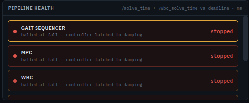
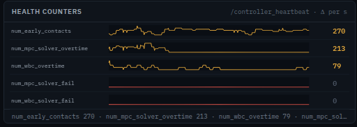
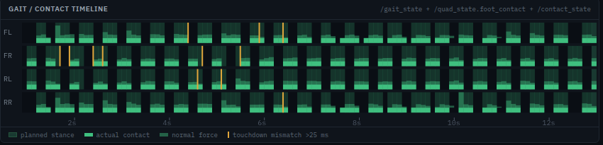
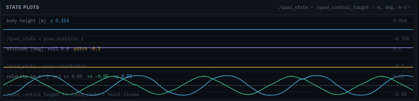
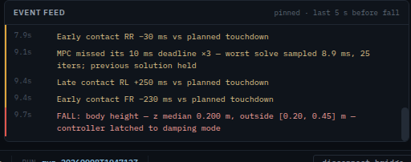

# Diagnosis — reading the Dashboard

Six panels, a banner and a status bar. This page is one section each: what it
shows, where the number comes from, what makes it change colour, and what to do
about it.

Every screenshot here is a real one, cut out of a recorded run — most of them
from a run that fell.

---

## Pipeline health

The six stages of the pipeline, each tinted by how close it is to its deadline.

**Where the numbers come from.** `/solve_time` for MPC and `/wbc_solve_time` for
WBC, binned into tenths of a second. A block is tinted by the **worst single
solve in the last bin**, not by the average — one bad solve in a hundred is
exactly the thing an average would hide.

| Colour | Means |
|---|---|
| green | the worst recent solve is comfortably inside the budget |
| **amber** | MPC over **7 ms**, WBC over **1.5 ms** — still working, no longer with room |
| **red** | MPC at **10 ms**, WBC at **2 ms** — the deadline itself. A recent solver *failure* is red too |
| grey `off` | the stage is disabled by the composition (Model Adaptation is, at this pin) |
| red `stopped` | everything is red because the run ended in a fall |

The 10 ms is the controller's own budget: it runs the MPC once per 10 ms of
simulated time and counts an *overtime* every time a solve takes that long in
wall-clock terms. The 7 ms amber line is the console's, and it is a warning
rather than a failure.

**What to do.** An amber MPC block means the composition is expensive for this
host — a smaller condensed size, a ROBUST HPIPM mode and the *Stress* preset all
do it deliberately. If you did not intend it, `Runs` will show you which choice
differs from the run that was green.

## Health counters

Five counters the controller publishes about itself, shown as **rate** — how
fast each is rising — with the total on the right.

- `num_early_contacts` — a foot touched down before it was planned to.
- `num_mpc_solver_overtime` / `num_wbc_overtime` — solves that reached the
  deadline.
- `num_mpc_solver_fail` / `num_wbc_solver_fail` — solves that did not produce an
  answer at all. The controller falls back to the last feasible plan.

**What to do.** Watch the *slope*, not the total: the totals are cumulative
since the controller started, so a long session has large ones and that says
nothing. A counter that starts climbing mid-run is the event. A **failure**
counter moving at all is more serious than an overtime one.

## Gait / contact timeline

Four rows — front-left, front-right, rear-left, rear-right. The pale bands are
where the gait sequencer *planned* each foot to be on the ground; the solid bars
are where it *actually* was; the vertical amber ticks are touchdowns that missed
their plan by more than **25 ms**.

**What to do.** A few scattered amber ticks are normal on rough ground. A row
that is amber constantly, or feet that stop matching their bands entirely, means
the robot is no longer tracking the gait — usually the last thing to be visible
before a fall.

One honest limit: the browser sees these topics about fifty times a second, so a
touchdown offset is only resolved to about 20 ms. That is why the threshold is
25 and not 5.

## State plots

Three stacked traces: **body height**, **attitude** (roll and pitch), and
**commanded velocity against actual**.

**What to do.** These are where a fall is visible before it is announced. The
verification recipe's own rule is worth knowing, because it is what decides the
verdict on your run:

> A run has fallen if the median body height leaves **0.20–0.45 m**, or the
> robot is tilted past **0.5 rad** for more than 2 % of the window, or the belly
> touches the ground.

A body height that sags and stays low is the classic shape of a composition the
controller cannot keep up with — the *Stress* preset does exactly this, settling
near 0.15 m while still walking.

The velocity trace is the one to read when the robot feels unresponsive: if
commanded and actual have separated, the controller is not achieving what you
asked, and the reason is usually visible one panel up.

## Event feed

Every event, in plain language, in the order it happened. There are eight shapes
and no others:

- `MPC exceeded 10 ms deadline (12.4 ms, 23 iters) — previous solution held`
- `WBC solver failed (3 since the last heartbeat) — falling back to the last feasible plan`
- `Early contact FL −40 ms vs planned touchdown`
- `FALL: body height — z median 0.197 m, outside [0.20, 0.45] m — controller latched to damping mode`
- `Disturbance: 120 N for 0.30 s at body CoM (120, 0, 0)`
- `sim clock restarted at 43172.4 s — windows cleared`
- `data source: live (ws://…)`
- `/gait_state stale for 1.40 s`

**What to do.** Read it bottom-up after a fall. The `FALL:` line names the rule
that fired; the lines above it are what led there.

## The banner

A fall raises a red banner naming the rule that fired, and **pins the feed to
the last five seconds before it**. That pinned window is the post-mortem — it
stops scrolling on purpose, because the five seconds you need are otherwise the
five seconds that scroll away first.

**unpin feed** releases it. A second fall pins again.

## The status bar

Left to right: which data source the panels are reading, the connection state,
the bridge (when you are driving), the real-time factor, how old the last
heartbeat is, the simulation clock, and the run being watched.

**mode** is the honesty item. `live` means these panels are real; `mock
(scripted demo)` means they are the built-in demonstration and nothing here is
about a robot. **rtf** below 1.0 means the simulation is running slower than
real time — expected if you composed it that way, worth noticing if you did not.

In the shot above, **bridge** reads `refused`: something else was already
publishing to the robot, so the page declined to fight it for control. That is
the right outcome, not an error — stop the other publisher
(`demo/tools/kennel-demo.sh walk stop`) and connect again.

---

## Reading a fall, in order

1. **The banner** names the rule: height, attitude or belly contact.
2. **The pinned feed** is the five seconds before it. Read it top to bottom:
   contact mismatches first, deadline or solver-failure lines if there were any,
   then `FALL:` last.
3. **The verdict** is what `demo/tools/kennel-demo.sh verify` filed beside the
   run folder, and what the **Runs** view shows: `fell` outranks
   `solver-failed`, because a run that fell *is* the finding and the solver
   counters are how it got there.
4. **The diff** is the next question. Open **Runs**, tick this run and one that
   completed, and read what differed in the composition.

## One thing worth knowing before you go looking

A composed configuration is in force from the controller's **first solve**. If
you compose something expensive — the *Stress* preset, a tiny condensed size —
the MPC block can be amber before you have commanded anything at all, and it
will not "go" amber during the run, because it never was green.

So a block that is amber from the start is telling you about your composition. A
block that turns amber *during* a run is telling you about something that
happened: a disturbance, rough terrain, a foot that missed.
