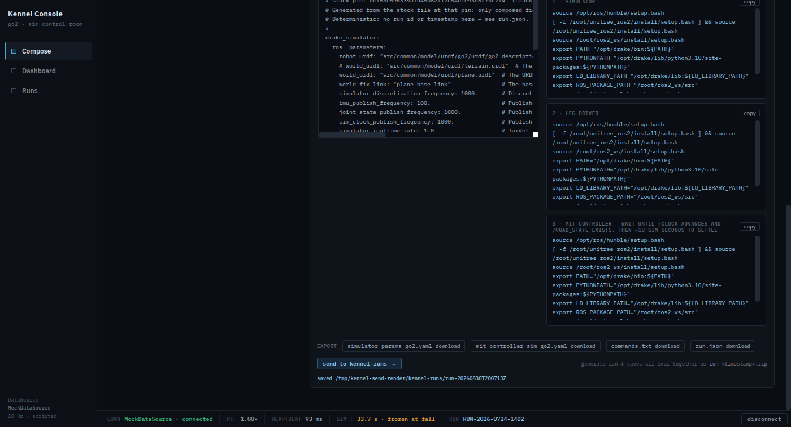
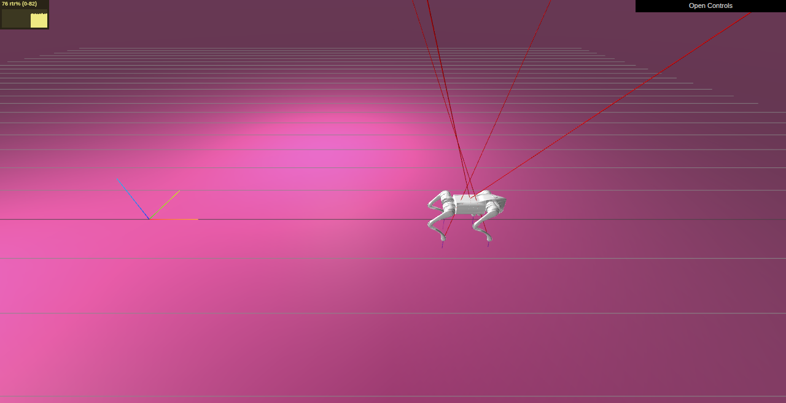
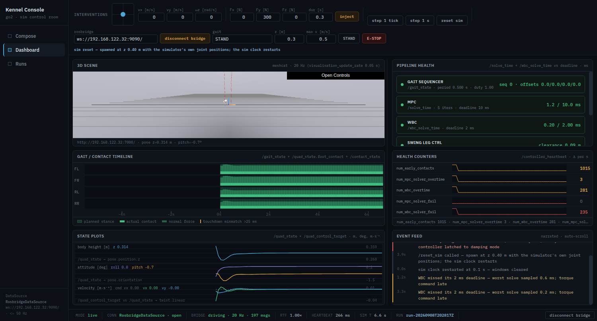

# Walkthrough — what the first run was actually doing

`first-run.md` gets you to a walking robot in eight steps. This page takes the
same five minutes apart, one piece at a time: compose, send, run, watch, drive,
reset, and the record it all leaves behind.

Nothing here is new machinery. It is the same six commands and the same three
views, explained.

---

## Compose — choosing the experiment

**What you do.** Pick a map, set the sim options you care about, choose the MPC
solver — or load one of the four presets and change nothing at all.

**What you see.** A pipeline of six stages. Exactly one of them, **MPC**, is a
dropdown. The other five carry a grey *stock (MVP)* badge and are read-only.
That is not an unfinished screen: at the revision of the stack this appliance
pins, those five stages have no selection key to write, so the console shows
them fixed rather than offering a choice it could not honour. Clicking a stage
opens its parameter drawer; a fixed stage's drawer lists the mechanism it is
held by and no parameters.

**The four presets**, in the toolbar under **load preset…**:

| Preset | What it composes | Why it exists |
|---|---|---|
| **Stock Go2 walk** | every value the pinned stack itself uses | the safe first run — the generated files are the stack's own, byte for byte |
| **Solver benchmark A (HPIPM)** | HPIPM, as fast as the host can go | one half of a solver comparison |
| **Solver benchmark B (OSQP)** | the same, with only the solver changed | the other half — pick both in **Runs** and the diff shows exactly one difference |
| **Stress** | OSQP squeezed to a condensed size of 1 | a composition that is slow enough to fall over. It is meant to fail |

The four ship with the console and cannot be edited. To make one your own,
press **duplicate**, and it becomes a preset of yours you can save over and
delete. The line under the toolbar always says which preset you are holding,
and adds *(modified)* the moment your composition stops matching it.

**What it means.** Everything on this view ends up in two YAML files and a list
of commands. The **YAML tabs** on the right show them as they will be written —
that is the actual file, not a preview of one.

## Send — getting it out of the browser

**What you do.** Either **send to kennel-runs →**, which writes the run folder
straight onto this machine, or **generate run ↓**, which downloads it like any
other file.

**What you see.** The strip reports the folder it wrote, and that is the last
thing you need from the browser for now.

**What it means.** A *run folder* is four files: the two configs, a
`commands.txt` of what to launch, and a `run.json` recording what you chose and
which revision of the stack it was composed against. It is the unit everything
downstream reads.

The **send** button only appears when the console is served by
`demo/tools/kennel-demo.sh console`. Served any other way it is simply absent,
and the download route still works.

## Run — into the guest and walking

**What you do.**

`demo/tools/kennel-demo.sh run`

**What you see.** Four phases, each announced: it says which run folder it
picked and why, copies the two configs into the guest and checksums them,
starts the stack and waits for the whole node graph to come up, then runs ten
checks and prints `pass=10 fail=0` and a Meshcat URL. About a minute and a
half from a guest that is already on.

**What it means.** The console never launches anything — it writes commands, the
driver runs them. The ten checks are a real verification of the running stack:
that the solver you composed is the one the controller loaded, that the sim
clock advances at the rate you asked for, that the robot is walking and has not
fallen. The verdict lands beside the run folder as `verify.json`, which is what
the **Runs** view reads.

`demo/tools/kennel-demo.sh walk stop` returns the gait to standing;
`demo/tools/kennel-demo.sh down` stops the stack inside the guest.

## Watch — the Dashboard

**What you do.** Open **Dashboard**. With a stack running and the bridge up
(next section), it fills with live data.

**What you see.** Six panels and a status bar. Briefly:

- **3D scene** — the simulator's own Meshcat viewer, framed here.
- **Pipeline health** — the six stages again, tinted by how close each is to its
  deadline.
- **Gait / contact timeline** — where each foot was planned to be, and where it
  actually was.
- **Health counters** — how fast the controller's own error counters are rising.
- **State plots** — body height and attitude; commanded velocity against actual.
- **Event feed** — the same events in plain language.

The status bar's **mode** item is the one to trust: it says `live` only when the
panels are showing real data, and `mock (scripted demo)` when they are showing
the built-in demo. A console with no stack at all still fills every panel — that
is the demo, and it says so.

`diagnosis.md` is one page per panel: what each threshold is, and what to do
when one goes amber.

## Drive — the Interventions row

**What you do.** `demo/tools/kennel-demo.sh teleop`, then **connect bridge**.
Then the joystick, the gait picker, the velocity fields.

**What you see.** The Interventions line says `driving`, and the status bar
gains a **bridge** item counting the messages you are sending. Choosing a gait
reports back `active` — with the period the robot actually adopted — or
`refused`, which means the robot did not change and the picker is not going to
pretend it did.

**What it means.** The page publishes a velocity target twenty times a second
while you hold the stick, and stops when you let go. Two things are watching you
do it: the page zeroes the target if the tab is hidden or closed, and a watchdog
inside the guest zeroes it if the page goes away without saying so — a browser
killed outright sends nothing, and without the watchdog the robot would keep the
last command it heard, forever.

**STAND** returns to standing. **E-STOP** drops the robot into damping mode
immediately; it is the button to hit when something is going wrong, and it
leaves the robot on the floor on purpose.

## Reset — two of them, and they are not the same

**`reset sim`**, in the Interventions row, respawns the robot and restarts the
simulation clock. The stack keeps running and your composition is still in
force — if the configuration is what made the robot fall, it will fall again.

**`demo/tools/kennel-demo.sh reset`**, in the terminal, throws the whole guest
away and brings back the frozen baseline: stock configs, nothing running, about
ninety seconds. It is the way out of any mess, and it is thirty-five minutes
cheaper than provisioning again.

Between them sits
`stack/transfer/kennel-transfer.sh restore-stock`, which puts the two config
files back and touches nothing else. Reach for that when you know what you
changed, and for `demo/tools/kennel-demo.sh reset` when you do not.

## The record — Runs

**What you do.** Open **Runs**. Tick two runs to compare them.

**What you see.** Every run folder on this machine, newest first, with the
verdict its verification reached — `completed`, `fell`, `solver-failed`,
`unhealthy` — and the headline counters. Tick two and the diff shows what
differed in the composition, and what differed in the outcome.

**What it means.** This is the lab notebook. Two runs of the same preset should
agree; two runs that differ in one choice should differ in one row of the diff.
The **load** control on a row puts that run's composition back into Compose, so
a run you liked is one click from being run again.

Each row also links its full verification report, which is the same text the
`run` command printed.

---

Next: `diagnosis.md` — how to read the Dashboard when something goes wrong.
