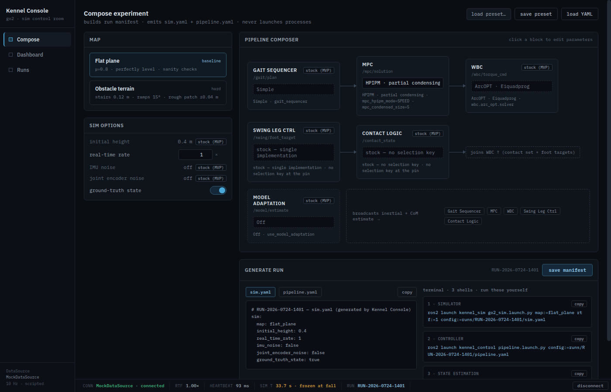
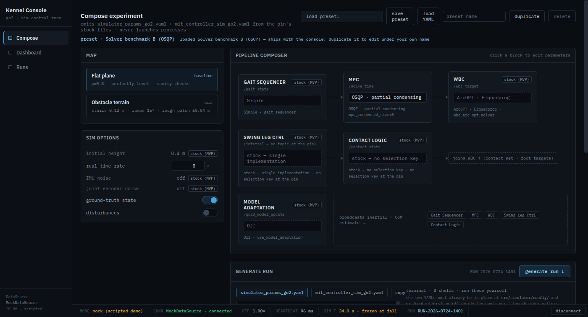

# The composer's MVP scope — what is selectable, and why nothing else is

Implementation record for
[issue #17](https://github.com/alius-git/kennel/issues/17) — the Compose view
offers exactly the choices [`stack/mapping.md`](../stack/mapping.md) can express
at the pin, and shows everything else fixed at its stock value.

Builds on [`stack/mapping.md`](../stack/mapping.md)
([#15](https://github.com/alius-git/kennel/issues/15)), which is the contract
this document renders, and on [`serve.md`](serve.md)
([#16](https://github.com/alius-git/kennel/issues/16)), which makes the
prototype bootable offline. The pin is
`dcf53c596339afd45b82f12c54b1e93e8273c2f4` ([`stack/pin.lock`](../stack/pin.lock)).

Verified 2026-08-06 by driving the served console in a throwaway headless
browser profile with all external DNS blocked — see §4 and
[`verify-scope.sh`](verify-scope.sh).

> **Bypass note** (tracking-issue [#7](https://github.com/alius-git/kennel/issues/7),
> [#26](https://github.com/alius-git/kennel/issues/26)): the composer specified
> in [`plan/prompts.txt`](../plan/prompts.txt) is a full pipeline editor — every
> stage selectable, every parameter editable. The MVP narrows that to **map +
> MPC solver (+ its two dependent parameters) + real-time rate + ground-truth
> state**. The narrowing is not cosmetic: each excluded control either has no
> mechanism at the pin at all, or has one the MVP config path does not yet
> generate. Out-of-scope stages are rendered **visible but fixed**, never
> hidden, so the pipeline diagram keeps telling the truth about what the stack
> runs.
> *Retirement path:* stage `type:` keys land upstream (M2.5, rehearsed by
> scenario s009.repin) → the fixed stages become selectable without a change to
> the composer's state schema, because the schema already carries an `impl` per
> stage. What changes is the option list, not the shape.

## 1. Dispositions

Every row cites the mechanism that justifies it. "Stock" means the value the pin
uses when nothing is configured.

### 1.1 Selectable — the MVP scope

| Control | Value(s) | Stock / default | Mechanism |
|---|---|---|---|
| Map | `flat_plane`, `obstacle_terrain` | **`flat_plane`** | `world_urdf` + `world_fix_link` (mapping §1.1) |
| MPC solver | `PARTIAL_CONDENSING_HPIPM`, `FULL_CONDENSING_HPIPM`, `PARTIAL_CONDENSING_OSQP`, `FULL_CONDENSING_QPOASES` | `PARTIAL_CONDENSING_HPIPM` | `mpc_solver` (mapping §1.3) |
| HPIPM mode | `SPEED_ABS`, `SPEED`, `BALANCE`, `ROBUST` | `SPEED` | `mpc_hpipm_mode` (mapping §1.3) |
| Condensed size | int, 1–10 | `5` | `mpc_condensed_size` (mapping §1.3) |
| Real-time rate | ≥ 0 (`0` = as fast as possible) | `1.0` | `simulator_realtime_rate` (mapping §1.2) |
| Ground-truth state | on / off | **on** | `publish_quad_state` (mapping §1.2) |
| Disturbances | on / off | **off** | *no YAML key*: a fourth command, `ros2 run simulator sim_disturber` (mapping §4.6, [#68](https://github.com/alius-git/kennel/issues/68)) |

The solver's **stored value is the canonical parameter string**, not a friendly
id. The display label may be friendly ("HPIPM · partial condensing"); the value
that reaches the config must be byte-exact, because the node is the only layer
that validates it — an unknown value exits with `Unknown mpc solver`
(`mit_controller_node.cpp:537-539`) while the launch file silently ignores it
(mapping §2.2). §4 asserts the exact strings.

Condensed size is bounded 1–10 because the pin asserts
`0 < condensing_N <= MPC_PREDICTION_HORIZON` (`mpc.cpp:224-225`) and
`MPC_PREDICTION_HORIZON = 10` (`mit_controller_params.hpp:6`) — which is also
where the default of 5 comes from.

Ground-truth state defaults **on**, which is stock. Turning it off raises an
inline caution, because at this pin it does not mean "use estimated state" — it
means no state source at all (mapping §4.4).

### 1.2 Visible but fixed at stock

| Stage / option | Held at | Mechanism | Why not selectable |
|---|---|---|---|
| Gait Sequencer | `Simple` | `gait_sequencer` | `Adaptive` exists but is out of the MVP config path; `Bio-inspired` does not exist at all (mapping §4.3) |
| WBC | `EiquadprogSolver` | `wbc.arc_opt.solver` | Single stock solver; the spec's `wbc.solver` spelling is not the real key (mapping §4.3) |
| Swing Leg Ctrl | stock | *none* | One implementation at the pin; the dropdown would have one entry (mapping §4.3) |
| Contact Logic | stock | *none* | Inline, no selection key — nothing to map (mapping §4.3) |
| Model Adaptation | `Off` | `use_model_adaptation` | Stock is off; on/KF/LS is a two-key mapping (`use_model_adaptation` + `ma_mode`) the MVP does not generate (mapping §1.4) |
| Initial height | `0.4` m | `initial_robot_height` | Real mechanism, deliberately out of MVP scope |
| IMU noise | off | `imu_noise` | Stock is zero-noise, and both toggles are inert in the MVP configuration (mapping §4.4) |
| Joint encoder noise | off | `joint_noise` | as above |

Each renders with a grey **`stock (MVP)`** badge and a read-only control. The
stage cards keep their position, topic and arrows in the pipeline diagram.

**Fixed stages show their mechanism, not parameters.** A fixed stage's card
summarises as `gait_sequencer` / `wbc.arc_opt.solver` / `use_model_adaptation`,
or "no selection key at the pin" where none exists — and its drawer lists no
parameters at all. The prototype's per-stage parameter tables
(`step_frequency`, `duty_factor`, `clearance`, …) are **invented placeholders,
not keys read from the pin**; displaying them as "stock" would have replaced the
dishonesty this issue removes with a subtler one. They remain in composer state
only because the mock Dashboard reads them, and they are withheld from the
emitted YAML.

### 1.3 Removed outright

| Control | Why removal, not fixing |
|---|---|
| **Brick** map card | No working configuration at the pin: `brick.urdf`'s only link is `base_link`, which collides with the Go2's own and aborts the simulator; it is also an object, not a ground plane (mapping §4.1) |
| **Foot force noise** toggle | Unlike the fixed rows, the pin has **no such key at all** — mapping §1.2 lists `imu_noise` and `joint_noise` only. With no stock value to display, the honest rendering is absence |
| MPC's mock parameters (`mode`, `horizon_steps`, `timestep`, `max_iterations`, `deadline_ms`, `w_body_*`, `friction_mu`, `warm_start`) | Invented by the prototype; replaced by the two real solver-dependent keys |

## 2. Solver-dependent fields — the finding

Issue #17 asks that HPIPM mode and condensed size "only appear for the relevant
solver". The pin decides this in two guards, and they are **not the same guard**
(`mpc.cpp:223` and `:230`):

```cpp
if (solver < FULL_CONDENSING_HPIPM) {   // this is the first solver after partials
  ...  ocp_qp_xcond_solver_opts_set(..., "cond_N", &condensing_N);
}
if (solver == PARTIAL_CONDENSING_HPIPM || solver == FULL_CONDENSING_HPIPM) {
  ...  ocp_qp_xcond_solver_opts_set(..., "hpipm_mode", ...);
}
```

Taking upstream's own comment as the authority on the enum ordering — every
partial-condensing solver sorts before `FULL_CONDENSING_HPIPM` — this yields a
2×2 over the four launch-reachable solvers:

| Solver | `mpc_condensed_size` | `mpc_hpipm_mode` |
|---|---|---|
| `PARTIAL_CONDENSING_HPIPM` | ✅ | ✅ |
| `PARTIAL_CONDENSING_OSQP` | ✅ | — |
| `FULL_CONDENSING_HPIPM` | — | ✅ |
| `FULL_CONDENSING_QPOASES` | — | — |

So it is **not** "the HPIPM fields appear together": condensing follows
partial-vs-full, HPIPM mode follows the solver family, and the two cut across
each other. The composer implements exactly this, and §4 asserts all four rows.

An inapplicable field is hidden in the drawer. It is **not** withheld from the
emitted YAML — that was this record's original intent and
[#18](https://github.com/alius-git/kennel/issues/18) decided otherwise, on the
grounds that always-emitting keeps a one-choice change a one-line diff and
records the value the parameter genuinely holds. The honesty is paid in the
generated block's own note, which names which keys the chosen solver reads:
[`generate.md`](generate.md) §2.1 is the decision, and
[`verify-scope.sh`](verify-scope.sh) group 11 asserts the behaviour that exists.
*(Corrected 2026-09-09, from the code, while writing §7.)*

> **Method, stated plainly.** This is derived from the source at the pin, not
> executed — the two `ocp_qp_xcond_solver_opts_set` calls sit inside acados, and
> confirming the enum ordering directly would mean reading acados' headers in
> the container. Unlike mapping.md's **[runtime]** rows, this table carries no
> runtime evidence. It rests on upstream's comment at `mpc.cpp:223` being
> accurate about the ordering. Worth a runtime confirmation when a guest is next
> available; the consequence of the comment being wrong is a field offered for a
> solver that ignores it, which is a UI defect, not a bad config.

## 3. Normalization — the load paths

A config can enter the composer four ways, and three of them can carry values
from before this issue: **defaults**, a **saved preset** (`localStorage`), a
**loaded run**, and **pasted YAML**. All four now funnel through one
`normalizeCfg()`:

- map not in the two offered → `flat_plane`
- legacy solver id → canonical string (`hpipm` → `PARTIAL_CONDENSING_HPIPM`,
  `osqp` → `PARTIAL_CONDENSING_OSQP`, `qpoases` → `FULL_CONDENSING_QPOASES`)
- any fixed stage → its stock value, whatever the input said
- fixed sim options → stock; negative real-time rate → stock
- numeric params clamped to their declared range; enum params rejected unless
  the value is offered

Without this, a preset saved yesterday — or one of the seeded runs — could
re-arm `map: brick` or `impl: bio` in a composer that no longer offers them, and
the generated config would carry a value the stack cannot honour. §4 tests this
with a deliberately poisoned preset.

The seeded run history was rewritten for the same reason: every entry is now a
config the constrained composer could itself produce, differing only in
MVP-scope choices.

## 4. Verification

```bash
./kennel_console/verify-scope.sh          # serves, drives a headless browser, asserts
./kennel_console/verify-serve.sh          # #16 — still green
```

`verify-scope.sh` drives the real console in a throwaway profile with all
external DNS blocked (the same isolation [`serve.md`](serve.md) §5 establishes)
and asserts, **78 checks** (36 for #17, and group 11's 42 for #72):

| Group | Asserts |
|---|---|
| Map picker | Two cards; Brick absent from the rendered UI; `flat_plane` selected on a fresh session |
| Solver | Exactly four options; values byte-equal to the canonical strings; default `PARTIAL_CONDENSING_HPIPM` |
| Solver-dependent fields | All four rows of the §2 table, by switching solver and reading the drawer |
| Emitted YAML | Canonical string present; no legacy id anywhere |
| Fixed stages | All five still visible; `stock (MVP)` badges present; the solver is the only composer `<select>` |
| Sim options | Foot force noise gone; initial height fixed at 0.4; ground truth defaults on |
| Ground-truth caution | Hidden while on, shown when off, YAML follows |
| Poisoned preset | A pre-#17 preset (`brick`, `bio`, `osqp`, `-5` rate, condensed size 99) lands entirely on legal values |
| Seeded runs | Listed, with no legacy stage names |
| Named presets (group 11, [#72](https://github.com/alius-git/kennel/issues/72)) | The four shipped presets are listed in order and nothing else is; *Stock Go2 walk* emits exactly what a fresh session emits; A and B differ in the solver line alone; *Stress* is `stress.md` §4's composition, restated as literals; `(modified)` appears and clears on a byte comparison; save refuses a shipped preset and writes nothing; duplicate, save-over, delete, and the numbering of repeated copies; a saved preset survives a reload; the poisoned entry normalises through the new handler too |
| Network | Zero non-localhost requests |



Two notes for whoever extends these checks: composer section headers and stage
titles are **uppercased by CSS**, so `innerText` matching must be
case-insensitive; and toggle labels sit inside a `<span class="sc-interp">`, so
the row — not the label — is the element to search from.

## 5. Limits

- **The generated YAML was still the prototype's shape when this was written.**
  This issue governs *what is selectable*; turning the selections into the real
  `simulator_params_go2.yaml` / `mit_controller_sim_go2.yaml` and the three-command
  launch block was [#18](https://github.com/alius-git/kennel/issues/18) — since
  done, see [`generate.md`](generate.md).
- **The §2 table is source-derived, not runtime-verified** (see the note there).
- **Chrome only**, headless, on the host.
- **The Dashboard is untouched** — it still runs on `MockDataSource`, and the
  Model Adaptation tile now permanently reads "disabled", which is the honest
  consequence of that stage being fixed Off.

## 6. What this feeds

| Issue | What it takes from here |
|---|---|
| [#18](https://github.com/alius-git/kennel/issues/18) — done, [`generate.md`](generate.md) | The state schema and the §1 dispositions; §2's 2x2 became the per-solver note written into the generated controller file |
| [#19](https://github.com/alius-git/kennel/issues/19) | A composer state that is already legal at export time |
| [#26](https://github.com/alius-git/kennel/issues/26) | The bypass note above |
| [#28](https://github.com/alius-git/kennel/issues/28) | Nothing new — every gap cited here is already recorded in mapping.md §4 |
| [#72](https://github.com/alius-git/kennel/issues/72) — **done**, §7 | The normalization funnel of §3, which every preset load goes through, and §2's 2×2, which is why the A/B pair differs in one line |

---

## 7. Named presets ([#72](https://github.com/alius-git/kennel/issues/72))

The spec ([`prompts.txt`](../plan/prompts.txt) View 1 c) ships named presets with
save / load / duplicate. Before this, presets lived only in `localStorage`, none
shipped, and there was no delete, no duplicate, and nothing on screen saying
which preset the composer was holding.

Four now ship **in the page, as data**. Every one of them is a row
[`stack/stress.md`](../stack/stress.md) §2 measured on the reference guest — a
preset nobody has run is a guess with a name:

| Preset | Composition | `stress.md` §2 row | Measured there |
|---|---|---|---|
| **Stock Go2 walk** | every value stock: flat plane · rate 1.0 · ground truth on · `PARTIAL_CONDENSING_HPIPM` · `SPEED` · condensed 5 · disturbances off | `hpipm-speed-5-r1` | 0.685 ms mean, walked |
| **Solver benchmark A (HPIPM)** | as stock, **rate 0** | `hpipm-speed-5-r0` | 0.67 ms, rtf 2.15, walked |
| **Solver benchmark B (OSQP)** | A with only the solver changed | `osqp-5-r0` | 1.151 ms, rtf 2.06, walked |
| **Stress** | flat plane · rate 1.0 · `PARTIAL_CONDENSING_OSQP` · condensed **1** | `osqp-1-r1`, and §4's three runs | 3.75 ms mean, **fell 3 of 3** |



**Why A and B sit at rate 0.** At rate 1.0, *Solver benchmark A* would be
byte-identical to *Stock Go2 walk* under a second name, and the Runs diff —
s005.compare's whole point — would show the pair as no difference at all. Rate 0
is also what a solver benchmark is for: the deadline is a wall-clock budget per
sim-time cycle, so "as fast as possible" is 2.1× the solves per wall second
([`stress.md`](../stack/stress.md) §1). The A/B controller diff is then exactly
the `mpc_solver` line and its consumes-note, which §4's group 11 asserts.

### 7.1 The semantics, stated so they can be quoted

- **Load** — shipped or saved, through `normalizeCfg()`. §3's funnel is the
  whole point: a preset is untrusted input like a pasted YAML or a loaded run,
  and the poisoned pre-#17 entry §4's group 8 writes normalises the same way
  whichever handler loads it.
- **Save** — under the typed name, else the **loaded preset's** name, else an
  auto-name. Never over a shipped one. That fallback order is what makes
  "read-only" reachable: falling back to the auto-name with a shipped preset
  loaded would quietly save a copy of it under a machine-made name, which is the
  one thing read-only has to prevent. (Found by group 11 before this was
  written.)
- **Duplicate** — always a new user preset, named from the **root** of the
  loaded name, so a third press gives `X (copy) (3)` and not
  `X (copy) (copy) (copy)`. Only the copy suffix this code writes is stripped; a
  user's own `run (2)` keeps its number. (Also found by group 11.)
- **Delete** — only a loaded user preset. A shipped one is refused by name.
- **`preset · <name> (modified)`** — a **byte comparison** of what the composer
  and the preset *emit*, not a walk over their fields. It is the same question
  `load YAML`'s round-trip asks, so "still the preset" means what
  [`export.md`](export.md) §2.1 means by identical.

**Where the data lives, and where it does not.** `SHIPPED_PRESETS` is a constant
in the page; `kennel.presets` in `localStorage` stays the operator's own list and
is never written by the shipped ones. Option values are `s0…s3` for shipped and
`u0…` for saved, shipped listed first — §4's group 8 finds its entry by the
option's *text* and sets `.value` directly, so the scheme is free and the
`load preset…` text is not.

### 7.2 `KENNEL_PRESET` — the driver passes a name, the page decides

`kennel-demo.sh compose` and `all` accept `KENNEL_PRESET`. It is matched **in the
UI**, against an option's exact text or its slug, so `stress`, `Stress` and
`stock-go2-walk` all reach the same row of the page's data. A name the page does
not ship is refused **by the page**, which prints the four it does.

The driver's own `preset_field` table — one preset, four fields — is **deleted**.
A second copy of what a preset composes is a copy that can disagree with the page
silently, and it did not have to exist. A preset still fills in only what the
operator did not choose: an explicit `KENNEL_SOLVER` or `KENNEL_RATE` wins, a
defaulted one is passed through empty and the page's value stands.

Measured on the live guest ([`composer-scope/evidence/`](composer-scope/evidence/)):

| | |
|---|---|
| `01-preset-refused-before.txt` | the negative control, before the change: `KENNEL_PRESET=stock-go2-walk` exits 2, *"the one that exists is 'stress'"* |
| `02-stress-by-text.txt` | `KENNEL_PRESET=stress` composes OSQP · condensed 1 · rate 1.0 · flat plane, and its two YAMLs **diff empty** against the run folder #70's driver-side table produced (`stack/stress/evidence/red-osqp1/runs/run-20260908T184703Z`). Also: `"Solver benchmark B (OSQP)"` → rate `0.0`; `nonsense` → exit 1 naming the four; `stress` + `KENNEL_RATE=0.5` → rate 0.5, the knob winning |
| `03-all-stock.txt` | `KENNEL_PRESET=stock-go2-walk kennel-demo.sh all` → `pass=10 fail=0`, verdict `completed`, `expect solver PARTIAL_CONDENSING_HPIPM (from run-…/run.json)` |
| `04-all-stress.txt` | `KENNEL_PRESET=stress kennel-demo.sh all` → `verify` files **`fell`** (z median 0.1254 m) and exits 1, so `all` stops there. That is by design: a red preset that verified green would be the bug |
| `demo/evidence/s003-diagnose/10-after-72.txt` | `scenario diagnose`, the only other `KENNEL_PRESET` consumer, green after the table was retired: `pass=87 fail=0 bypass=2`, fell 2 of 2 |

**The limit worth stating**: only *shipped* presets are reachable from the
scripted compose. `p22-console-demo.sh` drives a throwaway Chrome profile, so an
operator's own saved presets do not exist in it — by construction, not by
omission.

### 7.3 Bypass — "Stairs + Adaptive gait" is not shippable

> The spec's third preset is *Stairs + Adaptive gait*. Neither half can ship
> honestly.
>
> **Adaptive** is the fixed value of a stage the composer cannot select (§1.2;
> [`mapping.md`](../stack/mapping.md) §4.3 — `gait_sequencer` is outside the MVP
> config path), so a preset naming it would compose `Simple` and call itself
> Adaptive. **Stairs** — obstacle terrain — was measured three times for #70:
> it falls 2 of 3 and shows *no* solver degradation at all
> ([`stress.md`](../stack/stress.md) §4.1). A preset of the two would be a name
> for a composition that does neither thing it claims.
>
> Shipped in its place: **Stress**, which is the measured red composition.
>
> *Retirement path:* **both** halves, not either — the `gait_sequencer` key
> entering the MVP config path (`mapping.md` §1.4's two-key pattern is the
> shape), **and** a terrain composition that walks. Until both, this stays a
> bypass. Tracking: [#26](https://github.com/alius-git/kennel/issues/26),
> [#28](https://github.com/alius-git/kennel/issues/28).
