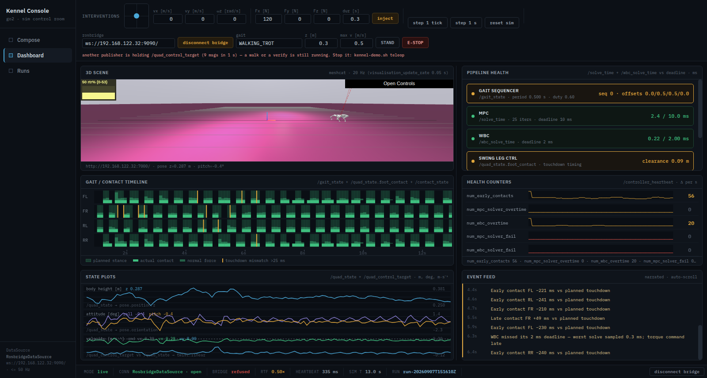

# The Dashboard, live — the real viewer, the real stack, the real fall

> Implementation record for issues
> [#61](https://github.com/alius-git/kennel/issues/61),
> [#62](https://github.com/alius-git/kennel/issues/62) and
> [#63](https://github.com/alius-git/kennel/issues/63). The Runs half of the same
> pass is [`runs.md`](runs.md) ([#64](https://github.com/alius-git/kennel/issues/64)).
>
> One sentence: the Dashboard stops narrating a recording — the 3D pane frames
> the simulator's own viewer, every panel reads the running stack across the
> `DataSource` seam, and the fall it reports is the one
> [`verify.md` §4](../stack/verify.md)'s rule finds.



Everything below was measured on 2026-09-07 against the live guest
(`kennel-vm` at `192.168.122.32`, pin `dcf53c5`), on the composed run
`run-20260907T144210Z` — OSQP, flat plane, `simulator_realtime_rate: 0.5`.

## 0. What this closes, and what it does not

[`teleop.md` §6](teleop.md) is the finding this pass answers:

> The render above is honest about it: a red **FALL DETECTED** banner and three
> `stopped` pipeline blocks, while the real robot trots along at 0.47 m/s. …
> Until the `RosbridgeDataSource` lands, **the panels narrate a recording while
> the joystick drives a robot**, and an operator has to know that.

That is gone. What is still outstanding is named in §6 and in
[`runs.md`](runs.md): the interventions (`inject`, `reset sim`, single-step)
still drive the mock, because each is a service call the bridge does not carry
yet — [#66](https://github.com/alius-git/kennel/issues/66) and
[#68](https://github.com/alius-git/kennel/issues/68).

Nothing here launches a process. `kennel-demo.sh teleop` starts the bridge, as
it has since [#58](https://github.com/alius-git/kennel/issues/58), for the
reason [`send.md` §6](send.md) records; the page opens a socket only when
somebody clicks.

## 1. #61 — the truth pass

### 1.1 The 3D pane

The pane was a dashed *"meshcat iframe slot"* whose empty state read
`ros2 launch kennel_viz meshcat.launch.py port:=7000` — **a package that does
not exist anywhere**, at this pin or in this repo. Meanwhile `walk` and
`teleop` had been writing the real viewer's URL to `<out>/.kennel-meshcat` since
#58 and [`serve.py`](serve.py) had been reporting it in `/api/health`.

It is now an `<iframe>` to that URL, rendered when — and only when —
`/api/health` carried one. Feature-detected exactly like *send* (#56) and the
teleop controls (#58): served by plain `python3 -m http.server` there is no
`/api/`, so there is no iframe and the pane is what it always was.

Two things measured rather than assumed:

- **Drake's Meshcat can be framed.** `curl -D -` against
  `http://192.168.122.32:7000/` returns `200`, `Content-Type: text/html`,
  `uWebSockets: 20`, and **no `X-Frame-Options` and no `Content-Security-Policy`**.
  Nothing had to be relaxed on the guest.
- **The URL is never composed by the page.** It is the string the driver
  discovered and `serve.py` validated against its `URL_RE`, passed through
  verbatim. That is also why `verify-serve.sh` step 2's grep for `src="http…"`
  still finds nothing: the attribute is a binding.

The pane mounts on the Dashboard view only, so opening the console does not hold
a WebGL context on the Compose screen. The suite proves that from the viewer's
own access log rather than from the attribute (§4).

### 1.2 Every command a panel names

The rule this pass installs: **the only commands a Dashboard panel may name are
`kennel-demo.sh` verbs, or the three `ros2 launch` lines the console's own
`commands.txt` generates.** Before it, five of the six panels named packages
that had never existed:

| Panel | Named | Now names |
|---|---|---|
| 3D scene | `ros2 launch kennel_viz meshcat.launch.py port:=7000` | `kennel-demo.sh run`, then `walk` or `teleop` |
| Pipeline health | `ros2 launch kennel_control pipeline.launch.py` | `kennel-demo.sh run`; block 3 of `commands.txt` |
| Timeline | `ros2 launch kennel_control pipeline.launch.py` | `kennel-demo.sh run` |
| Health counters | `ros2 launch kennel_control pipeline.launch.py` | `kennel-demo.sh run` |
| State plots | `ros2 launch kennel_estimation state_estimation.launch.py` | `kennel-demo.sh run`; block 1 of `commands.txt` |
| Event feed | `ros2 launch kennel_sim go2_sim.launch.py` | `kennel-demo.sh run` |

Each empty state now also names the **topic** that is silent, and in mock mode a
third line says the demo is paused rather than that the stack is missing.

The same pass corrected every panel header, plot label and pipeline-block topic
to what the pin publishes ([`known-good/06-healthy-graph.txt`](../stack/known-good/06-healthy-graph.txt)):

| Was | Is |
|---|---|
| `meshcat · /tf · 30 Hz` | `meshcat · 20 Hz (visualisation_update_rate 0.05 s)` |
| `/pipeline/diagnostics`, `/mpc/solution`, `/wbc/torque_cmd` | `/solve_time`, `/wbc_solve_time` |
| `/gait/plan + /contact_state · bool · 10 Hz` | `/gait_state + /quad_state.foot_contact + /contact_state` |
| `/diagnostics · events·s⁻¹` | `/controller_heartbeat · Δ per s` |
| `/odom → pose.position.z`, `/imu/data → orientation`, `/cmd_vel vs /odom` | `/quad_state → …`, `/quad_control_target vs /quad_state → twist.linear` |
| `/rosout · auto-scroll` | `narrated · auto-scroll` |
| `/swing/foot_target` (a block's topic) | `(internal — no topic at the pin)` |
| `/model/estimate` | `/quad_model_update` |

### 1.3 The mode label

`mode · mock (scripted demo)` / `mode · live`, wired to **the DataSource in
use** and never to the bridge — s007.bridge step 3, *"the scripted run is never
presentable as live data"*. A bridge that is connected but only carrying the
joystick is still a mock dashboard, and the label says so. The nav rail's footer
names the source and its rate for the same reason.

## 2. #62 — `RosbridgeDataSource`, part 1

### 2.1 The `DataSource` contract

[`design.md` §4](../plan/design.md) names the seam; this is the first time it
has been written down. Enumerated from `MockDataSource` **before** the live one
was written, and implemented by it exactly:

| Member | Type | Read by |
|---|---|---|
| `buf` | samples at **10 Hz of sim time**, ≤ 900: `{t, mpcMs, mpcIters, wbcMs, solverFail, planned[4], actual[4], miss[4], forces[4], height, pitch, roll, vx, vy, wz, cvx, cvy, cwz, rtf, hb, c{…}}`, `pitch`/`roll` in **degrees** | `win()`, the four canvases, `renderVals` |
| `counters` | `{earlyContacts, mpcOvertime, wbcOvertime, mpcFail, wbcFail}`, cumulative | sparkline totals, health strip, detail drawer |
| `lastInc[k]` | sim time of the last increment | `recent()` → block tint and flash |
| `events` | `[{t, sev, text}]`, ≤ 500 | the feed, the pinned post-mortem |
| `t` | sim seconds | status bar, `recent()` |
| `fallen` `fallText` `fallAt` `halted` | fall state | banner, pin window, health |
| `timer` | truthy while running | `onReset` |
| `cmd {vx, vy, wz}` | the velocity fields' target | joystick, `velFields` |
| `start()` `stop()` `reset()` `last()` | lifecycle | the status bar toggle, unmount |
| `advance()` `seedDemo(s)` `inject(f)` | the scripted interventions | `step`, `reset sim`, `inject` |

**Every member above is implemented by both sources, and no panel's reads
changed**: `buf`, `counters`, `lastInc`, `events`, `t`, the fall state and the
lifecycle are consumed by exactly the code that consumed them before. That is
what "the seam holds" means here, and it is checkable:

```bash
git show main:"kennel_console/Kennel Console.dc.html" | grep -oE '\bds\.[a-zA-Z]+' | sort -u
grep -oE '\bds\.[a-zA-Z]+' "kennel_console/Kennel Console.dc.html" | sort -u
```

**Two members are new, and they are the honest exception.** #63's health strip
reports the sequencer's live signature, which needs the newest raw `/gait_state`
and a way to ask whether it is still arriving, so the live source also exposes:

| Member | |
|---|---|
| `latest[topic]` | the newest raw message per topic |
| `fresh(topic, s)` | has this topic said anything in the last `s` wall seconds |

Both are read **only** under `isLive`, so the mock does not implement them and
nothing on the mock path can reach them. They are additions to the contract, not
changes to it — but they are additions, and the contract table above is the
place that has to say so. (`ds.seedDemo` left the list in the other direction:
the demo is seeded through `this.mock` now, because only the mock has one.)

### 2.2 One socket

`RosbridgeLink` owns the WebSocket; `RosbridgeTarget` (#58, publishes one topic
and calls two services) and `RosbridgeDataSource` (subscribes to eight topics)
are its clients. Ops are routed by `op`, by topic for a publish and by `id` for
a service response — no framework, and the page constructs **one** WebSocket
(`grep -n 'new WebSocket'` finds a single call site, in `RosbridgeLink.connect`).

Two consequences worth stating:

- **The teleop probe must be the first subscribe on the wire.** It counts
  foreign publishers on `/quad_control_target` for a second before advertising
  (`teleop.md` §3); if the DataSource subscribed first, what the probe counted
  could include our own traffic. The link runs its `onOpen` callbacks in
  registration order and the target registers first.
- **A refusal no longer closes the socket.** In #58 a foreign publisher meant
  closing, because the socket was the joystick's alone. Now it means *do not
  drive* — the panels stay live, which is exactly what an operator watching a
  `kennel-verify.sh` walk or a colleague's session wants.

### 2.3 The binning decision

**The live source bins what arrives into the same 10 Hz sim-time samples the
mock emits.** This is the one decision that shapes everything else.

The alternative — pushing each arriving message into `buf` — would have changed
every drawing routine's assumptions (bar widths, the 10-sample sparkline delta,
the 900-sample ring) and made s007.bridge's *"no panel behaving differently than
it did on mock data"* a hope rather than a property of the code.

`/clock` is the tick: a bin closes when sim time passes the next tenth of a
second, so every window is a **sim**-time window and the whole source is
invariant to `simulator_realtime_rate` — the rule
[`verify.md` §1.1](../stack/verify.md) established for the CLI recipe, applied
in the browser. Nothing in the live source runs on a `setInterval`.

A sim clock that goes **backwards** is a real event — a relaunch,
[#66](https://github.com/alius-git/kennel/issues/66)'s `/reset_sim`, a replay
that looped without rebasing — and it clears the windows and says so in the feed
rather than drawing a plot across the discontinuity.

### 2.4 What is subscribed, and at what rate

Measured against the real bridge (rosbridge `2.0.7`, in the pinned image since
before Kennel existed) with an 8-topic subscription over a held trot:

| Topic | `throttle_rate` | Arrived | Largest message |
|---|---|---|---|
| `/clock` | 100 ms | 10.0 Hz | 92 B |
| `/quad_state` | 20 ms | **49.5 Hz** | 2613 B |
| `/solve_time` | 20 ms | 49.3 Hz | 529 B |
| `/wbc_solve_time` | 20 ms | 49.4 Hz | 267 B |
| `/gait_state` | 20 ms | 49.3 Hz | 297 B |
| `/contact_state` | 20 ms | 49.3 Hz | 234 B |
| `/controller_heartbeat` | 0 | 2 Hz in sim time | 322 B |
| `/quad_control_target` | 0 | 10 Hz | 165 B |

`throttle_rate` is a **minimum gap**, not a metronome: inter-arrivals on
`/quad_state` were 13.8–26.1 ms, median 20.2. The bridge takes the **minimum**
over a topic's subscriptions
(`rosbridge_library/capabilities/subscribe.py:225`), so one panel cannot slow
another's stream.

Three things that did not need solving, because they were measured:

- **QoS needs no argument.** rosbridge's subscriber defaults to
  `BEST_EFFORT`/`VOLATILE` and adopts a publisher's `TRANSIENT_LOCAL`
  (`internal/subscribers.py:156–184`), and the controller publishes its
  diagnostics `QOS_BEST_EFFORT_NO_DEPTH` (`mit_controller_node.cpp:218–245` at
  the pin). They match without asking.
- **`/contact_state.ground_contact_force` is four scalars**, one per foot — not
  four vectors, as the specification's *"measured forces"* reads.
- **Subscribing to a topic that does not exist is accepted silently** — no
  error op, and messages arrive if it later appears. So panels can come alive
  one by one as their topics do (s007 step 5) with no resubscribe.

### 2.5 The counters

The five `ControllerInfo` fields, under their own names. The totals shown are
**the message's own cumulative values**, not a tally kept since the console
connected: a number on screen that disagreed with `ros2 topic echo
/controller_heartbeat` at the same instant would be a number an operator cannot
check. The informative half is the rate, and the sparklines draw that from the
deltas — the spec's *"rate-of-change sparklines, not just totals"*, and the same
deltas `kennel-verify.sh` check 7 asserts.

The mock's `imu_stale_windows` row is gone: there was no live signal behind it,
and a row that only ever moves in the demo is a demo of nothing. Its slot is now
`num_wbc_solver_fail`, which the real stack does exercise — 104 of them in one
12-second probe.

A DOM strip under the sparklines carries the same five totals as text, because
**a canvas cannot be read by a verification suite** and a number nobody can
check is a number nobody should believe.

### 2.6 The switch

The status bar's connect/disconnect owns the DataSource, which since this issue
means it owns the bridge when there is one to own:

| State | Button | Click |
|---|---|---|
| kennel server, a bridge URL known | `connect bridge` / `disconnect bridge` | opens or closes the link; both halves |
| no server, or no URL | `connect` / `disconnect` | starts or stops the mock, exactly as before |

Going live stops the mock; coming back **resumes** it where it paused, so
Devon's ~30 s demo is not restarted by a detour through the real stack. Both
transitions are announced in the feed through the shared grammar, and in the
`mode` item.

## 3. #63 — the timeline, the grammar and the fall

### 3.1 The fall rule is the recipe's, not the specification's

`prompts.txt` says *"fall detection = `belly_contact` OR attitude/height
thresholds"*. [`verify.md` §4](../stack/verify.md) is the record of what
happened when that was tried:

- **`belly_contact` never fires at this pin.** It stayed false through a damping
  collapse with the body flat on the floor and through a full tip-over at 166°
  of roll. Confirmed again here, first-hand: **0 of 1240 samples** in a
  recording that ends with the body at 0.075 m.
- **Body height needs a median.** The OSQP gait bobs 97 mm around a 0.287 m
  median while walking perfectly well; a per-sample floor tuned to HPIPM rejects
  it.
- **Attitude has to be a sustained fraction.** A tipped robot holds its
  attitude; a gait transient does not.

So the console runs check 9's rule, constant for constant, under the same knobs'
names — `Z_MIN` `Z_MAX` `TILT_MAX_RAD` — with a comment saying to change them
together.

**The one number that is not verify's is the window.** The recipe judges a 15 s
measurement after the fact; a dashboard has to say so while it is happening, so
it looks at **2 sim-seconds**. verify's `FALL_TOLERANCE` of 2 % of 15 s is
**0.3 s of sustained tilt**, and 0.3 s of 2 s is 15 %: the duration is what is
preserved, not the percentage. Widen the window before touching the fraction.

### 3.2 One rule, both sources

`MockDataSource` no longer raises its banner by fiat. The script still topples
the robot at `T_FALL`; the **same `fallRule()`** then finds it in the samples
the script produced. Two things follow, and both are improvements:

- The demo now demonstrates the instrument, not a hard-coded outcome.
- Its old text claimed *"belly contact, pitch −38°"* — a trigger that at this
  pin never happens. It now reads what the rule found:
  `FALL: attitude — tilt over 0.5 rad in 20% of the last 2 s`.

### 3.3 One grammar

`narrate(kind, d)` is the only place an event's words are built, and both
sources call it — s007.bridge step 6's *"same event-feed grammar"*, made a
property of the code:

| kind | shape |
|---|---|
| `deadline` | `MPC exceeded 10 ms deadline (12.4 ms, 23 iters) — previous solution held` |
| `solverFail` | `WBC solver failed (3 since the last heartbeat) — falling back to the last feasible plan` |
| `contact` | `Early contact FL −40 ms vs planned touchdown` |
| `fall` | `FALL: body height — z median 0.197 m, outside [0.20, 0.45] m — controller latched to damping mode` |
| `mode` | `data source: live (ws://192.168.122.32:9090/)` |
| `reset` | `sim clock restarted at 43172.4 s — windows cleared` (#66) |
| `disturb` | `Disturbance: 120 N for 0.30 s at body CoM (120, 0, 0)` (#68) |
| `stale` | `/gait_state stale for 1.40 s` |

### 3.4 The feed now actually pins

The banner has said *"event feed pinned to last 5 s before fall"* since the
prototype was written, and **nothing ever pinned it** — the post-mortem scrolled
away with everything else, which is precisely the five seconds s003.diagnose
step 6 asks to be kept. A fall now pins the feed once, keyed on its timestamp,
so *unpin feed* stays unpinned and a second fall pins again.

### 3.5 Touchdown timing — a finding

The obvious implementation is to pair a planned contact edge (`/gait_state`
`contact` false→true) with the actual one (`/quad_state` `foot_contact`
false→true) and subtract. It is wrong, and the fixtures said so before any of it
reached the page: **offsets of up to 5.5 seconds**.

The reason, measured over both recordings, for every sample and every leg:

```
gait_state.contact[i]  ===  (gait_state.phase[i] < gait_state.duty_factor[i])
```

`contact` is not an independent signal — it is a phase window. During `STAND`
(duty factor 1.0) every leg is planned-in-contact forever, there is no planned
edge to pair with, and the first touchdown of the following trot pairs with an
edge seconds old.

What a touchdown's offset **is**: the leg's phase when the foot lands. Planned
touchdown is phase 0, so the distance to it, wrapped into (−0.5, +0.5] and
scaled by the period, is the offset — negative early, positive late. Measured:

| Fixture | Touchdowns | Offsets | Past the 25 ms threshold |
|---|---|---|---|
| healthy | 82 | −40 … +10 ms | 2 |
| fall | 63 | −191 … +250 ms | 13 |

The quantisation is the arrival interval (~20 ms at `throttle_rate` 20), which
is why the threshold is 25 ms and not less. Planned and actual agreed in
**98.8 %** of samples on the healthy recording.

The timeline draws all three: planned stance as a band from `/gait_state`,
actual contact from `/quad_state.foot_contact`, and the measured normal force
from `/contact_state` scaled to the window's own peak — the loads differ by an
order of magnitude between a stand and a trot.

## 4. Verification

```bash
./kennel_console/verify-dashboard.sh     # 84 checks, no VM
./kennel_console/verify-runs.sh          # #64, see runs.md
for s in serve scope generate export send teleop; do ./kennel_console/verify-$s.sh; done
```

`verify-dashboard.sh` starts four servers of its own and drives one throwaway
headless Chrome across two origins with all external DNS blocked. Every claim
about what the page *did* is checked against bytes a server recorded — the
viewer's access log, the bridge's op log — never against a JavaScript variable
read back out of the page under test.

| Group | Asserts |
|---|---|
| 1 | the iframe exists on the Dashboard only, its `src` is `/api/health`'s URL verbatim, and **the viewer's access log gained a request** — an `src` nobody fetched proves the string, not the pane |
| 2 | with `.kennel-meshcat` removed: no iframe, and the empty state names `kennel-demo.sh run` |
| 3 | every command the Dashboard names is a driver verb or one of the console's own generated launches; no `kennel_*` package and no fictional topic anywhere in the file |
| 4 | the mode item is present and says `mock (scripted demo)` |
| 5 | under plain `http.server`: no iframe, no bridge controls, the six empty states, zero mustaches, zero errors |
| 6 | zero non-localhost requests; zero WebSockets on load |
| 7 | one socket to the configured URL; **the teleop probe is the first subscribe on the wire**; all eight topics subscribed; `/quad_state` throttled ≥ 17 ms with `queue_length: 1`; the mode flips to live and the feed says so |
| 8 | the panels leave their empty states; the real-time factor read back equals the fixture's own `/clock`-vs-wall ratio; the heartbeat is fresh; **the counter totals equal the fixture's own last `/controller_heartbeat`, field for field**; sim time advances; no errors |
| 9 | disconnect returns to the mock, says so, and the demo **resumes where it paused** with its own fall intact |
| 10 | a reload dials nothing |
| 11 | the timeline populates; the pipeline strip reports the live gait signature (`period 0.500 s · duty 0.60` — check 6's own); the feed reports the fixture's touchdown mismatches with leg and offset; a healthy fixture **never** raises the banner |
| 12 | the recorded fall raises the banner, names the trigger, is timestamped **within 0.5 s of where the suite's own independent implementation of the rule fires**, and pins a five-second window that ends in the `FALL:` line (s003 step 7) |
| 13 | every line the mock writes matches the shared grammar, and its fall reads in the same words as the live one |

The suite re-implements the fall rule and the touchdown arithmetic **from
`verify.md`, not from the console**: two independent implementations that agree
is evidence; one checked against itself is not. On the recorded fall the page
says 7.9 s and the suite says 7.9 s.

### 4.1 The fixtures

`kennel_console/fixtures/` holds two recordings of the real stack, each with the
`run.json` it is of. They are what makes a live Dashboard testable with no VM.

| File | What it is | Size |
|---|---|---|
| `healthy.jsonl.gz` | 30 s: standing, a commanded trot from ~5 s, back to STAND at ~27 s. 7837 messages, `rtf` 0.500, no fall | 1.4 MB |
| `fall.jsonl.gz` | 25 s: a trot, then `/set_emergency_damping_mode` at ~12 s. 6670 messages, body 0.318 → 0.075 m, `belly_contact` false throughout | 1.1 MB |

Recorded by [`record-fixture.py`](record-fixture.py) from the host against
`kennel-demo.sh teleop`'s bridge, and replayed by
[`fake-rosbridge.py`](fake-rosbridge.py) `--replay`, which honours
`throttle_rate` as rosbridge does and rebases sim time when it loops. **Never
hand-edit a fixture** — regenerating goes through the script, and the run it is
of travels beside it.

**Why an E-STOP and not the obstacle terrain** for the fall: terrain's failure
is a tip-over that takes a variable number of metres and does not repeat run to
run ([`transfer.md` §6.3](../stack/transfer.md)), while the damping collapse is
deterministic, takes one service call, and is one of the two falls
[`verify.md` §4.1](../stack/verify.md) calibrated the rule on. The *tilt* half
of the rule is covered by a real tumble measured on this guest the same day
(§5).

## 5. Evidence

In [`dashboard/evidence/`](dashboard/evidence/):

| File | What it shows |
|---|---|
| `00-status.txt` | the starting state, and the Dashboard as it was |
| `01-run-rate05.txt` | a composed run at `simulator_realtime_rate: 0.5`, `pass=10 fail=0`, and the first `verify.json` ever filed in a run folder |
| `01b-relaunch.txt`, `03b-relaunch.txt` | the guest left green after each recording session |
| `02-record-healthy.txt` | the healthy fixture, with per-topic rates |
| `03-record-fall.txt` | the fall fixture, and the damping call that produced it |
| `04-live.png`, `04-live-60s.txt`, `04-cpu.txt` | the console on the live stack for 60 s, and what it costs the guest and the browser |
| `05-timeline.png`, `05-feed.txt` | the timeline populated, the feed narrating |
| `06-fall-live.png`, `06-postmortem.txt` | a real fall, live, with its pinned post-mortem |
| `09-suites.txt` | the eight suites |

**A tumble, recorded by accident, and kept.** The 12-second probe that
established the message shapes (§2.4) caught the robot tumbling for its first
9 seconds after a trot command — tilt over 0.5 rad in **52 %** of samples, peak
3.08 rad, with the z median a perfectly normal 0.29 m — before it righted itself
and trotted on. It is the reason the tilt clause is in the rule and not only in
the record: on that data the height clause alone would have said nothing was
wrong.

## 6. Limits

- **Windowed statistics come from the throttled stream**, not from full rate.
  The specification asks for full-rate statistics with downsampled plots; at
  1000 Hz and 2.6 kB a message that is 1.5 MB/s of JSON through a browser tab.
  *Retirement path:* aggregation on the bridge side, which is where the full
  rate already is.
- **One intervention still drives the mock.** `reset sim` is **done**
  ([#66](https://github.com/alius-git/kennel/issues/66),
  [`teleop.md` §12](teleop.md)) and so is `inject`
  ([#68](https://github.com/alius-git/kennel/issues/68),
  [`teleop.md` §13](teleop.md)) — it calls `/disturb_simulation` when the applied
  run composed a disturber, and says which run and why when it did not. The two
  **step** buttons remain the mock's: `manually_step_sim` is fixed at stock, so
  the simulator never creates `/step_sim` at all
  ([`demo/scenarios.md`](../demo/scenarios.md) §1.5 carries the bypass and its
  retirement path). Live, they say so in the feed rather than doing nothing.
- **Touchdown offsets are quantised to ~20 ms** by the subscription rate. Below
  that the timeline cannot distinguish early from on-time, which is why the
  threshold is 25 ms.
- **One operator.** Two browsers are two DataSources, which is harmless, but
  also two teleop probes, and the second refuses to drive (`teleop.md` §10).
- **The 3D pane is an iframe, so the console cannot read it.** Camera framing is
  Meshcat's own; `p21-meshcat-shot.sh` is still the tool that aims a camera at a
  robot that has walked away from the origin.
- **No torque plot.** `/quad_state.joint_state.effort` carries 12 values and the
  pane's three rows are full; the detail drawer is where it belongs.

## 7. What this feeds

| Issue | What it takes from here |
|---|---|
| [#65](https://github.com/alius-git/kennel/issues/65) | a live regression suite has a fixture recorder and a replay bridge to build on |
| [#66](https://github.com/alius-git/kennel/issues/66) | `RosbridgeLink.call()` and the `reset` event, reserved in the grammar |
| [#68](https://github.com/alius-git/kennel/issues/68) | the `disturb` event, reserved in the grammar, and a health strip that already tints from the counters a disturbance moves |
| [#71](https://github.com/alius-git/kennel/issues/71) | s003.diagnose is now assertable: healthy → amber → fall, narrated, pinned |
| [#78](https://github.com/alius-git/kennel/issues/78) | the Dashboard can go in the deck — it no longer runs on `MockDataSource` |
