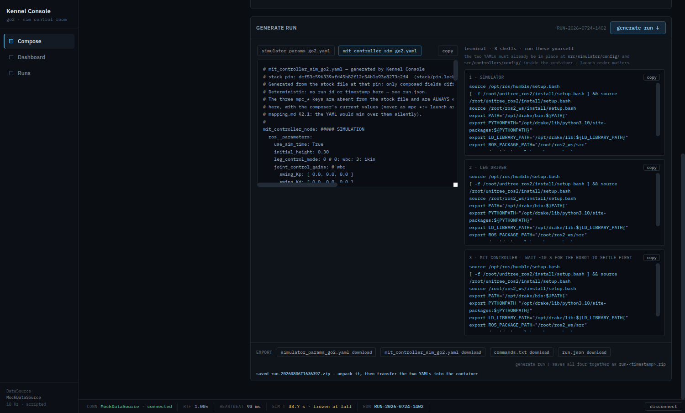

# Getting the generated artifacts out of the browser

Implementation record for
[issue #19](https://github.com/alius-git/kennel/issues/19) — one **Generate
run** click yields a folder of files that
[#20](https://github.com/alius-git/kennel/issues/20) pushes into the VM without
edits.

Consumes [`generate.md`](generate.md)
([#18](https://github.com/alius-git/kennel/issues/18)) — the two YAMLs and the
launch block this writes out are its output, unchanged. Pin:
`dcf53c596339afd45b82f12c54b1e93e8273c2f4`
([`stack/pin.lock`](../stack/pin.lock)).

Verified 2026-08-06 — 55 checks, [`verify-export.sh`](verify-export.sh).

> **Bypass note (tracking-issue [#4](https://github.com/alius-git/kennel/issues/4)).**
> File download plus manual placement stands in for the run-manifest store and
> the designated workspace directory. `run.json` is deliberately minimal —
> composed choices, pin SHA, timestamp — and is *not* the Run Manifests & Config
> Schema foundation.

## 1. What a run folder contains

`run-<timestamp>/`, four files:

| File | Bytes come from | Deterministic? |
|---|---|---|
| `simulator_params_go2.yaml` | `emitSimYaml(cfg)` — generate.md §1.1 | yes |
| `mit_controller_sim_go2.yaml` | `emitCtrlYaml(cfg)` — generate.md §1.2 | yes |
| `commands.txt` | `emitCommandsTxt()` — the three shells of generate.md §3 | yes |
| `run.json` | `emitRunJson(cfg, runId, stamp)` | no — carries the stamp |

The first three are byte-for-byte reproducible from the composer state alone.
Only `run.json` moves between two exports of the same configuration, and only in
`run`, `generated_at` and `run_id` (§4, group 6).

## 2. The four decisions

### 2.1 The bytes come from the emitters, never from the DOM

Every download serializes the string `emit*()` returned, the same call that
feeds the on-screen pane. Reading `pre.textContent` back instead would hand the
exporter whatever the browser did to the whitespace on the way in and out — the
"no browser mangling" item in the issue is exactly that risk. `artifacts()`
builds all four in one place, so the archive and the per-file buttons cannot
disagree about what a run contains.

The verification takes the opposite route on purpose: it compares the file on
disk against the *rendered pane*, not against the generator (§4, group 1). The
two must agree, and asserting it from the far side of the DOM is the only way to
catch a mangling that happens in between.

### 2.2 A store-only ZIP, hand-rolled

A browser cannot write a directory — `a.download` strips path separators — so
the `run-<timestamp>/` convention travels as `run-<timestamp>.zip` whose four
entries carry that prefix.

- **Hand-rolled** (~60 lines: CRC-32 table, local headers, central directory,
  EOCD) because the console must work with no network at all
  ([`serve.md`](serve.md)), which rules out pulling in JSZip. The verify suites
  assert zero non-localhost requests and would catch a regression here.
- **Method 0 (STORED)** is not a shortcut, it is the point: the YAML bytes sit
  in the archive uncompressed and literal, so `unzip` + `cmp` against the
  individually downloaded file is a real byte-fidelity check rather than a test
  of the inflate implementation. Confirmed against the system `unzip`, not only
  Python's `zipfile`.
- **No zip64.** These are kilobytes. A run folder over 4 GB would need a
  different writer, and would fail loudly rather than silently truncate.

**Rejected:** the File System Access API, which would give a real folder.
Chrome-only, gated on a permission dialog, and unverifiable in the headless
harness — three reasons the demo cannot depend on it.

### 2.3 `commands.txt`, not `commands.sh`

The three launches block and belong in three separate terminals
([`stack/launch.md`](../stack/launch.md) §1.1). A `.sh` would imply sequential
execution and strand the operator on the first command; the `#`-prefixed form
states the shape instead. The file repeats the precondition the UI shows — the
two YAMLs must already be at `src/simulator/config/` and
`src/controllers/config/` inside the container — because by the time someone
reads the file, the UI that said so is gone.

### 2.4 The stamp is taken at the click, and nowhere else

`stampNow()` runs when a download is requested, never during render. Two
consequences worth stating:

- **#18's determinism is untouched.** The YAML headers still carry no timestamp
  and no run id (generate.md §2.2), which is what makes byte-compare
  generated-against-generated a usable contract. `commands.txt` is deterministic
  for the same reason. The stamp lives in `run.json`, the folder name and the
  archive's entry mtimes — the three places that are *about* the run rather than
  about the configuration.
- **The name shown equals the name downloaded.** The composer re-renders at
  10 Hz from the mock DataSource; a stamp computed per render would spin the
  displayed filename between reading it and clicking. After a Generate the strip
  reports the name that actually landed.

Downloading `run.json` on its own stamps at *that* click, so it says when it was
asked for. The archive is the bundle whose four files share one stamp; that is
the artifact #20 consumes.

## 3. `run.json`

```json
{
  "run_id": "RUN-2026-0724-1401",
  "run": "run-20260806T163603Z",
  "generated_at": "2026-08-06T16:36:03Z",
  "pin": "dcf53c596339afd45b82f12c54b1e93e8273c2f4",
  "choices": {
    "world_urdf": "src/common/model/urdf/terrain.urdf",
    "world_fix_link": "plane_base_link",
    "simulator_realtime_rate": 1,
    "publish_quad_state": true,
    "mpc_solver": "PARTIAL_CONDENSING_OSQP",
    "mpc_hpipm_mode": "SPEED",
    "mpc_condensed_size": 5
  }
}
```

- **`choices` holds the seven fields the composer owns**, under their
  [`stack/mapping.md`](../stack/mapping.md) names rather than the composer's
  internal ones, so a reader can grep `run.json` against the YAMLs directly. Not
  `flatten(cfg)`: that carries the out-of-scope stages too, and recording a
  placeholder value for a stage held at stock would be a fresh dishonesty of the
  kind [#17](https://github.com/alius-git/kennel/issues/17) removed.
- **`simulator_realtime_rate` reads `1`, not `1.0`.** JSON has no int/float
  distinction. The ROS type lives in the YAML, where it matters and where §4
  group 5 asserts it survives parsing; `run.json` is provenance, not a config
  the stack loads.
- **`run_id`** is the manifest id the Runs view already uses. Its
  `RUN-2026-0724-` prefix is prototype furniture that predates this issue and is
  left alone.
- Nothing else. No file hashes — fidelity is the verify harness's job, and a
  hash in the file it describes invites the reader to trust it unchecked.

## 4. Verification

```bash
./kennel_console/verify-export.sh      # 55 checks — this issue
./kennel_console/verify-generate.sh    # #18 — still green (46)
./kennel_console/verify-scope.sh       # #17 — still green
./kennel_console/verify-serve.sh       # #16 — still green
```

Downloads are real: Chrome is told to write into a throwaway directory
(`Browser.setDownloadBehavior`, falling back to the deprecated `Page.` variant on
older builds) and the assertions run on the bytes that land there. Needs no
`dfki-quad` clone — template provenance is verify-generate.sh's job.

| Group | Asserts |
|---|---|
| 0 · Surface | A download button for each of the four artifacts; the Generate button |
| 1 · Fidelity | Each artifact downloads; the two YAMLs are **byte-identical to the rendered panes**; no CRLF, no BOM, trailing newline, valid UTF-8; the controller file is correct even when the simulator tab is the one on screen |
| 2 · Archive | One Generate click → one `run-<stamp>.zip`; every CRC-32 checks out; four entries, all under `run-<stamp>/`; **every entry STORED**; archived bytes == separately downloaded bytes == the panes |
| 3 · `run.json` | Exactly the five keys; pin SHA; ISO-8601 UTC; `run` derived from `generated_at` and equal to the folder actually used; exactly the seven choices |
| 4 · `commands.txt` | The three UI blocks verbatim; package-form launches; source chain and `cd` in each; **no** `mpc_*:=`, `safe_start`, `config:=` or path invocation; precondition stated; not a script |
| 5 · Composition | A non-stock solver **and** map reach all three files; `choices` equals what a YAML parser recovers from the exported YAMLs; ROS types survive the trip through disk |
| 6 · Determinism | Two exports of one state: the three deterministic files byte-identical; `run.json` differs only in `run`, `generated_at`, `run_id` |
| 7 · Network | Zero non-localhost requests |



## 5. Notes for whoever touches this next

- **Generate run no longer jumps to the Runs view.** Its primary outcome is now
  a file on disk, and navigating away from the artifacts you just exported hides
  the one confirmation that matters. The manifest is still staged; the Runs
  entry is one click away.
- **The export strip sits *below* the YAML panes on purpose.** Its buttons are
  labelled with the same filenames as the pane tabs, and
  [`verify-generate.py`](verify-generate.py) clicks tabs by exact text, taking
  the first match in document order. Moving the strip above the panes silently
  redirects those clicks into a download and fails four #18 checks in ways that
  look like generator bugs. [`verify-export.py`](verify-export.py) matches
  export rows structurally instead, so it is immune either way.
- **`COMMAND_BLOCKS` moved to module scope** so `emitCommandsTxt()` and the UI
  read one list. `Component.commands()` now just returns it; the constraints it
  encodes are recorded in generate.md §3 and asserted twice over.
- **The ZIP writer assumes UTF-8 names and sets the flag bit for it** (0x0800).
  Entry names are ASCII today; if a run folder ever carries a non-ASCII name the
  flag is already correct, but the DOS-time fields have two-second resolution and
  no timezone, so `unzip -l` shows the UTC value as if it were local.

## 6. Limits

- **The files have not been pushed into a container.** That is
  [#20](https://github.com/alius-git/kennel/issues/20), and booting the stack on
  them is [#21](https://github.com/alius-git/kennel/issues/21). Everything here
  is byte-level: what the generator produced is what reached the disk.
- **The timestamp is the browser's clock**, unsynchronised and in whatever the
  host thinks UTC is. It orders one operator's runs; it is not evidence.
- **Where the folder lands is the browser's business.** The console cannot
  choose a directory, so #20's script takes a path to an unpacked run folder
  rather than assuming one.
- **Unpacking is a manual step.** A real appliance would write the folder into a
  designated workspace directory; the bypass note above is where that went.

## 7. What this feeds

| Issue | What it takes from here |
|---|---|
| [#20](https://github.com/alius-git/kennel/issues/20) | An unpacked `run-<timestamp>/` with the two YAMLs at known names, `commands.txt`, and `run.json` for provenance — the input its transfer script consumes unmodified |
| [#21](https://github.com/alius-git/kennel/issues/21) | A composed, non-stock run folder to boot the stack on |
| [#27](https://github.com/alius-git/kennel/issues/27) | `commands.txt`, verbatim, for the quickstart |
