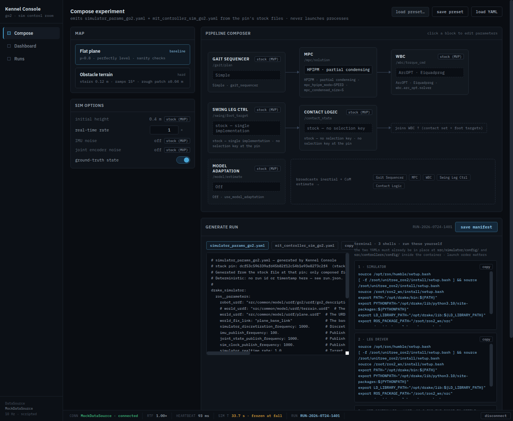

# Generating configs the pinned stack accepts

Implementation record for
[issue #18](https://github.com/alius-git/kennel/issues/18) — **Generate run**
emits a `simulator_params_go2.yaml`, a `mit_controller_sim_go2.yaml` and a
three-shell launch block that the stack at the pin can be started with
unmodified.

Builds on [`stack/mapping.md`](../stack/mapping.md)
([#15](https://github.com/alius-git/kennel/issues/15)) for every key and every
routing decision, [`stack/launch.md`](../stack/launch.md)
([#13](https://github.com/alius-git/kennel/issues/13)) for the command set, and
[`composer-scope.md`](composer-scope.md)
([#17](https://github.com/alius-git/kennel/issues/17)) for the state this
consumes. Pin: `dcf53c596339afd45b82f12c54b1e93e8273c2f4`
([`stack/pin.lock`](../stack/pin.lock)).

Verified 2026-08-06 — 46 checks, [`verify-generate.sh`](verify-generate.sh).
Extended 2026-09-08 for [#68](https://github.com/alius-git/kennel/issues/68)'s
fourth block — **57 checks** (§1.3, §4 group 10).

> **Generated ≠ hand-written.** The console does not compose YAML from a data
> structure. It embeds the pin's own two config files verbatim and substitutes
> only the fields the composer owns. Key order, comments, spacing and even
> upstream's duplicated `manually_step_sim` survive untouched, so a human
> diffing a generated file against upstream sees the composed choices and
> nothing else. With all-stock choices the generated simulator file is
> **byte-identical to the pin's**, modulo the header — asserted, not asserted-ish
> (§4, group 2).

## 1. What is substituted

### 1.1 `simulator_params_go2.yaml`

| Composer choice | Key(s) | Written as | mapping.md |
|---|---|---|---|
| Map | `world_urdf` **and** `world_fix_link` | quoted paths | §1.1 |
| Real-time rate | `simulator_realtime_rate` | double — always `N.0` | §1.2 |
| Ground-truth state | `publish_quad_state` | bare `true`/`false` | §1.2 |

**The map writes two keys, not one.** `world_fix_link` names the body the world
is welded to; both offered worlds happen to declare `plane_base_link`, but the
pair is the contract and a third world need not reuse the name.

### 1.2 `mit_controller_sim_go2.yaml`

| Composer choice | Key | Written as | mapping.md |
|---|---|---|---|
| MPC solver | `mpc_solver` | quoted canonical string | §1.3 |
| HPIPM mode | `mpc_hpipm_mode` | quoted | §1.3 |
| Condensed size | `mpc_condensed_size` | bare int | §1.3 |

These three are **absent from the stock file** — they exist only as code
defaults (`mit_controller_node.cpp:67-69`). They are therefore *inserted*, after
`mpc_warm_start`, under a `# --- composed by Kennel Console ---` marker.

### 1.3 The one choice that is in no YAML at all

`disturbances` ([#68](https://github.com/alius-git/kennel/issues/68)) is the
first composer choice that substitutes nothing. The disturbance service is a
**fourth command** — `sim_disturber` is built and installed at the pin and no
launch file starts it ([`mapping.md`](../stack/mapping.md) §4.6) — so the toggle
travels in `commands.txt` and in `run.json` and nowhere else. Off is stock:

| Toggle | `commands.txt` | `run.json` | the two YAMLs |
|---|---|---|---|
| **off** (default) | three blocks, header *THREE shells* — byte-identical to every run composed before this existed | the same seven `choices` | unchanged |
| **on** | header *FOUR shells*; a fourth block, the three above it byte-identical to the off case | an **eighth** key, `disturbances: true`, appended last | unchanged |

```bash
# 4 · sim disturber — the disturbance service (composed: disturbances on). Needs block 1 up; the launcher starts it last
<source chain>
ros2 run simulator sim_disturber --ros-args -p use_sim_time:=true
```

Three properties, each asserted (§4 group 10, [`export.md`](export.md) §4
group 8):

- **A `ros2 run`, never a fourth launch.** `commands.txt` still holds exactly
  three `ros2 launch` invocations, which is what the export suite counts.
- **`use_sim_time` is measured, not decorative.** The node answers the service
  only after sleeping for the requested `time` on its own clock
  (`disturbance_node.cpp:60-63`); at `simulator_realtime_rate: 0.5` a 0.2 s
  request lasts 0.200 **sim** seconds with the argument and 0.100 without. Every
  window in this repo is a sim second.
- **Absent means off.** The key is written only when on, so a `run.json`
  composed today with the toggle off is byte-identical to one composed before
  the toggle existed — which is what makes #68's *"a run composed with it off is
  unchanged byte for byte"* an assertion rather than a hope.

### 1.4 Types are not cosmetic

`simulator_realtime_rate` is declared `double`. Writing `1` instead of `1.0`
hands ROS an int for a double parameter, so the emitter forces a decimal point.
Symmetrically `mpc_condensed_size` is declared `int` and must carry no decimal
point, and the two string parameters are quoted. §4 group 3 asserts the written
forms and group 8 asserts what a real YAML parser recovers from them.

## 2. The two decisions #18 asked us to make

### 2.1 All three MPC keys are always emitted

The alternative was to emit only the keys the chosen solver consumes. Always-emit
won on three grounds:

1. **It cannot collide with a launch argument**, because we emit none (§3).
2. **It keeps the acceptance criterion literal.** "Differs from stock only in
   that choice" holds as a one-line diff; under emit-when-consumed, switching
   HPIPM → OSQP would also *delete* the `mpc_hpipm_mode` line, so a one-choice
   change would move two lines.
3. **It states true values.** All three are `declare_parameter`ed regardless, so
   writing `mpc_hpipm_mode: "SPEED"` for a qpOASES run records the value that
   parameter genuinely holds.

The honesty cost is paid in the file itself: the inserted block names which keys
the chosen solver actually reads, per the 2×2 in
[`composer-scope.md`](composer-scope.md) §2 —

```yaml
    # --- composed by Kennel Console (absent from the stock file) ---
    # PARTIAL_CONDENSING_OSQP reads mpc_condensed_size; mpc_hpipm_mode is declared but unused.
    mpc_solver: "PARTIAL_CONDENSING_OSQP"
```

and because #17 hides the fields a solver does not consume, an unused value is
guaranteed to be the code default rather than a stale edit.

### 2.2 Headers are deterministic — no run id, no timestamp

The same composer state produces byte-identical files across sessions. That is
what makes "byte-compare generated against generated" (mapping §4.5) a usable
contract rather than a diff of noise, and it lets §4 assert determinism directly.
Run provenance — id, timestamp, composed choices — belongs in `run.json`
([#19](https://github.com/alius-git/kennel/issues/19)); the run id remains
visible in the UI. Each header carries the **pin SHA**, as the issue requires.

### 2.3 Canonical form

Per mapping §4.5, the generated file is the canonical form and comparisons are
generated-against-generated, never against upstream stock. Two consequences
worth stating:

- **Upstream's duplicated `manually_step_sim` (lines 12 and 25) is kept.** The
  loader takes the last; keeping both makes the diff against upstream minimal,
  which is the property this design is for.
- The generated file ends with a newline; the pin's simulator file does not.

## 3. The command block

Three shells, in launch order (`launch.md` §1.1 — the leg driver is not
optional; without it the controller blocks on
`Waiting for leg driver service`):

```bash
<source chain>                                  # verbatim, ends with cd /root/ros2_ws
ros2 launch simulator simulator.launch.py sim:=go2
ros2 launch drivers leg_driver_launch.py sim:=go2
ros2 launch controllers mit_controller.launch.py sim:=go2
```

Every constraint here is a recorded finding, not a preference:

| Property | Why | Source |
|---|---|---|
| **No `mpc_*:=` arguments at all** | The YAML silently wins over `-p` overrides; emitting both routes disables the argument invisibly | mapping §2.1 **[runtime]** |
| `<package> <file>` form, never a path | The launch files parse `sys.argv[4:]`; a path invocation shortens argv and every argument vanishes | mapping §2.2 **[runtime]** |
| Full source chain in every shell | Non-interactive shells read no `.bashrc` | launch.md §2 |
| Ends in `/root/ros2_ws` | Config paths are resolved against the process working directory | mapping §2.3 **[runtime]** |
| `setup_ulab_workspace.bash` | It is the **sim** setup despite the name; the go2 one pins CycloneDDS to a NIC absent from the guest | launch.md §2.1 |
| No `safe_start:=false` | The 10 s settle is the intended path, not a flag to paper over launch order | launch.md §1.2 |
| No `config:=` | No such argument exists at the pin — which is *why* composed values travel as files | mapping §4.2 |

The source chain is embedded verbatim from
[`stack/known-good/tools/prelude.sh`](../stack/known-good/tools/prelude.sh) and
was confirmed to match launch.md §2 line for line before embedding. It already
ends with `cd /root/ros2_ws`, so no separate `cd` is emitted.

The block is prefaced in the UI by its precondition: **the two YAMLs must
already be in place** at `src/simulator/config/` and `src/controllers/config/`
inside the container. Putting them there is
[#20](https://github.com/alius-git/kennel/issues/20); the paths work because
`colcon build --symlink-install` makes the installed configs symlinks back into
the source tree (mapping §5), so no rebuild is needed.

## 4. Verification

```bash
./kennel_console/verify-generate.sh     # 46 checks
./kennel_console/verify-serve.sh        # #16 — still green
./kennel_console/verify-scope.sh        # #17 — still green
```

The console is driven for real: choices are made through the UI and the panes
are read back from the DOM, so what is asserted is what a user would copy.

| Group | Asserts |
|---|---|
| 0 · Provenance | The embedded templates hash to the pin's files (sha256 below) — **runs without the clone** |
| 1 · Determinism | Regenerating twice yields identical bytes; no timestamp or run id; pin SHA present |
| 2 · Stock fidelity | Generated simulator body **byte-identical** to the pin's file; controller body is stock plus only the composed block; the three MPC keys really are absent from stock |
| 3 · Types | `1.0` double, bare int, quoted strings |
| 4 · Map | Both keys written |
| 5 · One-choice diff | Solver change = one line (+ its note); map change = one line; line counts constant; a controller choice leaves the simulator file untouched |
| 6 · Command block | Three shells; package-form launches; leg driver present; source chain and cwd in each; **no** `mpc_`, `safe_start`, `config:=`, absolute-path launch, or fictional package names |
| 7 · Round-trip | The generated pair pastes back, loads, and regenerates to the same bytes |
| 8 · YAML validity | Both files parse; composed keys land inside `ros__parameters`; types survive parsing; the duplicate key collapses to stock's value |
| 9 · Network | Zero non-localhost requests |
| 10 · The fourth block (#68) | The toggle off emits three shells and none of them the disturber; on emits four, and **the first three are byte-identical to the three it emitted off**; block 4 is a `ros2 run` with the source chain and `use_sim_time`, never a fourth launch; toggling back off restores exactly those three |

Template provenance, for auditing without the gitignored `dfki-quad` clone:

| File at the pin | sha256 |
|---|---|
| `ws/src/simulator/config/simulator_params_go2.yaml` | `eb31c744941a68b27e7452f4c8724cf740eb1df88041ee0530bc959eef0b1942` |
| `ws/src/controllers/config/mit_controller_sim_go2.yaml` | `406830007e94597697855ab6d10b4961ef3b52b8cc69536bbe4df1610eef2923` |

Group 2 needs the clone and **SKIPs** without it; group 0 covers the same
property from the other direction and always runs.



## 5. Notes for whoever touches this next

- **Substitution fails loudly.** `subLine`/`insertAfter` throw when an anchor is
  missing rather than returning the text unchanged. A silent no-op would ship a
  stock config wearing a composed header — the same shape of invisible failure
  mapping §2.2 records for launch arguments.
- **The toy YAML parser is gone.** It flattened inline comments into values and
  could not represent multi-line arrays, so pointing it at a real config would
  have produced wrong values quietly. `readKey()` reads the seven fields the
  composer owns and nothing else.
- **The simulator template contains backticks** (line 12's comment references
  `` `/step_sim` ``), so the embedded literal escapes them. Regenerating the
  templates by hand without escaping breaks the page.
- **A commented-out `world_urdf: terrain.urdf` line exists in stock**, above the
  live one. Anything matching on `world_urdf` must anchor to the live key, or it
  will read the comment.

## 6. Limits

- **The stack has not been booted on these files.** That is
  [#21](https://github.com/alius-git/kennel/issues/21), and it is where the
  issue's "the stack boots on it" criterion is settled. Everything here is
  static verification: byte-level fidelity to the pin, ROS-type correctness, and
  YAML validity.
- **Only the MVP-scope fields are substituted** — by construction, since #17
  makes them the only ones selectable.
- ~~**The files are on screen, not on disk.**~~ Lifted by
  [#19](https://github.com/alius-git/kennel/issues/19) — Generate run writes the
  pair, the command block and a `run.json` out as a `run-<timestamp>/` folder.
  See [`export.md`](export.md).
- **Copy buttons rely on the clipboard API**, which browsers gate on a user
  gesture; the panes are selectable as a fallback.

## 7. What this feeds

| Issue | What it takes from here |
|---|---|
| [#19](https://github.com/alius-git/kennel/issues/19) | The two artifacts and the command block to write out as files; `run.json` carries the provenance deliberately kept out of the headers (§2.2). Done — [`export.md`](export.md) |
| [#20](https://github.com/alius-git/kennel/issues/20) | The two canonical config paths in §3, and the fact that no rebuild is needed |
| [#21](https://github.com/alius-git/kennel/issues/21) | A composed, non-stock pair to boot and prove the values took effect |
| [#27](https://github.com/alius-git/kennel/issues/27) | The command block, verbatim, for the quickstart |
