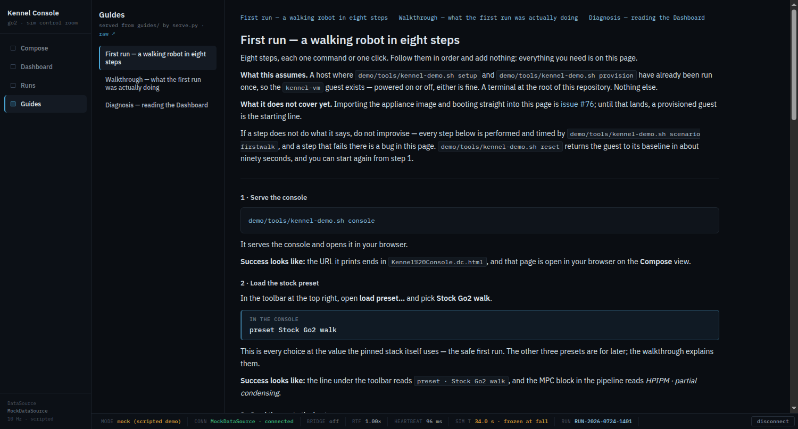

# The guides, served and rendered from the console

Implementation record for
[issue #73](https://github.com/alius-git/kennel/issues/73) — Kennel/guides,
part 1: the first-run checklist, the walkthrough and the diagnosis primer,
shipped in the repository, linked from the console shell, and — for the
checklist — *performed* rather than only read.

[`plan/design.md`](../plan/design.md) §3 names Kennel/guides as one of the four
applications and says its documents are *"shipped in-image and linked from the
console shell"*. Before this, none of it existed.

The three documents are [`guides/`](../guides/); this record is about how they
reach a browser and how the checklist is kept honest. Their content is their
own, and `demo/scenarios.md` §6 records what performing the checklist measured.

Verified 2026-09-09 by [`verify-guides.sh`](verify-guides.sh) — 62 checks, no
VM — and by `kennel-demo.sh scenario firstwalk` on the live guest.

## 1. What is delivered

| Artifact | Purpose |
|---|---|
| [`guides/first-run.md`](../guides/first-run.md) | the checklist: eight steps, each one command or one click, each with what success looks like |
| [`guides/walkthrough.md`](../guides/walkthrough.md) | compose → send → run → watch → drive → reset → the record, in user language |
| [`guides/diagnosis.md`](../guides/diagnosis.md) | one section per Dashboard panel: the number, the threshold, and what to do |
| [`guides/img/`](../guides/img/) | 15 images, all real renders already in this repo |
| [`guides/tools/make-img.sh`](../guides/tools/make-img.sh) | builds them; its table is the record and `--check` is what the suite runs |
| `--guides` in [`serve.py`](serve.py) | the three routes and the renderer |
| the shell's **Guides** item | the fourth nav item, when the server has guides |
| [`verify-guides.sh`](verify-guides.sh) + [`.py`](verify-guides.py) | 62 checks, no VM |
| `demo/tools/scenario-firstwalk.sh` | s001 as a driver verb — [`demo/scenarios.md`](../demo/scenarios.md) §6 |



## 2. The route, and why it cannot exist under plain `http.server`

`guides/` sits **outside** this server's docroot. `python3 -m http.server
--directory kennel_console` therefore cannot serve a guide however it is asked,
and the console's Guides item exists exactly when `serve.py` does. That is the
same feature-detection rule [`send.md`](send.md) §2.1 and [`teleop.md`](teleop.md)
§7 follow — but held *by construction* rather than by a flag: there is no build
that turns it on, and nothing to get out of step.

Four surfaces:

```
GET /api/health           gains "guides": [{"name": "first-run.md", "title": "…"}] | null
GET /guides/<name>.md     the file's own bytes, text/markdown
GET /guides/<name>.html   the same file rendered — what the console frames
GET /guides/img/<f>.png   one image out of guides/img/
```

`guides` is `null` when there is no directory — the shape `bridge` and `meshcat`
already use for absent — and the list is read **per request**, like the side
channels, so a guide edited while the console is open shows on the next click.
The reading order is fixed (`first-run`, `walkthrough`, `diagnosis`) with any
other `*.md` alphabetically after, so [#77](https://github.com/alius-git/kennel/issues/77)'s
safety gate and hardware notes will land at the end with no code change.

**The allow-list.** Each segment is matched in full — `^[a-z0-9][a-z0-9-]*$` for
a guide, `…\.png$` for an image — and the path is then **built** from what
matched. No separator, dot or absolute path can satisfy either pattern, which is
the reasoning `_run_file` already applies to a run folder: nothing is sanitised,
because nothing untrusted is ever joined to a path. §5 sends eight probes.

> **A trap worth writing down.** The first traversal probes appeared to pass and
> proved nothing: `curl` collapses `..` in a URL path *before it sends*, so
> `/guides/../serve.py` leaves the client as a request for `/serve.py` — which
> the static handler serves quite correctly out of the docroot. The suite would
> have been reporting the client's normalisation as the server's behaviour. Send
> these with `urllib`, or with `curl --path-as-is`.

## 3. The renderer is in `serve.py`, not in the page

The console's `.dc.html` runtime offers its template no raw-HTML binding, and the
page paints only canvases through refs. Putting a markdown renderer in the page
would mean introducing the one thing it has never had — a path from text to
markup — into the artifact `plan/` refers to.

So it renders here, where `html.escape` lives, and the page **frames** the result
exactly as it frames Meshcat ([`dashboard.md`](dashboard.md) §1.1). The frame is
same-origin by construction, so a guide's own links navigate inside it.

**The subset is fixed**: headings (with ids), paragraphs, `-` and `1.` lists,
`>` quotes, `|` tables, fenced code, inline code, bold, emphasis, links, images.
Anything it does not know becomes a paragraph. Two rules do the work:

- **Escape first.** Code spans are lifted out, then the whole line is escaped,
  then the inline rules run on escaped text. A guide can therefore show the
  markup it is teaching without the renderer eating it, and nothing a guide
  contains can become an element. §5 group 2 proves it with a fixture written
  for the purpose.
- **Links are classified, not passed through.** `name.md` → `name.html` (the
  frame navigates within the guides); `http(s)://` → a new tab with
  `rel="noopener"`; anything else relative → rendered as a **code span**. A repo
  path is a path to type, not a link the console could serve, and rendering it
  as a link would give a newcomer a 404 inside the frame that looks like a
  broken guide.

**A ` ```click ` fence renders as a callout**, not as a code block — because it
is not something to paste into a terminal. It is the same fence
`scenario firstwalk` executes; see §4.

## 4. One file, read by a person and executed by a verb

`first-run.md`'s steps carry their action in a fence: ` ```bash ` for a command,
` ```click ` for something done in the console. `kennel-demo.sh scenario
firstwalk` reads those fences and performs them, and asserts that everything it
executed came from that page — which is s001.firstwalk step 8, *"every executed
command string came from the checklist or the console's generated block"*, as a
set difference rather than as a claim.

The success line is read out of the file too: the first backticked literal on a
step's `**Success looks like:**` line must appear in that step's transcript or on
the page. **If the prose promises a line the tool does not print, the verb
fails** — and that failure is a defect in the checklist, fixed in the prose. It
is [`demo/dry-run.md`](../demo/dry-run.md)'s method with the friction log made
mechanical.

The alternative was a separate machine-readable checklist beside the human one.
Two files drift; this one cannot, because the page a newcomer reads *is* the
program. What it costs is a convention in the prose, stated in the guide's own
footer table.

## 5. Verification

```bash
./kennel_console/verify-guides.sh          # 62 checks, no VM
guides/tools/make-img.sh --check           # the images, against the table
demo/tools/kennel-demo.sh scenario firstwalk   # the checklist itself, on the guest
```

| Group | Asserts |
|---|---|
| 1 | `/api/health` lists the three in reading order, each titled by its own first heading; `GET /guides/first-run.md` is the file on disk **byte for byte**, `text/markdown`, `no-store` |
| 2 | the rendered page: one `<h1>`; every bash fence is a `<pre>` holding its text byte for byte; every click fence is a callout; the vocabulary table is a table; no `<script>`; every image the primer references answers 200 as `image/png`; a guide link points at `.html`; **and a fixture guide containing `<b>&</b>` comes back escaped** |
| 3 | eight refusals, sent raw: `..` in three shapes, a percent-encoded one, a capitalised name, a wrong extension, a missing extension, a non-PNG image. Plus: a server started with `--guides` at a directory that does not exist reports `guides: null` and serves nothing |
| 4 | the page under `serve.py`: **four** nav items with `Guides` appended last, Compose still the landing view; the list shows the three titles; the frame's `src` is `/guides/first-run.html` **and serve.py's own log shows it fetched**; the frame's `<h1>` is the guide's title (same-origin, so it is readable); picking another guide moves the frame and its heading; a link inside the frame navigates and is logged; `raw ↗` points at the `.md` |
| 5 | **the checklist is executable**: every bash fence is one line naming a verb `kennel-demo.sh help` lists; every click line names a step `scenario-page.py` implements (or `hold`); the file ends where s001 does; every verb any guide names exists; no guide tells anyone to type a `ros2 launch` line; no guide names a package that does not exist at the pin |
| 6 | every image a guide references is in `make-img.sh`'s table, present, and the size the table claims (the table is parsed out of the script) |
| 7 | the page under plain `http.server`: **three** nav items, no `Guides`, no request to `/guides/` at all, no uncaught errors |
| 8 | zero non-localhost requests on either origin |

**The witness for what the browser fetched is serve.py's own log**, never the
`src` attribute: an iframe nobody requested proves the string and not the pane.
That is [`dashboard.md`](dashboard.md) §4's rule, applied to a second frame.

## 6. The images

Every picture in the guides is a **real render already in this repository** —
produced by a suite or a scenario verb against the live stack. Nothing is drawn
or staged: a guide illustrating itself with an invented screenshot would be
teaching a console that does not exist.

[`make-img.sh`](../guides/tools/make-img.sh) has one table with two kinds of row.
**COPY** duplicates a whole page byte for byte, so git stores no new blob for it
(the deck under `slides/` does the same). **CROP** cuts one panel out with PIL at
a box measured once, and the target's size is re-asserted on every build — so a
re-render at a different window size fails there rather than quietly producing a
picture of the wrong panel.

Seven of the fifteen are panel crops from `demo/evidence/s003-diagnose/`: a run
that really degraded and really fell, which is what the diagnosis primer is about.

## 7. Limits

- **The guides are served from the repository, not from the image.** `design.md`
  §3 says *shipped in-image and versioned in the manifest*; the manifest is
  [#74](https://github.com/alius-git/kennel/issues/74) and the image is
  [#76](https://github.com/alius-git/kennel/issues/76). Today `serve.py` reads
  `guides/` out of a checkout, and `/api/health` reports what it found.
- **The checklist starts at a provisioned guest**, not at an imported appliance.
  s001's steps 1–2 are the OVA import; that is #76's. The guide says so in its
  own words.
- **The markdown subset is fixed**, and unknown syntax becomes a paragraph. It
  is enough for these three documents and is not a general renderer.
- **No search, no table of contents beyond the nav strip.** Three documents did
  not need one.
- **The safety gate and the hardware notes are not here** —
  [#77](https://github.com/alius-git/kennel/issues/77). They will land in
  `guides/` and appear in the list without a code change, but the *structural*
  gating s010.handoff asserts (hardware material reachable only from a completed
  gate record) is not built and this route does not pretend to it: every guide
  present is served.
- **One operator, and an agent.** Deviation D1 of `demo/dry-run.md` again: the
  checklist has been performed by a script, not by a person with a mouse. A
  person should still perform it once, and the friction that only a person can
  report is still open.

## 8. What this feeds

| Issue | What it takes from here |
|---|---|
| [#77](https://github.com/alius-git/kennel/issues/77) | the route, the list's ordering, and the renderer — the gate and the hardware notes are two more files in `guides/` |
| [#74](https://github.com/alius-git/kennel/issues/74) / [#76](https://github.com/alius-git/kennel/issues/76) | `guides/` is a directory to ship in-image and to version in the manifest |
| [#23](https://github.com/alius-git/kennel/issues/23) / [#24](https://github.com/alius-git/kennel/issues/24) | `scenario firstwalk` is s001 as a re-runnable test, which is what a discoverable `test/` needs to call |
| [#26](https://github.com/alius-git/kennel/issues/26) | the limits above: guides not in-image, the gate not structural |
