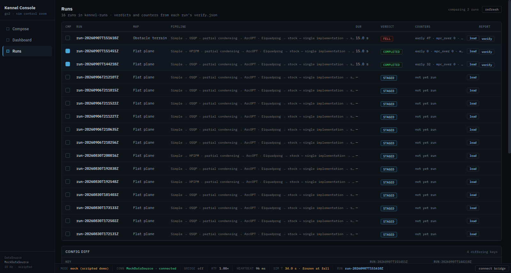

# Real run records — the verify report lands in the run folder

> Implementation record for [issue #64](https://github.com/alius-git/kennel/issues/64).
> The Dashboard half of the same pass is [`dashboard.md`](dashboard.md).
>
> One sentence: `kennel-verify.sh` has always written a full report and the
> driver has always read only its exit code, so the Runs view had nothing real
> to show and listed five invented runs instead — this is the report travelling
> from the container to the run folder, to `/api/runs`, to the table.



Measured on 2026-09-07 against the live guest (`kennel-vm` at `192.168.122.32`,
pin `dcf53c5`).

## 0. What was wrong

Three things, and they compound:

- **`kennel-verify.sh` wrote its report to `/tmp/kennel-verify` on the guest**
  and nothing ever read it back ([`verify.md` §1](../stack/verify.md)).
  `kennel-demo.sh verify` (line 1178) took the exit code and discarded the rest.
- **The Runs view listed `SEED_RUNS`** — five fictional manifests, complete with
  `RUN-2026-0718-1142 … verdict fell` and invented counters, shown in the same
  table and the same badges as anything real. A run an operator had actually
  sent appeared as `staged · not yet run` and stayed that way forever, because
  nothing could ever make it say anything else.
- **s005.compare and s006.reproduce both need real records** and had none.

## 1. The report

`kennel-verify.sh` now writes `report.json` beside `report.txt`. Two halves,
each where the numbers already are:

- **`check.py` writes `metrics.json`** at the end of each phase — the floats it
  already holds: `vx_mean`, `dx`, `sim_window`, the z quantiles, `tilt_max`,
  `tilt_over_frac`, `belly_hits`, the gait signature, and the heartbeat counters
  first/last/delta. It is the one place those exist as numbers; the host
  re-deriving them by parsing the `measured` prose would be a second, weaker
  copy.
- **The verdict block assembles `report.json`** from `results.psv` and
  `metrics.json`.

```json
{ "schema": "kennel-verify/1",
  "verdict": "completed", "exit": 0, "pass": 10, "fail": 0,
  "finished_at": "2026-09-07T16:00:47Z",
  "run": "run-20260907T144210Z", "pin": "dcf53c59…",
  "expect_solver": "PARTIAL_CONDENSING_OSQP",
  "active_solver": "PARTIAL_CONDENSING_OSQP",
  "solver_log_line": "[mitcontrollernode-1] Set osqp linear system solver to qdldl",
  "gait": "WALKING_TROT",
  "windows_sim_s": {"observe": 5.0, "settle": 5.0, "trot": 15.0},
  "knobs": { … the 19 thresholds in effect … },
  "checks": [ {"n": 1, "name": "node-graph", "status": "PASS",
               "observable": "ros2 node list", "measured": "…", "required": "…"}, … ],
  "metrics": { … },
  "headline": {"early_contacts": 3, "mpc_overtime": 0, "wbc_overtime": 0,
               "mpc_fail": 0, "wbc_fail": 0} }
```

**`report.txt` is untouched.** It is what an operator reads and what every
evidence file in this repo quotes; a machine-readable sibling is an addition,
not a replacement.

**The verdict mapping**, defined once and in this order:

| Condition | Verdict |
|---|---|
| check 9 (`no-fall`) failed | `fell` |
| check 7's solver-fail deltas > 0 | `solver-failed` |
| exit 0 | `completed` |
| otherwise | `unhealthy` |
| exit 2 — could not even look | *nothing is written* |

A fall outranks a solver failure because a run that fell **is** the finding, and
the solver counters are how it got there. Exit 2 files nothing and the driver
says so: an old `verify.json` left in place would be a lie about a run that
never ran.

`headline` is check 7's **deltas** over the measured window, not the absolute
counters — those are cumulative since the controller started and mostly say how
old the session is ([`verify.md` §2](../stack/verify.md), check 7).

## 2. Getting it into the run folder

`kennel-demo.sh verify` copies `report.json` → `<run>/verify.json` and
`report.txt` → `<run>/verify.txt`. The run it belongs to is resolved in two
steps, because `verify` is legitimately run both ways:

| Invocation | The run |
|---|---|
| inside `run` or `all` | `APPLIED_RUN`, set by the transfer phase — the run the stack was just launched on |
| on its own | the **guest's** own marker, `~/kennel-staging/current-run`, which `guest-apply-config.sh` writes and `status` already reads |
| neither resolves | nothing is filed, and the driver says where the report is instead |

**`run.json` is never opened for writing.** It is the composition the console
exported ([`export.md`](export.md)), the export suites assert its exact five
keys, and a verdict is not part of a composition. The report is a sibling file.

`KENNEL_RUN` and `KENNEL_PIN` join the recipe's passthrough environment so the
report says which run and which revision it is a report *of*.

## 3. Serving it

`serve.py` gains one endpoint and two fields:

| | |
|---|---|
| `GET /api/runs` | each run now also carries `run_id` and `choices` (from `run.json`) and `verify` — a **summary** of the report: verdict, pass/fail, `active_solver`, `headline`, `sim_window`, and each check's `n`/`name`/`status` |
| `GET /api/runs/<stamp>/<file>` | one file out of one run folder: the four export artifacts plus `verify.json` / `verify.txt`. Read-only, `localhost`, allow-listed |

Three decisions:

- **A summary, not the report.** The full thing carries every check's measured
  string and the whole metrics block — a table's worth of data per row, for a
  table that shows a badge and five numbers. The rest is one fetch away.
- **The summary carries no key named `run`.** `kennel-demo.sh status` lists run
  folders by `sed`-ing `"run": "…"` lines out of this document (line 1343), so a
  nested one would appear in the driver's output as a run that does not exist.
  The suite asserts the count of `"run"` occurrences equals the number of runs.
- **An allow-list, not a sanitiser.** Both path segments are checked — the stamp
  against `RUN_DIR_RE`, the filename against the set — and the path is then
  *built* from them. Nothing the request says can reach outside the run
  directory, which is the same reasoning the POST endpoint already uses
  ([`send.md` §2.3](send.md)).

## 4. The Runs view

**With a kennel server the table is the host's own run folders.** Rows are the
server's, newest first:

| Column | From |
|---|---|
| `run` | the folder stamp — not `run_id`, which [`export.md` §3](export.md) calls prototype furniture |
| `map`, `pipeline` | `run.json`'s `choices`, through `cfgFromChoices()` and `normalizeCfg()` |
| `dur` | `verify.metrics.sim_window`, in **sim** seconds |
| `verdict` | the report's, or `staged` when there is none |
| `counters` | the report's `headline` |
| `report` | a link to `verify.txt` |

`load` reopens the composition in Compose, rebuilt from `choices` through
`normalizeCfg` — a run folder is untrusted input like any other
([`composer-scope.md` §3](composer-scope.md)).

The table is re-read on entering the view, after a send, and from `refresh` —
never on a timer: a run folder changes when an operator runs something, not at
10 Hz.

### 4.1 The diff

Selecting two runs produces three blocks, and each answers a different question:

- **Config diff** — the differing keys among the six the composer owns. Not
  `flatten(cfg)`, which carries the out-of-scope stages too: a diff row for a
  stage nobody can select is noise about a value nobody set, which is the
  dishonesty [#17](https://github.com/alius-git/kennel/issues/17) removed from
  the composer. When the solver differs, its two dependent keys are shown with
  **which side actually reads them** — `composer-scope.md` §2's 2×2, where
  condensing follows partial-vs-full and HPIPM mode follows the family, and the
  two cut across each other. Measured, comparing an OSQP run against an HPIPM
  one: `mpc.mpc_hpipm_mode (read by run-…151451Z only)`,
  `mpc.mpc_condensed_size (read by both)`.
- **Outcome** — the two verdicts and every headline counter, side by side, from
  the reports. This is what makes s005.compare's *"honestly badged verdicts"*
  readable rather than inferable.
- **Generated YAML** — the two config pairs fetched from the server and compared
  **line by line, positionally**. That is exact here and only here: both files
  are emitted from the same stock template with only composed fields
  substituted, so they have the same lines in the same order by construction
  ([`generate.md` §4](generate.md) group 5). If a future pin makes that untrue
  the lengths differ, and the block says so rather than guessing at an
  alignment.

### 4.2 The seeded runs, and why they stayed

They are shown **only when there is no host to read runs from** — plain
`http.server`, which is Devon's demo — and every one of those rows now carries a
`demo` tag, with the sub-header saying `seeded demo history, no host to read
runs from`.

Deleting them was the other option and it is worse: s007.bridge's mock half is a
console with **no stack at all**, and a Runs view that were empty there would
demonstrate nothing. What was wrong was never that they existed; it was that
they were shown unlabelled, beside real ones, in the same badges.

`verify-scope.py:155` asserts the seeded runs are listed under plain
`http.server`, and it still passes, unmodified.

### 4.3 The status bar's run id

Now the newest run on the host — [#62](https://github.com/alius-git/kennel/issues/62)
asks for exactly that (*"run id = newest of `/api/runs`"*). With no host it stays
the composer's next manifest id, which is what `run.json` will carry.

## 5. Verification

```bash
./kennel_console/verify-runs.sh        # 51 checks, no VM
```

The runs are **composed by driving the console** — three sends through
`serve.py`, each with a different map or solver — never by writing folders
behind its back: what is under test includes the console's own idea of what a
run is. The three verify reports copied beside them are **real**, captured from
`kennel-verify.sh` on the live guest and committed under `fixtures/`.

| Group | Asserts |
|---|---|
| 1 | three runs composed and sent, each with its own choices |
| 2 | `/api/runs` lists each with its `choices` and a verify summary carrying the verdict; **no nested `"run"` key**; the two file endpoints serve; five traversal and unknown-file attempts all `404` |
| 3 | every run on the host is a row; no invented run in the table; the verdicts and the real `headline` counters; the map each was composed on; a report link; a run with no report says `staged`; the status bar's run id is a real one |
| 4 | OSQP vs HPIPM → the solver and its two dependent keys **with which side reads them**, and *not* the map or the rate; the two verdicts and every headline counter; the YAML pair down to the differing lines, which are the solver's and nothing else. A pair differing only in the map → exactly `sim.map` |
| 5 | under plain `http.server`: the seeded history is there, every row says `demo`, the sub-header says there is no host, there is no `refresh`, no errors |
| 6 | zero non-localhost requests |

### 5.1 The report fixtures

| File | Verdict | What it is |
|---|---|---|
| `verify-completed-osqp.json` | `completed` | OSQP, flat plane, `simulator_realtime_rate: 0.5` — `pass=10 fail=0` |
| `verify-completed-hpipm.json` | `completed` | HPIPM partial condensing, flat plane — `pass=10 fail=0` |
| `verify-fell.json` | `fell` | OSQP on the **obstacle terrain** — `pass=7 fail=3` |

The `fell` one is worth a sentence. [`transfer.md` §6.3](../stack/transfer.md)
records that the obstacle terrain does not walk at this pin and fails
*differently on repeat* — trotting in place once, driven backwards the next. The
plan for this issue budgeted a fallback (a damping call inside the trot window)
in case it merely failed to walk rather than falling. It was not needed: the
first attempt tipped the robot over —

```
[FAIL] 9 no-fall -- measured belly_contact=0/14996 samples, z median=0.2926 m,
       max tilt=2.843 rad, tilt over 0.50 in 64.33% of samples
```

— which is `transfer.md` §6.3's second row reproduced a month later, and a
reminder that `belly_contact` stayed **false** through a robot lying at 163° of
roll ([`verify.md` §4.1](../stack/verify.md)).

## 6. Evidence

In [`runs/evidence/`](runs/evidence/):

| File | What it shows |
|---|---|
| `02-run-hpipm.txt` | HPIPM composed in the console and run: `pass=10 fail=0`, verdict `completed` |
| `03-run-terrain.txt` | the same on obstacle terrain: `pass=7 fail=3`, verdict `fell`, on the first attempt |
| `04-api-runs.json` | what `/api/runs` serves for 16 real run folders |
| `04-runs.png`, `04-runs.txt` | the Runs view with three real verdicts and a two-run diff |

and in [`dashboard/evidence/`](dashboard/evidence/):

| File | What it shows |
|---|---|
| `01-run-rate05.txt` | the first `verify.json` ever filed in a run folder |
| `08-leave-green.txt` | `verify` **on its own**, resolving the run from the guest's own `current-run` marker, and what it filed |

## 7. Limits

- **`run.json` is still deliberately minimal** and still not the Run Manifests &
  Config Schema foundation ([`export.md`](export.md)'s bypass note). A verdict
  beside it is not a promotion.
- **One report per run.** A second `verify` of the same run overwrites the
  first: the newest verdict is the record, and the run folder does not become a
  history. s006.reproduce compares two *runs*, not two verifies of one.
- **The diff compares the six composed keys**, not the whole YAML semantically.
  The YAML block is a positional line comparison and says so when the files
  differ in length.
- **`/api/runs` is unauthenticated on `localhost`**, like everything else
  `serve.py` serves ([`send.md` §2.5](send.md)).
- **The console server must be the current one.** `/api/runs`'s new fields come
  from the process `kennel-demo.sh console` started; a server left running from
  before an upgrade serves the old shape, and every row then reads `staged`.
  Found the honest way, on the live guest. `console stop` then `console`.

## 8. What this feeds

| Issue | What it takes from here |
|---|---|
| [#69](https://github.com/alius-git/kennel/issues/69), [#71](https://github.com/alius-git/kennel/issues/71) | a scenario verb can assert a verdict from a file instead of scraping stdout |
| [#72](https://github.com/alius-git/kennel/issues/72) — **done** | named presets have a real history to be compared against; and this suite's group 7 is where their round trip is asserted, because only here is there a real server writing real run folders ([`composer-scope.md`](composer-scope.md) §7) |
| [#24](https://github.com/alius-git/kennel/issues/24) | the Yuruna sequence can read `verify.json` rather than parsing the report |
| [#74](https://github.com/alius-git/kennel/issues/74) | `report.json` already carries the pin; a version manifest is the next field |
