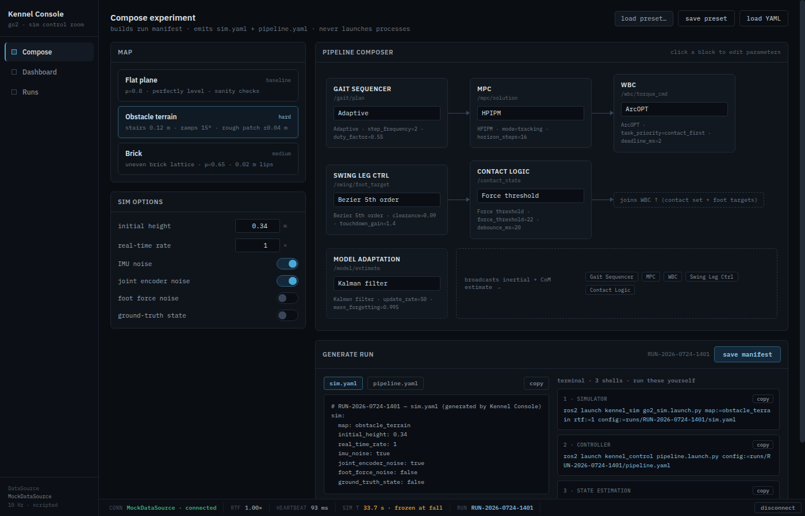

# Serving the console prototype from the host — one command, no network

Implementation record for
[issue #16](https://github.com/alius-git/kennel/issues/16) — the prototype in
`kennel_console/` (`Kennel Console.dc.html` + `support.js`) runs in a browser
from a trivial static server **on the host**, as the MVP's console.

This is the first task of
[Epic #4](https://github.com/alius-git/kennel/issues/4) (the console's
config-generation slice). It delivers the serve surface only: the composer's
scope is [#17](https://github.com/alius-git/kennel/issues/17), real launchable
YAMLs are [#18](https://github.com/alius-git/kennel/issues/18), and file export
is [#19](https://github.com/alius-git/kennel/issues/19). The serve command in §1
is the line the quickstart ([#27](https://github.com/alius-git/kennel/issues/27))
copies verbatim.

Everything below was run end to end on the host on **2026-08-05**, against
prototype files dated 2026-08-04. Evidence: `console-offline-render.png`
(offline, after §3) and `console-offline-before-vendoring.png` (offline, before).

> **Bypass note** (tracking-issue [#7](https://github.com/alius-git/kennel/issues/7),
> [#26](https://github.com/alius-git/kennel/issues/26)):
> [`plan/design.md`](../plan/design.md#1-decisions-locked) §1 specifies the console as a
> **React + TypeScript + Vite + Tailwind SPA**, with its static assets **served
> from inside the VM** and opened from the host browser over a forwarded port.
> This issue delivers the MVP stand-in on both axes: the pre-existing static
> **prototype** stands in for the SPA, and it is served **from the host**, not
> from the guest. The prototype already implements the shape design.md locks —
> Compose / Dashboard / Runs, the status bar, and a `MockDataSource` behind the
> `DataSource` seam — so the bypass is a delivery-path shortcut, not a
> product-contract change. The hard constraint is intact: **the console composes
> configs and prints commands; it never launches a process.**
> *Retirement path:* the `console/` SPA, mock phase first
> ([design.md §3, build-order note](../plan/design.md#3-application-inventory)),
> served from inside the appliance. §5 below is written so that move is a change of docroot, not a
> change of assets.

## 1. The command

From the repository root:

```bash
python3 -m http.server 8000 --directory kennel_console
```

Then open:

```
http://localhost:8000/Kennel%20Console.dc.html
```

Two things about that URL, both deliberate:

- **`%20` is required.** The file name contains a space. It is kept exactly as
  delivered because the prototype is a design artifact, and renaming it would
  fork the thing `plan/` refers to. Browsers escape the space themselves if you
  open the file through the directory listing at `http://localhost:8000/`, which
  is the friendlier route to tell a newcomer about.
- **`localhost`, not `0.0.0.0`.** Nothing here needs to be reachable off the
  host, and the console holds a run manifest store in `localStorage`.

No build step, no `npm install`, no dependencies beyond a Python 3 that is
already a prerequisite of the Yuruna host baseline
([`vm/host-baseline.md`](../vm/host-baseline.md)).

### 1.1 What the driver runs instead (issue #56)

[`kennel_console/serve.py`](serve.py) is the command
[`demo/tools/kennel-demo.sh console`](../demo/tools/kennel-demo.sh) starts:

```bash
python3 kennel_console/serve.py --port 8000 --out ~/kennel-runs
```

It serves this directory exactly as the line above does — same URLs, same
directory listing, the same `%20` — and adds three `localhost`-only `/api/`
endpoints so the console can write its run folder to the host directly, with no
download folder in between ([`send.md`](send.md)). `/api/health` also reports the
rosbridge and Meshcat URLs when `kennel-demo.sh teleop` has discovered them —
read per request, from `<out>/.kennel-bridge`, so a console that is already open
picks them up without a restart ([`teleop.md`](teleop.md)).

It also serves the guides ([#73](https://github.com/alius-git/kennel/issues/73),
[`guides.md`](guides.md)): `--guides DIR` (default the checkout's `guides/`) adds
`/guides/<name>.md`, `/guides/<name>.html` and `/guides/img/<file>.png`, and
lists what it found in `/api/health`. `guides/` is outside the docroot, so this
is the only way a guide reaches a browser -- which is what makes the console's
**Guides** item exist exactly when this server does.

**`python3 -m http.server` is not deprecated by it.** It is still the command
this record proved the offline claim on, still exactly what §2–§5 below assert,
and still the one to use to check that nothing here depends on a live server:
served that way the console feature-detects the absent `/api/`, renders no send
button and no teleop controls, opens no WebSocket, and behaves as it always did. [`verify-serve.sh`](verify-serve.sh) is
run against **both** servers, and takes the server as a knob:

```bash
KENNEL_SERVE_CMD='python3 kennel_console/serve.py --port PORT' ./kennel_console/verify-serve.sh
```

## 2. Offline behaviour — what issue #16 asked, and what was actually true

The issue asked to "confirm it degrades fine without network, or vendor the
fonts", naming Google Fonts as the concern. **The fonts were the lesser half.**

`support.js` bootstraps the page's runtime from a CDN. At
[`support.js` §`src/cdn.ts`](support.js) it pins three unpkg URLs:

| Dependency | Pinned version |
|------------|----------------|
| React | 18.3.1 |
| ReactDOM | 18.3.1 |
| `@babel/standalone` | 7.29.0 |

React and ReactDOM are fetched on **every** page load. So without a network the
console did not "degrade" — **it did not boot at all**: the browser left the raw
`<x-dc>` template in the DOM, 283 unresolved `{{` placeholders and 58
unprocessed `sc-for` / `sc-if` elements, painting nothing but the background
colour. That is `console-offline-before-vendoring.png`.

The fonts were the cosmetic half, as expected: the CSS already falls back to
`system-ui` / `ui-monospace`.

## 3. The fix — vendoring, using the hook that was already there

`support.js` ships its own escape hatch. `cdnScriptFor()` consults
`window.__resources` and prefers a local path when one is registered, falling
back to the CDN URL plus its SRI attribute otherwise:

```js
function cdnScriptFor(url, sri) {
  const res = window.__resources;
  const v = res ? res[url] : void 0;
  return typeof v === "string" && v ? { src: v } : { src: url, integrity: sri };
}
```

So vendoring needs **no change to `support.js`** — only a map declared before
its `<script>` tag. That is the whole edit in `Kennel Console.dc.html`:

```html
<script>
window.__resources = {
  "https://unpkg.com/react@18.3.1/umd/react.production.min.js": "./vendor/react.production.min.js",
  "https://unpkg.com/react-dom@18.3.1/umd/react-dom.production.min.js": "./vendor/react-dom.production.min.js",
  "https://unpkg.com/@babel/standalone@7.29.0/babel.min.js": "./vendor/babel.min.js"
};
</script>
<script src="./support.js"></script>
```

**The keys must match the URLs in `support.js` character for character** — they
are dictionary lookups, not pattern matches. A typo silently reverts that
dependency to the network, which is invisible while you are online. `verify-serve.sh`
step 1 exists to catch exactly that, because it reads the URLs and hashes out of
`support.js` rather than restating them.

### 3.1 Integrity

A local `src` skips the browser's SRI check — `cdnScriptFor` returns no
`integrity` attribute on that branch. The pin is therefore enforced at vendor
time instead: each file was checked against the `sha384-` constant already
beside its URL in `support.js`, and `verify-serve.sh` re-checks on every run.

```bash
openssl dgst -sha384 -binary vendor/react.production.min.js | openssl base64 -A
```

All three matched at the time of writing.

### 3.2 About `babel.min.js` — 3.1 MB that is never fetched

Babel is loaded lazily: `ensureBabel()` runs only when an **external** module has
to be transpiled (`kind === "jsx"`), and the prototype is one self-contained file
with zero external module references. Across every run recorded here the browser
never requested it — the server access log shows React, ReactDOM, the font CSS
and five woff2 files, and no Babel.

It is vendored anyway, deliberately. The point of this work is that the console
**cannot** reach the network, and the retirement path bakes this directory into
an appliance image where a lazy fetch that misses is a field failure rather than
a slow page. 3.1 MB against a multi-gigabyte image is not a trade worth making.
If a later change wants it gone, delete the file *and* its `__resources` key
together, and let `verify-serve.sh` step 2 prove nothing points off-host.

## 4. Fonts

Vendored, rather than left to fall back — the dark-theme IBM Plex look is what
`plan/` locks, and the endgame serves this from inside the appliance anyway.

`vendor/fonts/plex.css` is Google's own stylesheet with the `url()`s rewritten to
relative paths. Only the **latin** and **greek** subsets were kept, which is what
the prototype's glyph inventory needs: latin covers `· — ° ¹ − × … ↑ ±`, and
greek covers `μ ω`. IBM Plex Sans is served as a single variable font file across
weights 400/500/600, so the three identical downloads are stored once.

Four glyphs the prototype uses — `→`, `⁻`, `✓`, `✗` — are in **none** of the six
subsets Google serves for IBM Plex. They already fell back to a system font
before this change, online included; vendoring neither fixes nor worsens that.

## 5. Verification

```bash
./kennel_console/verify-serve.sh          # defaults to port 8000
```

Four steps: SRI of the vendored runtime (hashes read from `support.js`, so they
cannot drift from the pin) → no off-host `src`/`href`/`url()` anywhere the
browser looks → every asset returns 200 → the page renders under
`--host-resolver-rules="MAP * ~NOTFOUND, EXCLUDE localhost"`, which fails all DNS
except localhost. The render check is the load-bearing one: un-booted, the page
keeps its `{{ }}` placeholders, so "Compose experiment present **and** zero
mustaches" separates a booted console from a raw template.

Chrome is optional; steps 1–3 still run without it.

### 5.1 The acceptance criteria, checked

Issue #16 asks for a fresh browser session in which the Compose view works. Each
run below used a throwaway browser profile — empty `localStorage`, empty cache —
with all external DNS blocked:

| Check | Result |
|-------|--------|
| Fresh session, no saved presets | React mounts, 0 unresolved placeholders |
| Compose is the default view | Map picker, Sim options, Pipeline composer, Generate run all render |
| Composition drives the output | Default YAML carries `map: obstacle_terrain` |
| Change a choice — map → Flat plane | YAML re-generates to `map: flat_plane` |
| Change a choice — MPC solver → OSQP | Selection takes, OSQP reflected in the pipeline |
| Dashboard and Runs mount | Both render, return to Compose works |
| Preset round-trip | `save preset` writes `kennel.presets` to `localStorage` |
| Network | **0** non-localhost resource requests |

The MPC-solver row is deliberate: OSQP is the exact non-stock choice
[Epic #4](https://github.com/alius-git/kennel/issues/4) names in its "done when",
and [`stack/mapping.md`](../stack/mapping.md) maps it to `mpc_solver:=`.

The strongest single piece of evidence is that the offline render after §3 is
**byte-identical** to the online render before it — same PNG checksum, so the
vendored path reproduces the CDN path pixel for pixel:



## 6. Limits, honestly

- **The prototype's data is mock.** The status bar's RTF, heartbeat and sim
  clock come from `MockDataSource` on a scripted 10 Hz loop, per design.md's
  console seam. Nothing here talks to a VM; that is Epic
  [#5](https://github.com/alius-git/kennel/issues/5).
- **The YAML in the Compose view is illustrative at this commit.** Making it
  genuinely launchable is [#18](https://github.com/alius-git/kennel/issues/18) —
  §5.1 proves the composer *reacts*, not that its output would run.
- **Verified on one browser.** Chrome/Chromium on the host, headless and
  headed-equivalent. No Firefox or Safari pass was made.
- **`python3 -m http.server` is single-threaded and not a production server.**
  Correct for one operator on localhost; it is not a thing to expose.

## 7. What this feeds

| Issue | What it takes from here |
|-------|------------------------|
| [#17](https://github.com/alius-git/kennel/issues/17) — done, [`composer-scope.md`](composer-scope.md) | A console that boots reliably, to develop against; the offline-isolated browser harness its checks reuse |
| [#18](https://github.com/alius-git/kennel/issues/18), [#19](https://github.com/alius-git/kennel/issues/19) | The same, plus a composer whose every option is already legal |
| [#26](https://github.com/alius-git/kennel/issues/26) | The bypass note above, for the consolidated log |
| [#27](https://github.com/alius-git/kennel/issues/27) | §1 verbatim, plus the `%20` warning |
| [#23](https://github.com/alius-git/kennel/issues/23), [#25](https://github.com/alius-git/kennel/issues/25) | `verify-serve.sh` as a host-side assert with no VM dependency |
