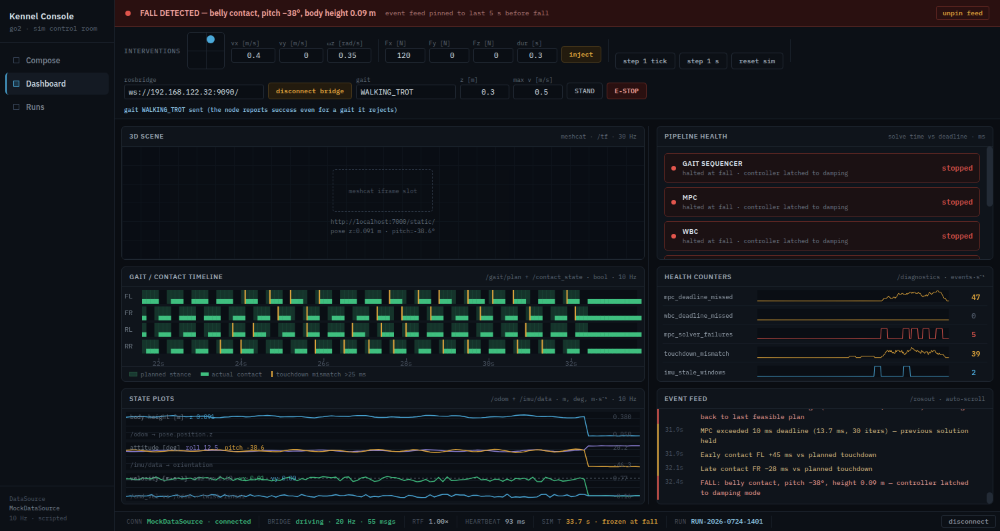

# Driving the robot from the console — the Interventions joystick, live

> Implementation record for [issue #58](https://github.com/alius-git/kennel/issues/58),
> the console half. The guest-and-host half is
> [`stack/bridge.md`](../stack/bridge.md).
>
> One sentence: the joystick that was already in the Interventions toolbar,
> pointed at the real stack over a WebSocket, publishing
> `/quad_control_target` at 20 Hz and calling the controller's two services —
> with the Dashboard's panels left exactly as they were.



## 0. Why this is inside the design, and what is not

The joystick is specified, in these words:

> *Interventions toolbar:* velocity/gait target commands (publish
> `/quad_control_target` — joystick widget + fields) …
> — [`plan/prompts.txt:180`](../plan/prompts.txt)

> … all as service calls and topic publishes against the already-running sim.
> — [`plan/applications.md:80`](../plan/applications.md)

> Dashboard's interventions are topic publishes and sim-level service calls
> through the seam — **no process control anywhere**.
> — [`plan/design/03-console.md:27`](../plan/design/03-console.md)

Publishing a topic at a stack that is already running is not process control, so
no button here is a deviation and nothing here belongs in
[#26](https://github.com/alius-git/kennel/issues/26)'s log for *that* reason.
**Starting** the bridge is process control, and it is a driver verb
(`kennel-demo.sh teleop`) for exactly the reason [`send.md` §6](send.md) records.

**One bypass.** [`design.md` §1](../plan/design.md) serves the console *from
inside the VM*, where the bridge would be same-host and need no discovery. The
MVP console runs on the host, so the `ws://` URL has to be handed to the page —
`teleop` writes it to `<out>/.kennel-bridge` and `serve.py` reports it in
`/api/health`, the same shape as `send`'s `out` and `pin`.
*Retirement path:* the console served from the appliance, where the URL is
`ws://localhost:9090/` and no hand-off exists. Belongs in #26's log when that
file is written.

## 1. What is delivered

| Artifact | Purpose |
|---|---|
| `RosbridgeTarget` in [`Kennel Console.dc.html`](Kennel%20Console.dc.html) | ~180 lines: connect, probe, publish at 20 Hz, two service calls, dead man |
| teleop controls, appended to the Interventions row | bridge URL, connect, gait, `z`, `max v`, STAND, E-STOP |
| `bridge` + `meshcat` in [`serve.py`](serve.py)'s `/api/health` | the URL hand-off, resolved **per request** |
| [`verify-teleop.sh`](verify-teleop.sh) + [`verify-teleop.py`](verify-teleop.py) + [`fake-rosbridge.py`](fake-rosbridge.py) | 38 checks, no VM |

Nothing new is vendored: it is rosbridge v2's JSON protocol over a native
`WebSocket`, so `verify-serve.sh`'s asset list is unchanged.

## 2. It is not the `RosbridgeDataSource`

[`design.md` §7](../plan/design.md) build step 3 is a `RosbridgeDataSource` that
subscribes every panel to the live stack. This is not that, and does not start
it: `RosbridgeTarget` publishes **one** topic and calls **two** services. The
`DataSource` seam is untouched, `MockDataSource` still drives every panel, and
`this.ds` and `this.tp` are separate objects that never talk to each other.

What this does prove for that later work: the socket, the type resolution, and
the URL hand-off.

## 3. Listening before speaking

On connect the page **subscribes** to `/quad_control_target` for one second and
counts what arrives, before advertising anything.

If anything is publishing, it refuses outright — no advertise, no publish — and
says so:

```
another publisher is holding /quad_control_target (2 msgs in 1 s) —
a walk or a verify is still running.  Stop it:  kennel-demo.sh teleop
```

Two publishers on this topic do not merge; the controller consumes the latest
every cycle, so they alternate and the robot jitters between two speeds
([`stack/bridge.md` §7](../stack/bridge.md)). `kennel-demo.sh teleop` stops the
publisher it knows about (`p21-trot-hold.sh`, which `run` leaves holding); this
probe is what catches the ones it cannot know about — a `kennel-verify.sh` walk
phase, or a second browser.

## 4. What goes on the wire

```js
{op: 'publish', topic: '/quad_control_target', msg: {
   body_x_dot, body_y_dot, world_z, hybrid_theta_dot, pitch, roll}}
```

**All six fields, every message, `world_z` always set.** The first message
overwrites the controller's whole target, and one that omits `world_z` defaults
it to `0.0` — commanding the body to the ground. The trap is silent
([`launch.md` §4.2](../stack/launch.md)), so there is exactly one function that
builds this message and it fills all six.

**20 Hz, continuously, zeros included.** `joy_to_target`'s `update_freq`.
Silence is not a stop: the controller keeps the last target it received forever.

**The mapping is copied from `joy_to_target.py`, not invented:**

| | value | source |
|---|---|---|
| stick y → `body_x_dot` | ±`max v`, default 0.5 m/s | `scaling.x` |
| stick x → `hybrid_theta_dot` | ±1.0 rad/s | `scaling.yaw` |
| `world_z` | 0.30 m | `init_robot_height`, `mit_controller_sim_go2.yaml:93` |
| acceleration limit | 0.5 m/s² | `max_acceleration`, same file line 95 |

The ramp is `clip_velocity` field for field: it caps the **change** per tick
along the direction of the change, not each axis independently. Verified from
the bytes on the wire — no step exceeds 0.025 m/s, which is 0.5 m/s² at 20 Hz.

**Gait is a service call, not a topic:**

```js
{op: 'call_service', service: '/mit_controller_node/set_parameters',
 type: 'rcl_interfaces/srv/SetParameters',
 args: {parameters: [{name: 'simple_gait_sequencer.gait',
                      value: {type: 4, string_value: 'WALKING_TROT'}}]}}
```

The picker offers the **node's** ten gaits, not the gamepad's six: `TROT` and
`FLYING_TROT` are commented out in `joy_to_target.py` at the pin, so a
parameter-driven picker reaches gaits a joystick cannot
([`launch.md` §4.1](../stack/launch.md)).

The page reports a gait as **sent**, never as **active**. `SetParameters`
answers `successful: true` for a gait the node then refuses to load — confirmed
against the real stack, [`stack/bridge.md` §5.1](../stack/bridge.md). `/gait_state`
is the observable that could say *active*, and reading it is not this issue.

## 5. The dead man's switch, and its honest limit

The controller keeps the last target forever, so a page that goes away
mid-stride must put a zero on the wire before it does.

| Event | What happens |
|---|---|
| stick released | the command becomes zero at once; the ramp puts it on the wire over ~1 s, as releasing a gamepad does |
| `STAND` | hard zero **immediately**, then the STAND gait |
| `E-STOP` | hard zero, then `/set_emergency_damping_mode` |
| tab hidden | hard zero |
| `pagehide` / `beforeunload` | hard zero, unadvertise, close |
| socket error | the UI says disconnected — **and the stack keeps its last target** |

**The limit, stated plainly: a killed renderer fires none of these.** Kill the
tab mid-stride and the robot keeps walking until someone runs
`kennel-demo.sh teleop stop`. No amount of JavaScript fixes that, because the
JavaScript is what died.

> **Measured, and then retired by [#67](https://github.com/alius-git/kennel/issues/67).**
>
> First the measurement, because the retirement is only worth what the finding
> was. `kill -9` on the renderer mid-stride, twice, on a live stack: the robot
> travelled **13.3 m in 30 sim-s and was still going** when the window closed;
> on the second run it destabilised after 0.6 m and stopped by itself. No zero
> was ever published either time, and the stack was still holding the target the
> dead page had sent. What an abandoned robot *does* varies; that nothing stops
> it did not ([`bridge.md` §10.6](../stack/bridge.md)).
>
> Since #67 a guest-side node zeroes a stale non-zero target about a second after
> the page goes quiet, and the robot then stops. It runs beside the bridge,
> started and stopped by the same verb, and it is the only thing in the system
> that can catch this: [`bridge.md` §11](../stack/bridge.md).

## 6. What the Dashboard showed while this issue was the whole of the bridge

> **Resolved by [#62](https://github.com/alius-git/kennel/issues/62) and
> [#63](https://github.com/alius-git/kennel/issues/63)** — see
> [`dashboard.md`](dashboard.md). The finding is kept as found, because it is
> what those issues were for.

The render above is honest about it: a red **FALL DETECTED** banner and three
`stopped` pipeline blocks, while the real robot trots along at 0.47 m/s.

That was `MockDataSource`'s scripted demo — ~30 s of trot, degrading solve
times, a fall — playing out on panels this issue deliberately did not touch. The
only live things on the page were the bridge status item, the teleop message
line, and the robot itself. Until the `RosbridgeDataSource` landed, **the panels
narrated a recording while the joystick drove a robot**, and an operator had to
know that.

Mitigating it properly meant the seam work, and that is what happened: since
#62 the panels read the stack across the `DataSource` seam, the status bar says
`mode · live` or `mode · mock (scripted demo)`, and the fall banner is
[`verify.md` §4](../stack/verify.md)'s rule on live samples. The demo is
unchanged and still plays when no bridge is connected — which is why the
cosmetic fix (hiding panels) was never the answer.

## 7. Feature detection, exactly like `send`

`probeKennel()` already fetched `/api/health` once on mount. It now also reads
`bridge` and prefills the URL field. The rules that keep the offline console
offline are unchanged:

- The controls render **only** when `state.kennel` is non-null — served by plain
  `python3 -m http.server`, the page is byte-for-byte what it was: no controls,
  no bridge item in the status bar, no socket, no errors.
- **A URL is never a reason to connect.** The page opens a WebSocket only on a
  click. Verified: zero sockets on load, exactly one after the button.
- The field stays editable — a lab that knows its own bridge can type it.

## 8. Verification

`kennel_console/verify-teleop.sh` — 38 checks, **no VM, no ROS, no stack**. The
far end is `fake-rosbridge.py`, the server half of `cdp.py`'s WebSocket, which
records every op to JSONL. Every assertion reads **bytes the page sent**, never
a JavaScript variable read back out of the page under test.

| Group | Asserts |
|---|---|
| 1 | controls present under `serve.py`, URL prefilled from `/api/health`, the ten gaits |
| 2 | **zero** WebSockets on load; the ops log empty |
| 3 | exactly one socket, to the configured URL; subscribe *before* advertise; no publish during the probe |
| 4 | 20 Hz ± 2; all six fields on every message; `world_z` 0.30 always; zeros published, not silence |
| 5 | the stick ramps, no step over `max_acc / rate`, saturates at `max v` |
| 6 | release returns to zero and keeps publishing zeros |
| 7 | the exact `SetParameters` and `Trigger` payloads; "sent", never "active" |
| 8 | navigating away leaves a **zero** as the last message, and unadvertises |
| 10 | a bridge with a foreign publisher is refused: subscribe, then no advertise, no publish |
| 11 | under plain `http.server`: no controls, no socket, zero placeholders, no errors |
| 12 | zero non-localhost requests |

The bridge URL reaches the page the way it does in real use — the suite writes
`<out>/.kennel-bridge` and lets `serve.py` read it — so the hand-off is
exercised rather than bypassed.

The other five suites are green and unmodified: `verify-serve.sh`,
`verify-scope.sh`, `verify-generate.sh`, `verify-export.sh`, `verify-send.sh`.

## 9. Two defects this found in existing code

- **`k13-stop.sh` would have leaked the bridge.** Its sweep is `pkill -x`, and
  rosbridge's two children run with `comm` `python3`. Fixed there, by path
  pattern, the way it already handles `joy_to_target.py`
  ([`stack/bridge.md` §4](../stack/bridge.md)).
- **A second bare "connect".** The status bar's connect/disconnect toggles
  `MockDataSource`. A second button labelled just `connect` on the same screen
  was ambiguous — and made the test selector ambiguous too, which is how it was
  noticed. The teleop button says **connect bridge**.

## 10. Limits

- ~~**The Dashboard is still on `MockDataSource`** (§6). This is the big one.~~
  **Done** in #62/#63 — [`dashboard.md`](dashboard.md).
- ~~**No `/reset_sim`, no disturbance injector.**~~ `/reset_sim` is **done** in
  [#66](https://github.com/alius-git/kennel/issues/66) — §12. The disturbance
  injector is still [#68](https://github.com/alius-git/kennel/issues/68), and
  `inject` says so in the feed rather than quietly driving the mock.
- **No keyboard driving.** The same publisher would carry WASD; not built.
- ~~**The 3D pane is still a placeholder.**~~ **Done** in
  [#61](https://github.com/alius-git/kennel/issues/61): the pane frames the
  viewer `/api/health` carries, and Drake's Meshcat sets no `X-Frame-Options`
  ([`dashboard.md` §1.1](dashboard.md)).
- **One operator.** Two connected browsers are two publishers; the probe makes
  the second one refuse, which is the right outcome but not a shared-control
  design.

## 11. Tested live ([#65](https://github.com/alius-git/kennel/issues/65))

§8's 51 checks run against a fake bridge with no VM, and that is deliberate: they
prove the *console's* half, byte for byte. What they cannot prove is that the
robot moves. [`stack/bridge/verify-teleop-live.sh`](../stack/bridge/verify-teleop-live.sh)
does, from the host, against the real stack — and it re-runs, which the thirteen
transcripts of [`bridge.md` §8](../stack/bridge.md) never did.

**90 checks, green twice in a row** — and 76, twice, with `KENNEL_WATCHDOG=0`,
which is the same suite measuring the behaviour #67 replaced. It leaves the stack
in STAND on every path:
[`04a`](../stack/bridge/evidence/live/04a-live-suite.txt),
[`04b`](../stack/bridge/evidence/live/04b-live-suite.txt) before the watchdog and
[`10a`](../stack/bridge/evidence/live/10a-live-suite-watchdog.txt),
[`10b`](../stack/bridge/evidence/live/10b-live-suite-watchdog.txt) with it.

| Group | What it drives, and what the GUEST is asked |
|---|---|
| 0 | `recover`, then `teleop`: `/api/health` carries the URL `verify-bridge-host.sh` prints |
| 1 | connect → `driving`; the guest sees 20 Hz of zeros; the watchdog has said nothing |
| 2 | gait + stick forward → 20 Hz, **0.47 m/s**, 9.4 m in 20 sim-s, z 0.289 m, tilt 0.02 rad, `/gait_state` says `WALKING_TROT` |
| 3 | release → the wire carries zeros and the robot stops going anywhere |
| 4 | STAND → the sequencer stands, the last target is a zero |
| 5 | a held trot → the page **refuses**; `walk stop` → it drives again |
| 6 | `kill -9` on the renderer → §5's measurement, and #67's answer |
| 7 | E-STOP → z < 0.15 m; `recover` → standing, no relaunch |
| 7b | `kennel-demo.sh verify` with the session up → `pass=10 fail=0` |
| 8 | `teleop stop` → port closed, no process, `/api/health` `bridge: null` |
| 9 | no uncaught errors; nothing fetched from anywhere but localhost and the guest |

The numbers all come from
[`k13-target-monitor.py`](../stack/bridge/tools/k13-target-monitor.py) in the
container: **what a node in the ROS graph saw**, never a variable read back out
of the page under test — the rule [`dashboard.md` §4](dashboard.md) sets.

### 11.1 The five caveats of `plan/teleop-joystick.md` D.3, answered

| | Answer | Evidence |
|---|---|---|
| §4 two publishers | reproduced: `[0.3, 0.5]` on the wire, 3 publishers, 30 Hz, robot at 0.427 m/s between the two commands. `teleop` returns it to `[0.5]` | [`03-jitter.txt`](../stack/bridge/evidence/live/03-jitter.txt) |
| §5 killed renderer | **13.3 m in 30 sim-s, still going** — §5 | [`04a`](../stack/bridge/evidence/live/04a-live-suite.txt) |
| §6 CPU and lag | 84.3 % of a core at rate 0.5, 79.0 % at 1.0; inter-arrival std 3.65 / 1.53 ms; no growing lag | [`05-cpu-lag.txt`](../stack/bridge/evidence/live/05-cpu-lag.txt) |
| §7 Firefox | connects and publishes at 17.4 Hz; **Private Network Access does not interfere** | [`06-firefox.txt`](../stack/bridge/evidence/live/06-firefox.txt) |
| §8 readiness race | the port is bound first in **10 of 10** starts, by 0.10–2.18 s | [`02-bridge-race.txt`](../stack/bridge/evidence/live/02-bridge-race.txt) |

[`bridge.md` §10](../stack/bridge.md) has each of these in full, and the three
traps the suite itself fell into first.

**Still open: a person at the controls.** #65 also asks for a session with a
mouse and one with a trackpad, logged as a friction list. An agent has no hand;
the pad was driven with synthetic `PointerEvent`s, which proves the code path and
says nothing about how the control feels. The template is
[`20-friction-human.md`](../stack/bridge/evidence/live/20-friction-human.md),
with the dead zone and the ramp already filled in from the measurements.

## 12. Interventions over the bridge ([#66](https://github.com/alius-git/kennel/issues/66))

Two controls in the Interventions row stopped pretending.

### 12.1 `reset sim` is four steps, and the order was measured

§10 used to say *"the existing `inject` / `reset sim` buttons still drive the
mock"* — a button that rewound a recording while a real robot lay on the floor in
front of it. It now calls `/reset_sim`, in the sequence a live probe forced:

| | | why |
|---|---|---|
| 1 | a hard zero on the wire | `/reset_sim` replaces the simulator's context and never touches the controller, which keeps the last target it was sent (`mit_controller_node.cpp:793-798`). Resetting under a held velocity walks the fresh robot off its spawn |
| 2 | `STAND` | so the gait the operator picks next is deliberate |
| 3 | `/set_damping_mode` — **only when the robot is down** (`z < 0.15 m`) | E-STOP is `EMERGENCY_DAMPING` and a reset while damped puts a fresh robot on the ground with no controller under it. On a robot that is standing the same call would drop it ([`bridge.md` §10.5](../stack/bridge.md)) |
| 4 | `/reset_sim`, `joint_positions` **empty** | anything but exactly 12 makes the simulator use its own `initial_joint_positions` (`drake_simulator.cpp:504-512`), so the stock spawn stays the simulator's to define and this page copies no joint constants it would have to keep in step |

```js
{op: 'call_service', service: '/reset_sim', type: 'interfaces/srv/ResetSimulation',
 args: {pose: {position: {x: 0, y: 0, z: 0.40},
                orientation: {x: 0, y: 0, z: 0, w: 1}},
        joint_positions: []}}
```

`0.40` is `initial_robot_height` in `simulator_params_go2.yaml` at the pin, which
the composer never touches ([`composer-scope.md`](composer-scope.md)).

**Live, end to end** ([`08-reset-from-console.txt`](../stack/bridge/evidence/live/08-reset-from-console.txt)):
driving at 0.470 m/s → E-STOP → **z 0.0754 m** on the floor → *reset sim* in the
browser → **z 0.3140 m** standing, gait `STAND`, target zero. The leg driver's own
log carries the middle of it (`Switch to DAMPING` → `switching to operation` →
`Switch to OPERATE`), and `verify` afterwards is `pass=10 fail=0` **with no
relaunch**. That is s004.disturb step 4 — *"standing posture restored, plots and
counters cleared"* — done.

The feed says both halves, in order:

```
/reset_sim called — spawn at z 0.40 m with the simulator's own joint positions; the sim clock restarts
sim clock restarted at 0.0 s — windows cleared
```

The second line is #63's, unchanged: the call is what the operator did, the clock
restart is what happened, and they are different events a few hundred
milliseconds apart. The counters are **not** cleared — they are the controller's
own cumulative values and it was never restarted ([`dashboard.md` §2.5](dashboard.md)).

**When it refuses.** Under a foreign publisher, nothing is sent at all and the
page says `kennel-demo.sh walk stop` — a reset into a held trot spawns the robot
and walks it straight off. While the probe is still listening it says to try
again in a second. With no bridge, and under plain `http.server`, the button is
exactly what it always was: the mock's own rewind.

### 12.2 The gait picker says `active`, or `refused`

> **A defect this had, found later by a cold container** (2026-09-08,
> [`demo/scenarios.md`](../demo/scenarios.md) §1.4). `setGait` sent the call
> through `call()`, whose response callback says its message unconditionally —
> so a response slower than `GAIT_SETTLE_MS` painted `sent` back over the
> `refused` the timer had already reached, and the picker was left showing a
> message its own state machine had abandoned. The response callback is now
> guarded on the gait still being the one it was sent for. The no-VM suite could
> not have caught it: the fake bridge answers instantly, so both orderings are
> the same ordering there.


§4 ended: *"`/gait_state` is the observable that could say active, and reading it
is not this issue."* This is that issue.

`RosbridgeTarget` subscribes `/gait_state` itself — **after** the advertise, so
the first subscribe on the wire is still the foreign-publisher probe (§3), and a
target that refused to drive subscribes to nothing — and matches the incoming
signature against `GaitDatabase::getGait`'s ten entries (`gait.cpp:748-783` at
the pin, the same table `kennel-verify.sh` check 6 carries).

- signature matches what was asked → **`active`**, with the period, duty and
  offsets it matched and how long it took;
- two seconds after a `successful: true` with no change → **`refused`**.

Live, at rate 1.0 ([`09-gait-active-refused.txt`](../stack/bridge/evidence/live/09-gait-active-refused.txt)):

```
WALKING_TROT   -> active — /gait_state period 0.500 s, duty 0.60, offsets [0.00, 0.50, 0.50, 0.00] after 0.04 s
STATIC_WALK    -> active — period 1.250 s, duty 0.80, offsets [0.00, 0.50, 0.75, 0.25]       after 0.04 s
PRONK          -> active — period 0.500 s, duty 0.50, offsets [0.00, 0.00, 0.00, 0.00]       after 0.07 s
GARBAGE        -> refused — /gait_state has not changed 2.0 s after the node reported success
```

and the controller log says `Unknown gait type [GARBAGE]`, which is the whole
point: the parameter took, the sequencer did not, and until now the page could
not tell the difference. Sub-second in every accepted case, so the two-second
window is generous rather than tight.

### 12.3 Verification

`verify-teleop.sh` grows two more far ends — a fake that follows the gait
parameter and publishes `/gait_state`, and the recorded fall replayed with the
held trot dropped so the page can drive at a robot that is on the floor — and
five groups. **51 → 76 checks, still no VM.**

| Group | Asserts, from the bytes the page sent |
|---|---|
| 13 | reset while driving: a zero, then `STAND`, then `/reset_sim` with the exact args and **no** damping call |
| 14 | reset on the replayed fall: `/set_damping_mode` **precedes** `/reset_sim` |
| 15 | reset under a foreign publisher: no service call at all, and the page names `walk stop` |
| 16 | `active` for a gait the node loads, `refused` for one it ignores, never `active` for that one; the `/gait_state` subscribe comes after the probe |
| 17 | plain `http.server`: `reset sim` still rewinds the mock, no socket, nothing thrown |

The fake answers each service in **its own shape** — `SetParameters` returns a
list of results, `ResetSimulation` and the Triggers return a bool. One shape for
all three was fine while only the gait was called.

## 13. The disturbance over the bridge ([#68](https://github.com/alius-git/kennel/issues/68))

The Interventions row has had an `inject` button since the prototype, and it has
always pushed a *recorded* robot. It now pushes the real one.

### 13.1 The call, and why nothing waits for it

`/disturb_simulation` is `interfaces/srv/DisturbSim`: three forces, three
torques and a duration, answering a bool. The payload is what the operator
typed, and `tau` is always zero — the row has no torque fields, and inventing a
number nobody chose would put it on the wire as though someone had.

```js
{force: [fx, fy, fz], tau: [0, 0, 0], time: duration}
```

**The service blocks for the whole of `time` before it answers.** The node
publishes the rotated force, sleeps, publishes a zero, and only then returns
`success` (`disturbance_node.cpp:39-65`) — measured **0.400 s wall for a 0.2 s
request** at `simulator_realtime_rate: 0.5`. So the page sends the call and
forgets it: the link routes the response to a callback whenever it arrives, and
the joystick's 20 Hz tick is never in that path. `verify-teleop.sh` group 18
proves it with a fixture that answers two seconds late — **40 publishes in those
two seconds, largest gap 52 ms**.

The operator sees two lines, and they are different claims:

```
disturbance requested: 100 N for 0.20 s — the service answers when the push ends
disturbance done: 100 N for 0.20 s
```

and one feed entry, in the grammar the mock already writes (s007.bridge step 6's
*same event-feed grammar*, and the line `verify-dashboard.py` group 13 pins):

```
Disturbance: 100 N for 0.20 s at body CoM (100, 0, 0)
```

### 13.2 The guard is the applied run, not the page

The service exists only if the run **the guest launched** composed block 4. The
page cannot see the guest, so it reads the newest run of `/api/runs` — what the
status bar already calls *the run* (#62) — and checks `choices.disturbances`.
With the toggle off it sends nothing and says which run and what to do:

```
inject is off: the newest run (run-…Z) was composed with disturbances off, so no
/disturb_simulation is running.  Compose with the disturbances toggle on, then
kennel-demo.sh run
```

The button is **dimmed, never hidden and never renamed** — the suites click it
by its exact text, and an operator who cannot see a control cannot read why it
is off. The link fetches the run list on *connect*, because the Dashboard is
where the button is and a visit to the Runs view should not be a precondition.

A push needs no publisher, so `inject` works from a page that **refused to
drive** (someone else is holding `/quad_control_target`): watching a colleague's
run and pushing the robot are different privileges. If the stack answers
`result: false` — a disturber that is not running — the page says so and names
the toggle rather than swallowing it.

### 13.3 What the simulator was actually pushed with

The witness is not the page. `k13-target-monitor.py` subscribes
`/simulation_disturbance`, the topic the node publishes and the simulator
consumes (`drake_simulator.cpp:355-358`, `:400`), and reports the push in both
clocks:

```json
"disturbance": {"n": 2, "first_sim": 130.957, "sim_gap": 0.2, "wall_gap": 0.399,
                "force_max_norm": 100.0, "force_max": [99.945, -3.313, 0.0]}
```

Two things that table says out loud:

- **A push is a PAIR** — the force, then a zero after `time` — so `n: 2` is what
  a bounded disturbance looks like, and the gap between them is its duration.
- **The magnitude survives the rotation; the components do not.** The node
  rotates the requested force into the robot's yaw frame before publishing
  (`disturbance_node.cpp:52-53`), so `[100, 0, 0]` arrives as whatever "forward"
  was at that instant. A scenario compares `force_max_norm`, never the vector.

### 13.4 `time` is a sim second, and that was a decision

Measured at `simulator_realtime_rate: 0.5`, one stack, both ways:

| block 4 | `sim_gap` | `wall_gap` | the service answered after |
|---|---|---|---|
| `ros2 run simulator sim_disturber` | 0.100 | 0.200 | 0.201 s |
| `… --ros-args -p use_sim_time:=true` | **0.200** | 0.399 | 0.400 s |

The node sleeps on **its own** clock. Without `use_sim_time` a 0.2 s push is
0.2 wall seconds — which is 0.1 sim-seconds at half rate, and a different amount
of robot at every composed rate. The composed block carries the argument, so a
push is a sim second like every other window in this repo
([`verify.md` §1.1](../stack/verify.md)).

### 13.5 Verification

`verify-teleop.sh` grows a fifth far end — the **healthy** recording replayed
with the held trot dropped, answering `/disturb_simulation` two seconds late —
and four groups. **76 → 96 checks, still no VM.**

| Group | Asserts, from the bytes the page sent |
|---|---|
| 18 | the payload (`force`, `tau` zero, `time`), exactly one call, the feed's line, and **20 Hz maintained through the two seconds the answer took** |
| 19 | the newest run composed without a disturber → no call at all, and the feed names the run and the toggle |
| 20 | a page that refused to DRIVE still injects; a `result: false` is reported, not swallowed |
| 21 | plain `http.server`: the mock's own disturbance, no socket, nothing thrown |

The fifth fixture is not a convenience. **The Dashboard renders an event feed
only once samples are arriving** — with none, the panels correctly show their
empty states — so a feed assertion made against a fake that answers services and
says nothing else fails for the fixture's reason. And the mock arrives already
fallen, with its feed pinned to the post-mortem window, so group 21 rewinds it
first.

Live: [`demo/scenarios.md`](../demo/scenarios.md) §1 drives the whole path
against the real robot — 100 N staggers it, 300 N fells it, and the process set
never changes.
