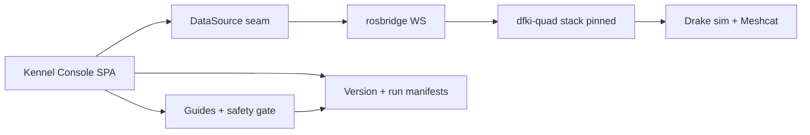
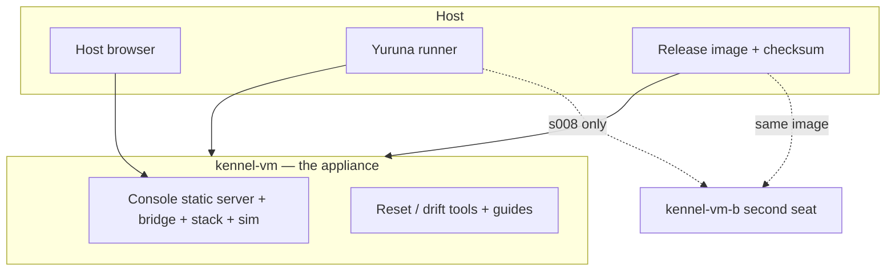

# POC Overview

> One sentence: the Kennel POC is one pinned VM appliance (stack + bridge + console + guides) driven from a host browser and verified by Yuruna sequences.

**Companion documents:** [design.md](../design.md) · [applications.md](../applications.md) · [scenarios.md](../scenarios.md)

## Top-level blocks

The DataSource seam has two implementations: `MockDataSource` (scripted demo, no stack needed) and the rosbridge client — swapping them changes no console panel ([design.md §4](../design.md)).

## Deployment topology

The user's VM terminal is part of the product: the console generates launch commands; a person (or the harness, over the shell channel) runs them. Nothing orchestrates processes on the user's behalf.

## Scenario coverage

All ten sequences traverse this topology; s007.bridge (mock half) runs with no VM at all, and s008.classroom is the only sequence provisioning the second seat. See [scenarios.md](../scenarios.md).
