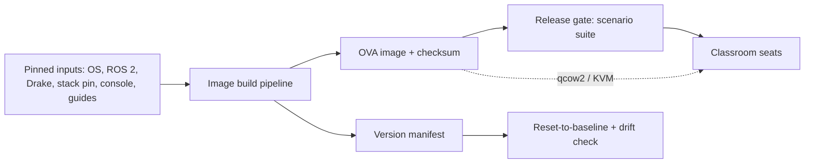

# Kennel/appliance

> One sentence: pinned inputs become an immutable OVA whose generated version manifest is the identity that release gating, drift checking, reset, and every scenario assert against.

**Companion documents:** [design.md](../design.md) · [applications.md](../applications.md#kennelappliance) · [01-overview.md](01-overview.md)

- The manifest is **generated by the build**, never hand-written; it ships in-image at a fixed path.
- The release gate is the Yuruna suite: no image ships with a red P0 scenario ([design.md §7](../design.md)).
- Reset preserves the designated workspace directory (run manifests users keep); drift check diffs the live environment against the manifest.

## Scenario coverage

s001.firstwalk (import, budget), s006.reproduce (reset baseline, drift negative control), s008.classroom (fleet, drift, reset), s009.repin (rebuild + regression gate). See [scenarios.md](../scenarios.md).
