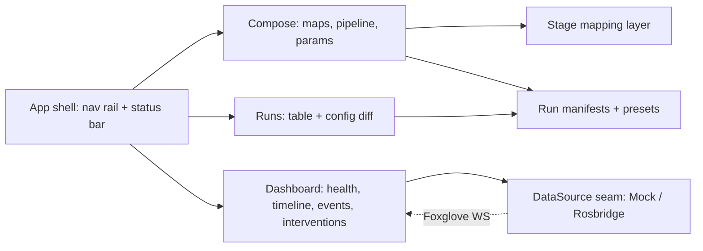

# Kennel/console

> One sentence: one SPA — Compose, Dashboard, Runs — where every live datum crosses the DataSource seam and every experiment's identity is a round-trip-safe run manifest.

**Companion documents:** [design.md](../design.md) · [applications.md](../applications.md#kennelconsole) · [prompts.txt](../prompts.txt) (the full specification) · [01-overview.md](01-overview.md)

- **Configure + monitor only:** Compose emits configs and command text; Dashboard's interventions are topic publishes and sim-level service calls through the seam — no process control anywhere.
- The **mapping layer** binds composer choices to today's launch args/YAML keys and is swapped, not rewritten, when upstream's stage `type:` keys land (rehearsed by s009.repin).
- **Round-trip contract:** load(generate(state)) = state, byte-compared (s002.compose).
- `MockDataSource` carries the scripted demo run so every panel demonstrates itself with no stack (s007.bridge).

## Scenario coverage

s001.firstwalk (status bar, empty states), s002.compose, s003.diagnose, s004.disturb, s005.compare, s006.reproduce, s007.bridge, s009.repin (mapping swap), s010.handoff (manifests as evidence). See [scenarios.md](../scenarios.md).
