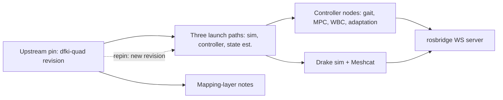

# Kennel/stack

> One sentence: the upstream dfki-quad revision, pinned and pre-built in the appliance, launched by three console-generated commands and observed over rosbridge — wrapped, never forked.

**Companion documents:** [design.md](../design.md) · [applications.md](../applications.md#kennelstack) · [01-overview.md](01-overview.md)

- The console integrates against the stack's **actual** contracts — topics, message definitions, service names, including the code's `controller_heartbeat` spelling ([design.md §4](../design.md)).
- Kennel-local patches are minimal, documented in `stack/pin.lock`, and headed upstream.
- The mapping-layer notes record which composer choice binds to which launch arg/YAML key today, and which upstream change retires each workaround.

## Scenario coverage

s001.firstwalk (launch paths), s002.compose (config surface), s003.diagnose + s004.disturb (live contracts), s005.compare, s006.reproduce, s009.repin (pin update + regression gate). See [scenarios.md](../scenarios.md).
