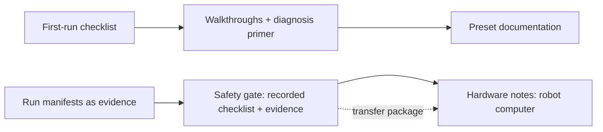

# Kennel/guides

> One sentence: versioned-with-the-image documentation that walks import → first walk → diagnosis → comparison, and structurally gates all hardware material behind a recorded simulation-first checklist.

**Companion documents:** [design.md](../design.md) · [applications.md](../applications.md#kennelguides) · [01-overview.md](01-overview.md)

- Guides ship **in the image** and are versioned in the manifest: instructions cannot drift from the stack they describe.
- The gate's enforcement is **structural**: hardware notes render only from a completed gate record with qualifying evidence (verdict `completed`, version-manifest match) — s010.handoff asserts the ordering, not a warning banner.
- The first-run checklist is executable literally: s001.firstwalk runs it step by step under a stopwatch.

## Scenario coverage

s001.firstwalk (checklist), s008.classroom (lesson skeleton, reset routine), s010.handoff (gate, hardware notes, transfer package). See [scenarios.md](../scenarios.md).
