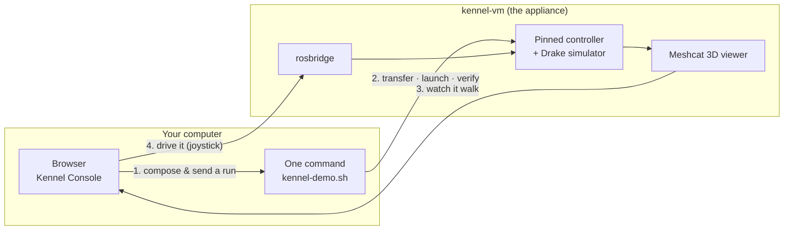

# Kennel

## A ready-to-use virtual lab for a walking Go2 quadruped

<div class="mt-8 opacity-80">
Compose an experiment in your browser · run it in a pinned virtual machine · watch the robot walk · drive it yourself
</div>

<div class="abs-br m-6 text-sm opacity-60">
2026 internship — Thales Andrade Soares
</div>

<!--
Opening line: "Today I will show you a lab in a box. You open a browser, choose how the robot should be controlled, press one button, and a simulated Go2 walks — on any machine, the same way, every time."
-->

---
layout: section
---

# The problem

Getting a quadruped controller running is a week of setup before the first trot

---

# The setup tax

<div class="grid grid-cols-2 gap-8 mt-6">

<div>

### Before Kennel

- Install ROS 2, Drake, a dozen dependencies
- Match versions across laptops that never match
- Rebuild the workspace until it compiles
- One person's machine works, another's does not
- Every new lab member repeats the same week

<div class="mt-6 p-3 rounded bg-red-900/30 border border-red-700/50">
"I used to budget a full week just to get the stack compiling before I could try a single trot in simulation."
</div>

</div>

<div v-click>

### With Kennel

- The lab is already assembled, pinned and frozen
- Every seat runs the **same** environment, byte for byte
- The first session is the product, not a heroic effort
- A mistake costs **90 seconds**, not a rebuild
- Time goes to the controller, not to the installation

<div class="mt-6 p-3 rounded bg-green-900/30 border border-green-700/50">
Open the lab → compose → run → watch it walk. About five minutes.
</div>

</div>

</div>

<!--
Kennel is a "practice yard": a shared, resettable starting point. It is simulation-first and says so — it is not a robot controller.
-->

---

# What Kennel is

<div class="grid grid-cols-3 gap-6 mt-8">

<div class="p-4 rounded border border-gray-600">

### 🖥️ The appliance
A virtual machine, **kennel-vm**, built and frozen once. Inside: the DFKI quadruped control stack at a pinned revision, the Drake simulator, and the 3D viewer.

</div>

<div class="p-4 rounded border border-gray-600" v-click>

### 🎛️ The console
A browser page on your own computer. Compose an experiment, send it, and — once the stack runs — drive the robot with a joystick.

</div>

<div class="p-4 rounded border border-gray-600" v-click>

### 🐕 The stack
The upstream research controller, **wrapped, never forked**. What walks in Kennel is the real controller at a known commit.

</div>

</div>

<div class="mt-10 text-center opacity-80" v-click>
Configure and observe from the browser. The machine runs the robot. Nothing is hidden.
</div>

---

# How the pieces fit



<div class="mt-4 text-sm opacity-80">
The virtual machine lives on your computer. The browser talks to it over a private network — no cloud, no account, nothing to install on the host besides the VM tools.
</div>

---
layout: section
---

# How it works

Four steps — two you do once, two you repeat every session

---

# The whole thing, in five commands

```bash {all|1-2|3|4|5|all}
demo/tools/kennel-demo.sh setup       # once per machine — checks and prepares the host
demo/tools/kennel-demo.sh provision   # once per machine, ~35 min — builds and freezes the lab
demo/tools/kennel-demo.sh console     # opens the console in your browser
demo/tools/kennel-demo.sh run         # newest composed run → into the VM → walking
demo/tools/kennel-demo.sh teleop      # hand the joystick to the browser
```

<div class="grid grid-cols-2 gap-8 mt-8">

<div>

### Once per machine
`setup` and `provision` turn a fresh computer into one with a working, frozen lab. You never run them again.

</div>

<div>

### Every session
`console`, `run`, `teleop`. That is the daily loop — and `run` copes with a powered-off VM by itself.

</div>

</div>

<!--
Emphasise: no path typing, no unzip, no ssh. `run` picks the newest run you composed and says which one and why.
-->

---
layout: image-right
image: /img/compose.png
---

# Step 1 — Compose

Choose what the experiment is, in the browser.

- **Map** — flat plane, or obstacle terrain
- **MPC solver** — four solvers, with their own settings
- **Real-time rate** — slow the simulation down to watch closely
- **Ground-truth state** — on by default

Everything else is shown **fixed at its stock value** — visible, never hidden — so the pipeline diagram always tells the truth about what the stack will run.

<div class="mt-4 text-sm opacity-70">
Only choices the pinned stack can honour are offered. If it is on the screen, it works.
</div>

---
layout: image-right
image: /img/send.png
---

# Step 2 — Send

One click: **send to kennel-runs →**

The console produces the exact files the stack reads and drops them where the next command looks:

```
run-20260830T200816Z/
├── simulator_params_go2.yaml
├── mit_controller_sim_go2.yaml
├── commands.txt
└── run.json          ← what you chose, and the stack revision
```

<div class="mt-4 text-sm opacity-70">
Prefer a download? <b>generate run ↓</b> gives you the same folder as a .zip. Either way, the next step finds it.
</div>

---

# Step 3 — Run

```bash
demo/tools/kennel-demo.sh run
```

<div class="grid grid-cols-4 gap-4 mt-6">

<div class="p-3 rounded border border-gray-600" v-click>

**transfer**
Your run goes into the VM. Every file is checksummed at every hop; a run made for another stack revision is refused.

</div>

<div class="p-3 rounded border border-gray-600" v-click>

**launch**
The three stack processes start — simulator, leg driver, controller — waited on by *watching the stack*, never by a timer.

</div>

<div class="p-3 rounded border border-gray-600" v-click>

**verify**
Ten checks decide "healthy and walking" from the robot's own data. One of them proves the controller loaded *your* solver.

</div>

<div class="p-3 rounded border border-gray-600" v-click>

**walk**
The robot trots and the 3D viewer URL is printed. Open it.

</div>

</div>

<div class="mt-8 text-center" v-click>

**≈ 2 minutes** from a running VM · **≈ 5 minutes** if the VM was powered off — it is started for you

</div>

---
layout: image
image: /img/meshcat-walking.png
backgroundSize: contain
---

<!--
Step 4 — Watch. This is the Drake Meshcat viewer, opened straight from the host browser: the Go2 trotting on the configuration composed a minute earlier. No port forwarding, no plugin.
-->

---
layout: two-cols
---

# Step 4 — Drive it yourself

```bash
demo/tools/kennel-demo.sh teleop
```

Then in the console: **Dashboard → Interventions → connect bridge**

- **Joystick** — push to walk, twist to turn; release and it stops
- **Gait picker** — trot, walk, pace, bound, gallop…
- **STAND** — stop and stand, immediately
- **E‑STOP** — emergency damping, the robot sits down

<div class="mt-4 text-sm opacity-70">
Measured: 0.47 m/s against a 0.50 m/s command; 12.5 m in 27 s; released stick → standstill in about a second.
</div>

::right::


---

# It checks itself — the ten verification checks

<div class="text-sm">

| # | The question it answers | How |
|---|---|---|
| 1 | Are exactly the right processes running? | the ROS node graph |
| 2 | Is simulated time advancing? | `/clock` against the wall clock |
| 3 | Is the robot's state streaming? | `/quad_state` at ~1000 Hz |
| 4 | Is the controller alive? | its heartbeat at 2 Hz |
| 5–6 | Did the gait command take, and is that gait **active**? | parameter read-back + the gait signature |
| 7 | Any solver failures or deadline overruns? | heartbeat counters, as deltas |
| 8 | Is it actually **walking** forward? | commanded vs. measured velocity and distance |
| 9 | Did it **not fall**? | belly contact, body height, tilt |
| 10 | Is it running **your** configuration? | the active solver, read from the running controller |

</div>

<div class="mt-3 text-sm opacity-80">
<code>pass=10 fail=0</code> is the phrase to look for. A red check names the observable it read and the threshold it expected.
</div>

---

# Never lose 35 minutes again

<div class="grid grid-cols-2 gap-8 mt-6">

<div>

### The baseline snapshot

`provision` ends by **freezing** the lab: stock configuration, workspace built, nothing running.

```bash
demo/tools/kennel-demo.sh reset     # ~90 s
```

`reset` returns the VM to exactly that state — and then *proves* it got there: right revision, stock files, container up, simulator launchable.

</div>

<div v-click>

### What it costs, what it buys

| | |
|---|---|
| Building the lab | ~35 min, once |
| Freezing it | +2m46s, once |
| Coming back after any mistake | **≈ 1m20s** |
| …of which the revert itself | **1–2 s** |

The rest of the 90 seconds is the lab **checking itself** before handing it back.

</div>

</div>

---

# Every run is reproducible

<div class="grid grid-cols-2 gap-8 mt-4">

<div>

### The run folder is the record

- The two configuration files the stack **actually read**
- The launch commands, ready to paste
- `run.json` — your choices **and the exact revision** of the stack

Same composition → **byte-identical** files, in any session, on any machine.

</div>

<div v-click>

### The stack is pinned, not forked

- One upstream commit, recorded in `stack/pin.lock`
- A run made against another revision is **refused**, not silently applied
- Upstream stays the source of truth; Kennel is the ready front door

</div>

</div>

<div class="mt-8 p-3 rounded bg-blue-900/30 border border-blue-700/50 text-sm" v-click>
A result obtained in Kennel can be handed to a colleague as a folder, and they will get the same experiment.
</div>

---

# Honest by design

<div class="grid grid-cols-2 gap-8 mt-6">

<div>

### What Kennel promises

- A working, identical lab on every machine
- A walking simulated Go2 within minutes
- Configurations that are exactly what the stack runs
- A way back to a clean state in seconds

</div>

<div v-click>

### What it does not claim

- It is **not** a controller for a real robot
- No hard real-time inside a virtual machine
- Simulation first — hardware notes come only after the simulation checklist

</div>

</div>

<div class="mt-8 text-sm opacity-80" v-click>
Every shortcut taken to get here is written down with the path that retires it. Nothing drifts silently.
</div>

---

# Measured, not estimated

<div class="grid grid-cols-2 gap-8 mt-4">

<div>

| Step | Wall clock |
|---|---|
| `setup` on a ready host | ~5 s |
| `provision` from nothing → frozen lab | 35–39 min |
| `run` from a powered-off VM → walking | **1m49s** |
| `run` again, over a running stack | 93 s |
| `reset` to baseline | 1m21s |
| `teleop` — bridge up and reachable | ~10 s |

</div>

<div v-click>

### Where the time goes in `run`

- guest up: 16 s
- transfer: 2 s
- launch: 44 s
- verify: 42 s — the checks *drive* the robot for 20 simulated seconds
- walk: 5 s

</div>

</div>

<div class="mt-6 text-xs opacity-60">
All figures from recorded transcripts on the reference host (8 vCPU / 16 GiB guest).
</div>

---

# What comes next

<div class="grid grid-cols-3 gap-6 mt-6">

<div class="p-4 rounded border border-gray-600">

### Live dashboard
The Dashboard's panels — pipeline health, gait timeline, health counters, the event feed — connected to the **running** robot instead of the scripted demo.

</div>

<div class="p-4 rounded border border-gray-600" v-click>

### More to try
Push the robot and watch it recover; stress the controller and read the diagnosis as it happens; compare two runs side by side.

</div>

<div class="p-4 rounded border border-gray-600" v-click>

### The appliance image
Today the lab is built on your machine in 35 minutes. Next: import a ready image, and be walking in five.

</div>

</div>

<!--
Keep this slide honest to the state at presentation time. Replace the three cards with what actually shipped.
-->

---
layout: center
class: text-center
---

# Demo

```bash
demo/tools/kennel-demo.sh console
demo/tools/kennel-demo.sh run
demo/tools/kennel-demo.sh teleop
```

<div class="mt-8 opacity-70">
compose → send → run → watch → drive
</div>

---
layout: end
---

# Thank you

<div class="opacity-70 mt-4">
Kennel — github.com/alius-git/kennel
</div>
