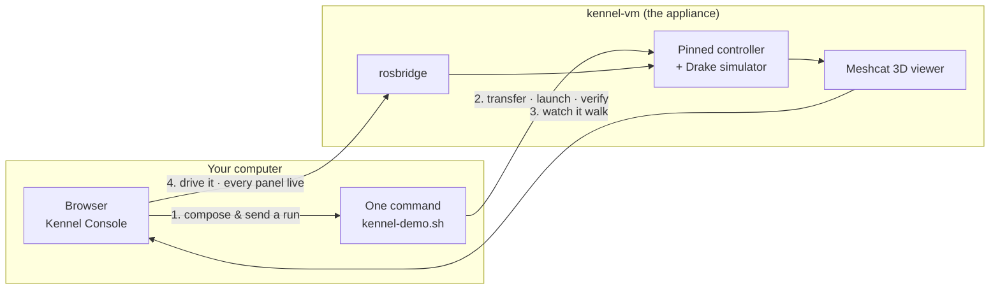

# Kennel

## A ready-to-use virtual lab for a walking Go2 quadruped

<div class="mt-8 opacity-80">
Compose an experiment in your browser · run it in a pinned virtual machine · watch the robot walk · drive it yourself
</div>

<div class="mt-16 text-sm opacity-60">
Final presentation — 2026 internship — Thales Andrade Soares
</div>

<!--
⏱ 0:00. One line: "A lab in a box. You open a browser, choose how the robot should be controlled, press one button, and a simulated Go2 walks — on any machine, the same way, every time."

Then the seven parts, in one breath: the problem, what existed, what I proposed, what I built, what it measures, a live demo, what I learned.
-->

---

# Agenda 

<div class="grid grid-cols-2 gap-x-12 gap-y-3 mt-8 text-lg">

<div><span class="opacity-50 mr-3">1</span> Problem statement</div>
<div><span class="opacity-50 mr-3">5</span> Results</div>
<div><span class="opacity-50 mr-3">2</span> Previous work</div>
<div><span class="opacity-50 mr-3">6</span> Demo</div>
<div><span class="opacity-50 mr-3">3</span> The proposal</div>
<div><span class="opacity-50 mr-3">7</span> Learnings</div>
<div><span class="opacity-50 mr-3">4</span> Development</div>
<div></div>

</div>


<!--
Budget: 2 · 2 · 2 · 2 · 2 · 8 · 2 = 20 minutes. The presenter view shows the clock; each section slide's notes carry the cumulative mark.
-->

---
layout: section
section: "1 · Problem statement"
---

# 1 · Problem statement

Getting a quadruped controller running is a week of setup before the first trot

<!--
⏱ 0:30 → 2:30. Two slides.
-->

---

# Running a research quadruped controller today

<div class="grid grid-cols-2 gap-8 mt-4">

<div>

### The path, as the upstream README writes it

1. Build the Docker image, start a container
2. Build the ROS 2 workspace — **22 min** on 8 vCPU, when everything is right
3. Open **three terminals**: simulator, leg driver, controller — `sim:=go2` on each
4. Wait "a moment", then publish a gait target by hand
5. Open the 3D viewer and **judge by eye** whether it walks

</div>

<div v-click>

### What actually happens

- Versions drift between laptops — one works, the next does not
- Nobody knows *which revision* they are running
- The written wait is wrong: at the 10-second mark the simulator was still enumerating joints
- No pass/fail — "it looks fine" is the verdict
- **Swapping one block** means hunting a scattered parameter, or editing code and rebuilding — some blocks have no switch at all
- Every new lab member repeats the same week

</div>

</div>

<div class="mt-6 p-3 rounded bg-red-900/30 border border-red-700/50 text-sm" v-click>
"I used to budget a full week just to get the stack compiling before I could try a single trot in simulation."
</div>

<!--
The stack is good — it is the DFKI underactuated lab's controller, with a published solver benchmark. The barrier is not the controller, it is the environment around it.

The "still enumerating joints" line is a measured finding from the demo dry run (F8) — the written 10 s was wrong at rate 1.0 and wrong again by 1/rate at any slower rate.
-->

---

# Who pays the setup tax

<div class="grid grid-cols-3 gap-6 mt-6">

<div class="card">

### Alex — the researcher
Works on the controller: gait sequencing, MPC solvers, whole-body control. Every hour on installation is an hour off the research.

</div>

<div class="card" v-click>

### Sofia — day one
Has read about quadruped control; has never built a ROS workspace. Her laptop is whatever it is.

</div>

<div class="card" v-click>

### Marcus — the instructor
Thirty seats on Monday. On Wednesday one is hopelessly modified. Contact time is the scarce resource.

</div>

</div>

<div class="mt-8 grid grid-cols-2 gap-8" v-click>

<div class="p-3 rounded bg-green-900/30 border border-green-700/50">

**The non-negotiable:** a walking, simulated Go2 within **about five minutes** of starting — on any machine, the same way, every time.

</div>

<div class="card opacity-80">

**Out of scope, on purpose:** controlling a real robot from a VM; hard real-time inside virtualisation; replacing the upstream stack.

</div>

</div>

<!--
Seven personas in the plan corpus; these three carry the problem. The bottom row is the PRFAQ's promise and its explicit non-claims — say them now, so the demo is judged against the right bar.
-->

---
layout: section
section: "2 · Previous work"
---

# 2 · Previous work

Two proven pieces, a prototype on mock data, and no product between them

<!--
⏱ 2:30 → 4:30. Two slides.
-->

---

# What existed

<div class="grid grid-cols-2 gap-8 mt-8">

<div class="card">

### 🐕 The DFKI quadruped stack
- ROS 2 controller: gait sequencer → **MPC** → **WBC**, four QP solvers
- Drake simulator + Meshcat viewer, in a Docker image
- ICRA 2025: a published QP solver benchmark
- Research code — three terminals, hand-typed commands
- The pipeline is **one node**: stage choice is scattered parameters

</div>

<div class="card" v-click>

### 🧪 Yuruna
- A VM test harness: reproducible host/guest setups, provisioning **sequences** with asserts, written in YAML
- Drives the hypervisor, boots the guest, runs steps over SSH, gates on 0 FAIL
- Already used to validate appliances — the home ground for a *VM-shaped* product

</div>

</div>

<!--
Two pieces, both proven, neither aimed at this problem: a research controller meant to be driven by hand from three terminals, and a harness for testing VM appliances. The third piece — the console prototype — is on the next slide, because it is where the gap is easiest to see.
-->

---

# What was missing between them

<div class="grid grid-cols-5 gap-6 mt-2">

<div class="col-span-2 text-sm">

- **One lab, identical everywhere** — not a week of setup per person, and not a different environment on every laptop.
- **A pipeline you can take apart** — swap the gait sequencer, the MPC, the swing or contact logic, one block at a time, without touching the rest.
- **A run you can repeat and check** — the same choices give the same configuration, and the verdict is read from the robot's own data.

<div class="note mt-4">
The objective: an easy-to-start lab where <b>every block of the control pipeline can be tested on its own</b> — and the same test can be run again tomorrow.
</div>

</div>

<div class="col-span-3">

<div class="caption">the prototype's pipeline composer — six stages, and every one of them on scripted data</div>
</div>

</div>

<!--
The third piece, and the gap in one picture: the console prototype, scaffolded from the specification in the first week and served on the host. Every panel is fed by a scripted mock — exactly as the spec asked ("MockDataSource first, bridge later") — so it demonstrated every panel's purpose and connected to nothing.

The layout is the same one you will see live in the demo. That is the point of the DataSource seam.

The three bullets are the whole thesis of the internship, and the box is the sentence to say slowly: a component of a control pipeline is only testable if you can swap it *and* trust that nothing else moved. That needs both halves — a modular pipeline, and an environment that is identical every time.
-->

---
layout: section
section: "3 · The proposal"
---

# 3 · The proposal

A stack whose parts can be substituted one at a time — and a lab that makes each test repeatable

<!--
⏱ 4:30 → 6:30. Two slides: what it is, and how it is used. No implementation here — that is the next section.

Say the two moves plainly: first make the stack modular, so a part of the control pipeline can be substituted without disturbing the rest; then wrap it in a lab that is identical every time, so the substitution is the only thing that changed.
-->

---

# Kennel: a virtual lab in a box

<div class="grid grid-cols-3 gap-6 mt-8">

<div class="card">

### 🖥️ The appliance
A virtual machine, **kennel-vm**, built and frozen once. Inside: the DFKI stack at a **pinned revision**, the Drake simulator, the 3D viewer, and a bridge.

</div>

<div class="card" v-click>

### 🎛️ The console
A browser page on your own computer. Compose an experiment, send it, watch every panel on the **running** robot, drive it with a joystick, compare runs.

</div>

<div class="card" v-click>

### 🐕 The stack
A **modular** stack: the parts of the control pipeline can be **substituted one at a time**, so each can be tested on its own. Kennel **pins** one revision of it and never patches it locally.

</div>

</div>

<div class="mt-10 text-center opacity-80" v-click>
One driver, five verbs: <code>setup · provision</code> once per machine — <code>console · run · teleop</code> every session.
</div>

<!--
Written down before building: a PRFAQ, seven personas, ten verification scenarios (s001 firstwalk … s010 handoff), a master design with the decisions locked. The plan corpus is in plan/ and was the first week of the internship.
-->

---

# How the pieces fit



<div class="mt-2 text-sm opacity-80">
The VM lives on your computer; the browser talks to it over a private network. No cloud, no account, nothing to install on the host besides the VM tools. The console never fetches off-host — the suites assert it.
</div>

<!--
Four arrows, four steps of the daily loop. Step 2 is the part the user never types: the driver checksums the run at every hop, launches the three processes, runs ten health checks, and hands back a walking robot.
-->

---
layout: section
section: "4 · Development"
---

# 4 · Development

The architecture — what the parts are, and where the seams are

<!--
⏱ 6:30 → 8:30. Three slides, all architecture: the stack's seam, Kennel's own parts, and the chain a single run travels.

If anyone asks about volume rather than shape: 82 commits here and 86 on the fork, 26 pull requests, 35 issues closed of 54, ~16k lines of scripts and sequences, ~10k lines of implementation records, 422 evidence transcripts. Every tool has a record beside it and every record has its transcripts — that is why the second number is as large as the first.
-->

---

# Every stage a plugin

<div class="grid grid-cols-2 gap-8 mt-4 text-sm">

<div>

### Before
The algorithms were compiled into the controller node. A stage was chosen — when it could be chosen at all — through a parameter that looked like any other.

### After
Six stages behind documented interfaces, each one a plugin:

- **`<stage>.type` in the YAML picks the implementation** — one uniform key for `gs` · `mpc` · `slc` · `wbc` · `contact_logic` · `model_adaptation`
- a loader that **fails fast** on a type it cannot resolve
- **per-stage overlays** for parameters, with shipped examples

</div>

<div v-click>

### What it buys
- The contact FSM became a stage of its own; the bio-inspired gait sequencer became a selectable plugin
- An **out-of-package plugin** — a pass-through swing-leg controller — loads through the production loader: a new stage needs no fork of the controller
- `adding_a_stage.md`, so the next person has a path
- Suites for the contract, the loader, the overlays, and the selection every shipped config makes


</div>

</div>

<!--
This is the half of the internship that happens inside the stack, and it is why "test every little component" is a sentence I am allowed to say.

The honest bit, if asked: this landed in the fork on the modular branch. The appliance pins the commit every number in this deck was measured against, which predates it — so the demo you are about to see composes the MPC, and the other five stages are shown fixed rather than pretended. Repinning is scenario s009, designed for exactly this, and the composer needs no change to gain them: the schema already has an impl per stage.
-->

---

# How Kennel is built

<div class="grid grid-cols-2 gap-8 mt-4 text-sm">

<div>

### The parts

- **On the host** — one HTML file, no build step and no off-host fetch; `serve.py` beside it, which reports the guest's URLs and writes run folders; and `kennel-demo.sh`, the **only** thing in the system that starts a process
- **On the guest** — an appliance built by Yuruna sequences and frozen as a snapshot; the pinned stack in a container; the Drake viewer on `:7000` and rosbridge on `:9090`

</div>

<div v-click>

### The seams

| Seam | What it lets you change |
|---|---|
| `<stage>.type` | one part of the control pipeline |
| the **run folder** | the whole experiment — it is the only contract between browser and stack |
| `DataSource` | where the panels' data comes from: mock or live, same panels |
| `verify.json` | nothing — it is the only thing allowed to say a run worked |

<div class="note mt-3">
The line that never moves: the console <b>configures and observes</b>. It never starts or stops a process.
</div>

</div>

</div>

<!--
Three seams and a rule. Each seam is a place where one thing can be replaced without the rest noticing — which is the whole point of the internship in one slide.

The rule at the bottom is why the driver exists: a browser that could start processes would be a browser you have to trust with the machine.
-->

---

# A run, end to end

<div class="chain grid grid-cols-6 gap-3 mt-6 text-xs">

<div class="chip"><b>Compose</b><span>in the browser</span></div>
<div class="chip"><b>run folder</b><span>run.json · 2 YAMLs · commands</span></div>
<div class="chip"><b>transfer</b><span>checksummed · pin checked</span></div>
<div class="chip"><b>launch</b><span>waits for the node graph</span></div>
<div class="chip"><b>verify</b><span>10 checks on the robot's topics</span></div>
<div class="chip"><b>verify.json</b><span>verdict · counters → Runs view</span></div>

</div>

<div class="grid grid-cols-3 gap-6 mt-2 text-sm">

<div class="card">

**Same in, same out.** The same choices produce byte-identical configuration files, in any session, on any machine.

</div>

<div class="card">

**Refused, not adapted.** A run composed against another revision of the stack is rejected at the door, never quietly applied.

</div>

<div class="card">

**A verdict, not an impression.** "It walked" is ten checks on the robot's own topics, filed back into the run folder.

</div>

</div>

<!--
This chain is what makes a component test worth anything: the only difference between two runs is the choice you changed, and the answer comes from the robot rather than from an opinion.

Worth naming as it goes past: the transfer checksums every file at every hop; the launcher waits for the six-node graph rather than for a timer; the report is machine-readable, which is why the Runs view can diff two runs at all.
-->

---
layout: section
section: "5 · Results"
---

# 5 · Results

Measured, not estimated

<!--
⏱ 8:30 → 10:30. Three slides. All figures from recorded transcripts on the reference host, 8 vCPU / 16 GiB guest.
-->

---

# The numbers

<div class="grid grid-cols-2 gap-8 mt-2">

<div class="text-sm">

| Step | Wall clock |
|---|---|
| `provision` from nothing → frozen lab | 32–39 min, **once** |
| `run` from a powered-off VM → walking | **1m49s** |
| `run` again, over a running stack | 93 s |
| `launch` alone, after the reliability fix | 43–46 s → **29–35 s** |
| `verify` — ten checks, driving the robot 20 sim-s | 42 s |
| `reset` to the baseline | 1m21s – 1m24s |
| `teleop` — bridge up and reachable | ~10 s |

</div>

<div class="text-sm" v-click>

### And what they prove

- **Cold containers: 4 of 4 green** after the launcher waited for the graph instead of a log line — it had been 2 of 4
- The `sleep 15` that fix removed stood in for a wait of **2–5 s**; it would have been too *short* on a slower host
- **Teleop:** 0.47 m/s measured against 0.50 commanded; 12.5 m in 27 s; stick released → standstill in about a second
- **Reproducible:** same composition → byte-identical config files; a run for another pin is refused
- **Never lose 35 minutes:** the revert itself is 1–2 s; the rest of `reset` is the lab checking itself before handing it back

</div>

</div>

<!--
The provision figure is the one-time cost; everything a person interacts with afterwards is under two minutes. The negative control before the launcher fix did not reproduce the race — the record says "4 of 4 green", not "the race was caught in the act".
-->

---

# The console, on the live stack

<div class="grid grid-cols-5 gap-6 mt-2">

<div class="col-span-3">

<div class="caption">mode · live — the viewer framed in the 3D pane, every panel on the running robot</div>
</div>

<div class="col-span-2 text-sm">

- **`mode · live`** — every panel reads the running robot over rosbridge
- It **bins into the mock's 10 Hz** cadence — **no drawing code changed**
- `/quad_state` at **49.5 Hz**; the real-time factor reads back **0.50×**
- **Fall detected at 7.9 s** — by the page and by the suite, independently
- **Real verdicts**: OSQP `completed`, HPIPM `completed`, OSQP on terrain **`fell`**
- **Interventions are real**: *inject* → `/disturb_simulation`, *reset sim* → `/reset_sim`
- Two new suites, **85 + 51 checks**, on recorded-bridge fixtures

</div>

</div>

<!--
This is the slide that answers the prototype: same layout, no recording. The post-mortem live: "WBC missed its 2 ms deadline … early contact FL −240 ms … FALL: body height — z median 0.180 m — controller latched to damping mode".
-->

---

# Against the ten scenarios the design set

<div class="text-sm">

| Scenario | State | What stands behind it |
|---|---|---|
| s001 · cold import → walking in budget | ✅ | `run` from a powered-off VM: 1m49s |
| s002 · compose, generate, round-trip | ✅ | byte-identical files; the composed solver proven in the running controller |
| s007 · the seam, mock ↔ live | ✅ | one seam, both sources, no panel changed |
| s004 · interventions, disturbance | ✅ | `scenario disturb`: **64 checks**, green twice, and the **process table identical** around every step |
| s003 · degradation, fall, post-mortem | ✅ | `scenario diagnose`: **87 checks**, 2 bypassed — tint history green→amber→red, post-mortem pinned, verdict recorded |
| s005 · solver comparison | 🟡 | verdicts, counters, config diff; the benchmark preset open (#72) |
| s006 · same manifest, same experiment | 🟡 | reproducible files; run-to-run verdict comparison not yet asserted |
| s008 · fleet, drift, reset | ⏳ | `reset` proves the baseline; fleet + drift check open (#75, #76) |
| s009 · repin · s010 · safety gate | ⏳ | designed, not started (#74, #77) |

</div>

<!--
Behind this table, if the number of checks comes up: Yuruna 28/28 on provision, 10 verify checks per run, 8 console suites on recorded-bridge fixtures, s004's 64 and s003's 87 — and 422 evidence transcripts in the repo.

Every open item is an issue in the *Finish the system* milestone, in order, with its plan slot.

Be plain here: five of the ten are asserted end to end by a command, two have the hard half done, three are open and named. That honesty is itself one of the results — nothing in the repo claims more than its evidence.

s009 is the repin rehearsal — the scenario that would put the modular revision under the appliance.
-->

---
section: "6 · Demo"
---

# Demo — eight minutes

<div class="grid grid-cols-5 gap-6 mt-2">

<div class="col-span-3 text-xs">

| Min | Action | What the audience sees |
|---|---|---|
| 0:00 | **Compose**: flat plane, OSQP, rate 0.75 → **send to kennel-runs →** | the pipeline diagram; the run folder appears |
| 1:00 | `kennel-demo.sh run` | transfer → launch → **`pass=10 fail=0`** → walk |
| 3:00 | open the Meshcat URL it prints | the Go2 trotting on *this* composition |
| 3:30 | `kennel-demo.sh teleop` → Dashboard → **connect bridge** | `mode · live`, the viewer in the 3D pane, panels moving |
| 4:30 | joystick · change gait · **STAND** | the robot obeys; the velocity plot follows the stick |
| 6:00 | Runs view: today's run vs the HPIPM one → **diff** | real verdicts; only the solver keys differ |
| 7:00 | `teleop stop` · `kennel-demo.sh reset` | back to the frozen baseline in ~90 s, self-checked |

</div>

<div class="col-span-2 text-sm">

### Before the talk
```bash
kennel-demo.sh up
kennel-demo.sh console
kennel-demo.sh status      # green
```
One earlier **HPIPM** run with a `verify.json` in `~/kennel-runs`, so the diff has a partner.


</div>

</div>

<!--
⏱ 10:30 → 18:30. Rate 0.75 rather than 0.5: verify drives the robot for 20 sim-seconds, so a slower rate lengthens the wait on stage. While `run` works, narrate: checksummed at every hop, a run for another pin is refused, the launcher waits for the six-node graph, ten checks, one of them proves the controller loaded *your* solver.
-->

---
layout: section
section: "7 · Learnings"
---

# 7 · Learnings

<!--
⏱ 18:30 → 20:00. Two slides.
-->

---

# What the records taught me

<div class="text-sm mt-2">

| | Learned the hard way |
|---|---|
| **Waits observe, never sleep** | the "wait ~10 s" in the generated commands had *never been obeyed by anything* — every script waited on observation. It was found only by running the demo from the written steps |
| **A check that looks right and tests the wrong thing** | graph presence as liveness (a killed node lingers 10–20 s); `topic echo --once` warning on **stdout**; a fall rule on a 0.2-s window; a counter mistaken for a solve time |
| **Run the docs, not the scripts** | two of the five dry-run findings exist only because a repo script was used solely where the written step *is* "run this script" |
| **Measure the negative control first** | the launcher race did not reproduce on the day; the record says "4 of 4 green after", not "caught in the act" |
| **Tools must name what they need** | a tool that is right about what it does and silent about what it depends on fails three ways, each with a different message |
| **Write for a reader with no context** | records, plans and rules for the next person — or the next agent — who has only the repo: ground truth by command, on a date |

</div>

<!--
Pick two to say aloud: the sleep, and the negative control. The table stays for the reader.
-->

---

# What I take with me

<div class="grid grid-cols-2 gap-8 mt-6">

<div>

### On building
- A number nobody can read back is a number nobody should believe — put the value where a suite can assert it
- **Say what it is not.** Kennel is not a robot controller, and saying so early made every other claim easier to trust
- Small issues, each ending in evidence, compound faster than big branches
- **Design the seam before you need it.** The composer carried an implementation per stage months before the stages were plugins — so the modular revision costs it no change

</div>

<div v-click>

### On working
- Planning is writing: a plan good enough for a stranger to implement is a plan good enough to implement
- The friction log is the product of a dry run — a green run teaches nothing
- Ship the record with the code, or the record never ships

</div>

</div>

<div class="mt-10 text-center opacity-70 text-sm" v-click>
Thank you — and thank you to the people who reviewed every one of those 25 pull requests.
</div>

<!--
This is the personal slide: swap any bullet for your own words before presenting. End on the thank-you and go to the last slide.
-->

---
layout: end
section: ""
---

# Thank you

<div class="opacity-70 mt-4">
Kennel — github.com/alius-git/kennel
</div>

<div class="opacity-50 mt-2 text-sm">
Backup slides follow — the walk, the live Dashboard, the Runs view, teleop.
</div>

---
layout: image
image: /img/meshcat-walking.png
backgroundSize: contain
section: "Backup"
---

<!--
Backup 1 — the Drake Meshcat viewer, opened from the host browser: the Go2 trotting on a console-composed run.
-->

---
layout: image
image: /img/dashboard.png
backgroundSize: contain
---

<!--
Backup 2 — the Dashboard on the live stack: mode · live, the viewer framed in the 3D pane, pipeline health, timeline, counters, plots, the event feed.
-->

---
layout: image
image: /img/runs.png
backgroundSize: contain
---

<!--
Backup 3 — the Runs view reading the host's own run folders: real verdicts, headline counters, and the diff of two runs.
-->

---
layout: two-cols
---

# Backup — driving it

```bash
demo/tools/kennel-demo.sh teleop
```

Dashboard → Interventions → **connect bridge**

- **Joystick** — push to walk, twist to turn; release and it stops
- **Gait picker** — trot, walk, pace, bound, gallop…
- **STAND** — stop and stand, immediately
- **E‑STOP** — emergency damping, the robot sits down

<div class="mt-4 text-sm opacity-70">
Measured: 0.47 m/s against a 0.50 m/s command; 12.5 m in 27 s; released stick → standstill in about a second.
</div>

::right::


<div class="caption">the Interventions row over the bridge; the panels below it were still on the mock when this was taken</div>
