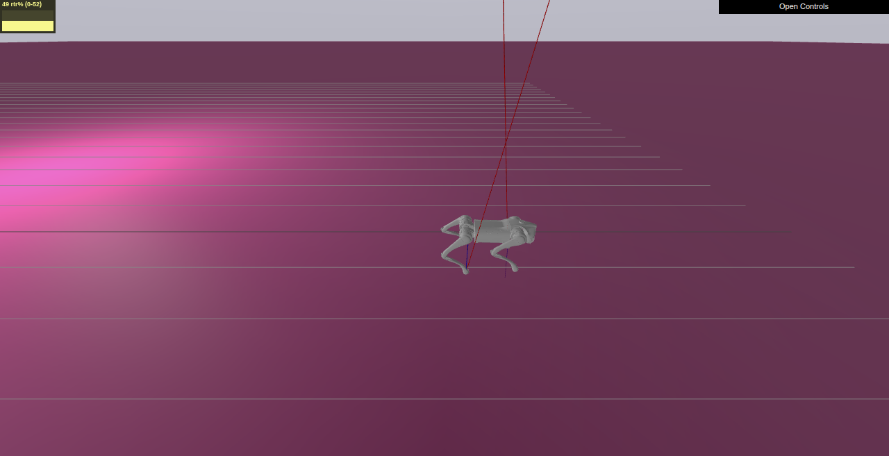

# The PoC moment — a composed config runs the stack, and the values took effect

Implementation record for
[issue #21](https://github.com/alius-git/kennel/issues/21) — a config composed
in the console UI, with observable non-stock choices, runs the go2 sim stack;
the robot walks; and the running stack demonstrably uses the composed values.

This is the issue every other one has been feeding. It consumes them unchanged:
[#18](https://github.com/alius-git/kennel/issues/18) generated the YAMLs,
[#19](https://github.com/alius-git/kennel/issues/19) exported them,
[#20](https://github.com/alius-git/kennel/issues/20) transferred them
([`stack/transfer.md`](transfer.md)),
[#13](https://github.com/alius-git/kennel/issues/13) established the launch
surface and [#14](https://github.com/alius-git/kennel/issues/14) the verification
recipe ([`stack/verify.md`](verify.md)). Pin:
`dcf53c596339afd45b82f12c54b1e93e8273c2f4` ([`stack/pin.lock`](pin.lock)).

Verified 2026-08-06 on `kennel-vm`. Evidence in
[`stack/composed-run/evidence/`](composed-run/evidence/).

## 1. The composition

| Choice | Stock | Composed | Why this one |
|---|---|---|---|
| `mpc_solver` | `PARTIAL_CONDENSING_HPIPM` | **`PARTIAL_CONDENSING_OSQP`** | Solver identity is readable from the running node and echoed in the launch log |
| `simulator_realtime_rate` | `1.0` | **`0.5`** | Observable as sim-time against wall-time, and independent of the solver |
| map | flat plane | *(left at stock)* | See below |

This is exactly the pair issue #21 suggests. The map is deliberately **not**
composed: [`stack/transfer.md` §6.3](transfer.md) established that the Obstacle
terrain world does not walk — the robot trots in place or tumbles, differently
on each run — and #21's acceptance requires the walking criterion to pass. That
finding is what made this composition the right one rather than a lucky guess.

The two choices are also independent on purpose: one lives in the **controller**
YAML and one in the **simulator** YAML, so a transfer that silently dropped
either file would fail a different assert. The export driver asserts that
`run.json` differs from stock in exactly these two fields and nothing else — an
accidental third choice would make "prove each composed value" ambiguous.

## 2. What is delivered

| Artifact | Purpose |
|----------|---------|
| [`stack/composed-run/tools/p21-launch-from-commands.sh`](composed-run/tools/p21-launch-from-commands.sh) | Launch the stack **from the console's generated `commands.txt`** |
| [`stack/composed-run/tools/p21-prove-realtime-rate.sh`](composed-run/tools/p21-prove-realtime-rate.sh) | Turn the realtime rate from an `[INFO]` line into a pass/fail |
| [`stack/composed-run/tools/p21-trot-hold.sh`](composed-run/tools/p21-trot-hold.sh) | Hold a commanded trot, so the view can be photographed mid-stride |
| [`stack/composed-run/tools/p21-meshcat-shot.sh`](composed-run/tools/p21-meshcat-shot.sh) | Capture the Meshcat view from the host, aimed at the robot |
| [`stack/composed-run/evidence/`](composed-run/evidence/) | The run folder, the transcripts, the launch logs, the screenshot |

## 3. The three decisions

### 3.1 Launch from `commands.txt`, not from a hand-written copy of it

`commands.txt` was the one console output no issue had ever executed. #13
established the three commands by hand; #14 and #20 drove them through
[`stack/verify/tools/k14-stack-up.sh`](verify/tools/k14-stack-up.sh), which is a
faithful but **hand-written** copy. A generated file that had quietly drifted
from that copy would have gone unnoticed by every test in the repo.

So the launcher reads the file and runs *it*. Before it runs anything it asserts
two things:

- **The three blocks reconstruct the file byte for byte** (`cat block1 block2
  block3 | cmp - payload`). Without this the splitter could drop a `source` line
  and the failure would surface much later as a mystery CMake or DDS error.
- **The launches are the canonical three of [`stack/launch.md` §1.1](launch.md)**,
  in order. A generated file that launched something else is a #18 regression,
  and running it anyway would report a green stack for the wrong stack.

The readiness waits are deliberately **not** in `commands.txt`. Launch *order*
and settling are properties of the stack (launch.md §1.2) and belong to whoever
runs the commands; the file is a faithful record of what the console composed.
The console's own comment says as much — "THREE shells, in this order — this is
not a script".

This also answers #24's open "non-blocking launch pattern over SSH" work item:
each blocking `ros2 launch` is started with `docker exec -d`, and the script then
waits by **observing the stack** — `/quad_state` appears, the sim clock advances,
the controller logs `Starting controller` — never by sleeping and hoping.

### 3.2 The settle is measured in sim seconds, not wall seconds

`commands.txt` says "wait ~10 s for the robot to settle first". At
`simulator_realtime_rate: 0.5` that is *twenty* wall seconds, and a `sleep 10`
would run `safe_start()` on a robot still dropping from its 0.4 m spawn.

The launcher therefore reads `/clock` and waits for 10 **sim** seconds, which is
invariant under the very parameter this issue composes. It is the same principle
[`stack/verify.md`](verify.md) applies to all its observation windows, and this
run is precisely the case that motivated it.

### 3.3 The realtime rate gets its own assert

#14's recipe reports the rate as `[INFO] realtime-rate` — informative, never
asserted, because #14 could not know what any given run would compose. #21 does
know, and its acceptance is "prove each composed value", so the same observable
is measured again as a pass/fail against `0.5 ± 0.1`.

The measurement is `/clock` against the guest's **monotonic** clock, not its wall
clock: [`vm/provisioning.md` §6a](../vm/provisioning.md) documents a host whose
NTP-adjusted clocks run ~10 % slow. That defect is the host's and this
measurement is the guest's, but the ratio is the entire result, so it is taken
from the one clock that cannot be re-railed underneath it. The ±0.1 window is
wide for the same reason — 0.5 against 1.0 is a factor of two, and no precision
claim is needed to tell them apart.

## 4. The result

```console
$ stack/transfer/kennel-transfer.sh apply run-20260806T183045Z
  simulator_params_go2.yaml      ef249170  ef249170  ef249170  ef249170  OK
  mit_controller_sim_go2.yaml    3c69d87f  3c69d87f  3c69d87f  3c69d87f  OK

$ ~/p21-launch-from-commands.sh
[p21-launch] split            3 shells, 30 payload lines, reconstructs the file exactly
[p21-launch] launches         the canonical three, in order (stack/launch.md 1.1)
[p21-launch]   settling 10 sim-s (sim clock at 1s)
[p21-launch]   settled at sim 12s
[p21-launch] stack is up, launched from the console's generated commands.txt

$ ~/kennel-verify.sh --expect-solver PARTIAL_CONDENSING_OSQP --controller-log /tmp/p21-ctrl.log
[INFO]   realtime-rate  -- measured 0.501
[PASS] 8 walking        -- vx_mean=0.261 m/s, dx=3.910 m over 15.00 sim-s, advanced in all 5 sub-windows: yes
[PASS] 10 composed-config -- measured PARTIAL_CONDENSING_OSQP, launch log agrees with the running value
                             ([mitcontrollernode-1] Set osqp linear system solver to qdldl)
pass=10 fail=0
VERDICT: PASS -- healthy and walking

$ ~/p21-prove-realtime-rate.sh 0.5 0.1 30
[PASS] realtime-rate -- /clock vs guest monotonic: measured 0.500 (15.722 sim-s in 31.450 s),
                        required 0.5 +/- 0.1 i.e. [0.400, 0.600]
```

**Both composed values are proven, by different mechanisms, on one run.** No
`mpc_solver:=` launch argument exists anywhere in `commands.txt` — the console's
generator deliberately emits none ([`stack/mapping.md` §2.1](mapping.md)) — so
the only path from the composer to the running node is the YAML.



The screenshot carries a third, unplanned corroboration: Drake's own HUD, top
left, reads **`49 rtr%`** — its realtime-rate meter, independently reporting the
composed 0.5 from inside the simulator.

## 5. Negative control — [`evidence/06-negative-controls.txt`](composed-run/evidence/06-negative-controls.txt)

Issue #21 asks for "a deliberately broken generated YAML (bad key) fails loudly
at launch, not silently — record the failure mode". Three corruptions of the same
exported controller YAML, each transferred and launched exactly like the good
one. The question is not whether the stack breaks; it is whether it *says so*.

| # | Corruption | Failure mode |
|---|---|---|
| A | `mpc_solver "…"` — colon removed | **Loud.** `mitcontrollernode` aborts before starting: *"Couldn't parse params file … Error parsing a event near line 32"* — names the file and the line. Launcher exits 1 |
| B | `mpc_solver: "NO_SUCH_SOLVER"` | **Loud, and better.** Upstream validates the value: *"Unknown mpc solver: NO_SUCH_SOLVER"*, node dies with exit 255 |
| C | `mpc_solverr:` — key misspelled | **SILENT.** See below |

**Case C is the finding.** The stack launches cleanly, exits 0, logs no
complaint about the unknown key, and quietly runs the **stock** solver. An
operator watching that launch sees a completely healthy stack running a
configuration nobody composed. The composed value was not rejected — it was
never read.

This is ROS 2 behaving as designed (an undeclared parameter in a params file is
not an error), which makes it a property to defend against rather than a bug to
report. The defense already exists, and this is the argument for it:

```
[FAIL] 10 composed-config -- ros2 param get /mit_controller_node mpc_solver:
       measured PARTIAL_CONDENSING_HPIPM, launch log agrees with the running value
       ([mitcontrollernode-1] Set hpipm mode to SPEED),
       required PARTIAL_CONDENSING_OSQP
pass=9 fail=1
VERDICT: FAIL
```

Nine checks pass. The stack **is** healthy and **is** walking. Check 10 is the
only thing between a silent typo and a believed result — which is exactly why
#14 built a read-back instead of trusting the launch, and why
[#24](https://github.com/alius-git/kennel/issues/24) is right to assert the
composed value rather than "something runs".

Worth a line on [#28](https://github.com/alius-git/kennel/issues/28): upstream
could `declare_parameter` strictly, or the mapping layer could validate generated
keys against the pin's schema before transfer.

## 6. Notes for whoever touches this next

### 6.1 `kennel-verify.sh` needs `--controller-log` unless #13's launcher ran

The recipe's launch-log corroboration falls back to a hardcoded
`/tmp/k13-ctrl.log` ([`kennel-verify.sh`](verify/kennel-verify.sh) line 176) —
the log of #13's launcher. A stack launched any other way, including from
`commands.txt`, writes somewhere else, and the recipe then reads **a stale file
from a previous run**.

It bit this issue. The first composed-run verification reported *"launch log
agrees with the running value (Set osqp …)"* while reading a `k13-ctrl.log` left
over from #20's runs hours earlier. It was accidentally right, which is the worst
kind of wrong. Every run recorded here passes `--controller-log /tmp/p21-ctrl.log`
explicitly.

**The assert itself was never affected** — `ros2 param get` reads the live node —
only the corroboration text beside it. #24 should pass the flag; a better default
would be for #14 to take the newest matching log, or to refuse to corroborate
from a file older than the node.

### 6.2 The Meshcat camera needs aiming, and the frame is not what it looks like

Two traps, both recorded in the shot tool's header:

- **The default camera frames the world origin, and the robot leaves it.** At
  0.3 m/s it is 10 m away after half a minute — a speck near the horizon. The
  first three attempts at this screenshot looked like "the robot is not in the
  scene".
- **Meshcat is Y-up, the Drake scene is Z-up, and `viewer.camera` sits under a
  `rotated` parent.** Setting `camera.position` to a Z-up coordinate puts the
  camera *under the ground plane*, looking up at the robot's underside. The tool
  sidesteps the whole question: it keeps the default camera's own direction
  vector and simply re-centres it on the robot, so it cannot get the convention
  wrong whichever axis is up.

Headless Chrome also has no GPU here — without `--use-gl=swiftshader` the canvas
renders empty, which looks identical to the first trap. The tool checks the PNG
is not a blank frame before accepting it.

### 6.3 The trot is commanded twice, deliberately

`kennel-verify.sh` commands its own trot and always returns the gait to STAND on
the way out, including on its failure paths — correctly, but it means the robot
is standing by the time the verdict prints. The screenshot therefore needs its
own trot, from `p21-trot-hold.sh`. Perturbing #14's measurement windows to get a
photograph would have traded evidence for a prop.

## 7. Limits

- **One composition.** Two of the composer's seven fields are exercised. The
  other five are mapped ([`stack/mapping.md`](mapping.md)) but not demonstrated
  end to end.
- **The screenshot is evidence of a moment, not a measurement.** The walking
  criterion is check 8; the photograph shows what check 8 asserts.
- **`run.json` is provenance, not config.** The negative controls corrupt the
  YAML and leave `run.json` claiming OSQP — as it should, since nothing reads it.
  A run folder is not self-validating, which is the point of the read-back.
- **The guest was left at stock** (`restore-stock`, `git status` clean), so this
  issue leaves no state behind for the next one.

## 8. What this feeds

| Issue | What it takes from here |
|---|---|
| [#24](https://github.com/alius-git/kennel/issues/24) | The non-blocking launch pattern (§3.1), the sim-time settle (§3.2), and the `--controller-log` trap (§6.1). Its fixture can be `evidence/run-20260806T183045Z/`, which is a real export and has now been run end to end |
| [#27](https://github.com/alius-git/kennel/issues/27) | The whole §4 sequence is the quickstart's happy path, and §5 is what to tell an operator whose run "worked" but did not |
| [#28](https://github.com/alius-git/kennel/issues/28) | The silently-ignored misspelled key (§5) |

---

Last review: 2026-08-06
