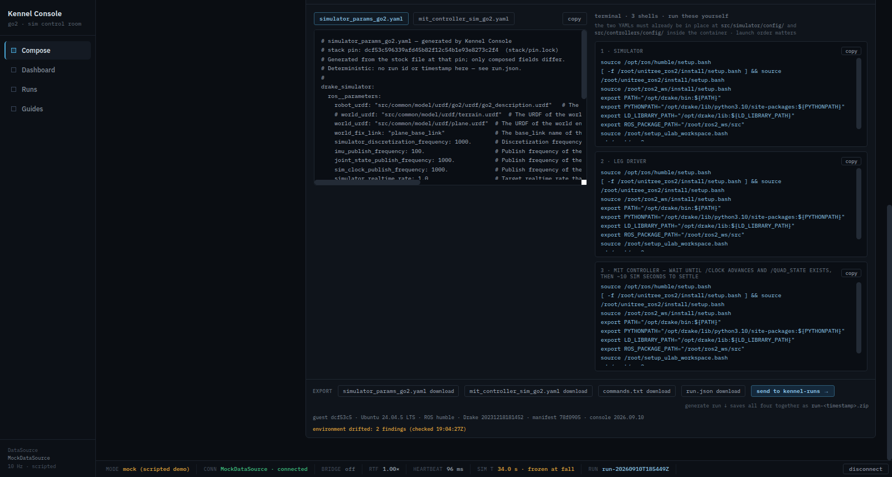

# The drift check — the live guest against its version manifest

Implementation record for
[issue #75](https://github.com/alius-git/kennel/issues/75), step 21 of 26 of
[*Finish the system*](https://github.com/alius-git/kennel/milestone/2). The
appliance gains its **drift check**: a guest-side script that compares the live
guest with the version manifest its baseline froze ([`manifest.md`](manifest.md),
#74) and prints one line per deviation. `reset` now ends by asserting it clean,
`drift` runs it on demand, and the console says *environment drifted* when the
last report found something.

The scenarios it answers: s006.reproduce step 6 (*"a modified stack file → the
drift check reports the deviation, and the console surfaces that the environment
does not match"*) and s008.classroom steps 4–5 (*"a stack file and a stray package
→ both deviations; clean seats report none … a student-kept run manifest placed in
the designated workspace before reset survives it"*). Plan:
[`plan/appliance.md`](../plan/appliance.md) §2.

## 0. Before: a guest that upgrades itself

Checked on the provisioned guest before any of this was written, read-only:
Ubuntu server's `apt-daily.timer` and `apt-daily-upgrade.timer` were **enabled**,
`20auto-upgrades` set both periodic switches to `"1"`, and
`/var/log/unattended-upgrades/unattended-upgrades.log` showed one run during
provisioning that had upgraded **135 packages**. Both timers are
`Persistent=true`: a baseline reverted a day after it was frozen runs a missed
upgrade within minutes of booting. A drift check against such a guest would
report every upgraded package — correctly — on any reset older than a day. So the
check could not be built honestly without the baseline first holding its package
set still (§2.2, F21).

## 1. What is delivered

| Artifact | Purpose |
|---|---|
| [`vm/guest/ubuntu.server.24/kennel-drift.sh`](guest/ubuntu.server.24/kennel-drift.sh) | GUEST: the check. One `DRIFT <class> <detail>` line per finding, `note:` lines, a JSON report at `~/kennel-drift.json`; exit `0` clean, `1` drift, `2` could not look |
| [`test/workload.guest.ubuntu.server.24.kennel.reset.ssh.yml`](../test/workload.guest.ubuntu.server.24.kennel.reset.ssh.yml) | A thirteenth step, last: fetch and run the check; `sequenceRevision: 2` |
| the baseline prep script's *hold the package set still* phase | the periodic apt timers off and a `99kennel-no-periodic` apt switch, before the package list is recorded |
| [`demo/tools/kennel-demo.sh`](../demo/tools/kennel-demo.sh) `drift` | stage, run, copy the report to `~/kennel-runs/.kennel-drift`; `reset` runs it after its sequence, and `export-image` and `import` refuse on it |
| [`kennel_console/serve.py`](../kennel_console/serve.py) + the page | `/api/health.drift`; the strip's *environment drifted* warning |

## 2. What is a finding

| Class | The deviation | Detail printed |
|---|---|---|
| `pin` | the dfki-quad clone is not at the manifest's pin | `clone at <sha>, manifest pin <sha>` |
| `tracked-file` | each line of `git status --porcelain --untracked-files=no` | ` M ws/src/…` |
| `package` | the sidecar vs `dpkg-query` now — added, removed, or another version | `sl 5.02-1 (added)`, `<pkg> (was <v>, now <v>)` |
| `image` | the image id is not the manifest's; the container is absent; or it runs another image | `image <id> (manifest <id>)` |
| `build-stamp` | `ws/.kennel-built-<pin>` or `ws/install/setup.bash` missing | the path |
| `kernel` | the running kernel is not the manifest's | `running <v>, manifest <v>` |

**Not findings, on purpose:** untracked files (every healthy guest has the build
stamp and `ws/log` untracked in the clone — [`snapshot.md`](snapshot.md) F1);
`~/kennel-staging` (the staging area); process state (whether the stack or the
container runs is a session's business); the host.

The package comparison runs the **same query, filter and sort** the prep script
recorded the list with, so a difference is a difference in the guest and never in
the formatting. The check refuses (exit 2) a sidecar whose sha256 is not the
manifest's `packages.sha256`: comparing against an edited list would report the
edit.

### 2.1 An applied composed run is drift

A composed run's two YAMLs are **tracked files overwritten in place**, so a guest
with a run applied reports two `tracked-file` findings — plus a `note:` naming the
run from `~/kennel-staging/current-run` and saying that this is expected and that
`reset` returns them to stock. It is reported rather than filtered because it is
true: the environment is not the baseline's. `export-image` refuses such a guest
for exactly that reason.

### 2.2 Holding the package set still

The baseline prep script's new phase, before the package list is recorded:
`systemctl disable --now apt-daily.timer apt-daily-upgrade.timer`, and
`/etc/apt/apt.conf.d/99kennel-no-periodic` setting both periodic switches to
`"0"` — so a timer re-enabled by some later package upgrade still does nothing. A
periodic run already in flight is not stopped by disabling its timer, so the
script then **waits for it** — polling `ActiveState` of both services (a oneshot
in flight is `activating`, which `is-active` does not count), bounded by
`KENNEL_APT_WAIT` (900 s) — and refuses to record a package list mid-upgrade.

Updating by hand still works (`sudo apt-get update && sudo apt-get install …`),
and is drift, which is the point.

## 3. Where it runs

- **`kennel-demo.sh drift`** — stages the script to `/tmp`, runs it over ssh,
  prints its output verbatim, copies the JSON to `~/kennel-runs/.kennel-drift` on
  exit 0 or 1 and **deletes** it on exit 2 (a report about a guest nobody could
  check is a lie), and exits with the script's code.
- **The reset sequence's last step** — `sshFetchAndExecute
  project/vm/guest/ubuntu.server.24/kennel-drift.sh`, 300 s bound. On the warm
  path it proves the revert; on the cold path it runs a minute after the baseline
  was frozen, the first proof that the check is quiet on a clean guest. Yuruna
  keeps a step's output only on failure, which is when the `DRIFT` lines matter.
- **`kennel-demo.sh reset`** runs it once more from the host after the sequence —
  seconds — for the one thing a Yuruna step cannot do: leave the report where the
  console reads it. Before `status`, so `status` shows this guest's report (F22).
- **`export-image`** and **`import`** refuse a guest with any finding
  ([`image.md`](image.md)).

The script lives in `vm/guest/`, not `test/ubuntu.server.24/`, because it is the
appliance's in-VM tool rather than a provisioning script; the reset sequence
fetches it from the project tree like any other path ([`test/README.md`](../test/README.md) §1).

## 4. The console

`serve.py` reads `<out>/.kennel-drift` per request and serves it as
`/api/health.drift` — `checked`, `manifest_ref`, `findings`, `notes` — or `null`.
The export strip's warning line then includes *environment drifted: <n> findings
(checked <HH:MM:SSZ>)*. The console cannot run the check: it reads what the driver
left, and it shows the `checked` time so a stale report is visibly stale.



*P7: the guest dirtied with §7's two deviations and `drift` run from the host — `environment drifted: 2 findings (checked 19:04:27Z)` in amber under the guest line.*

## 5. The survival question

s008 step 5 wants *"a student-kept run manifest placed in the designated workspace
area before reset"* to survive it, and [`plan/design.md` §4](../plan/design.md)
calls that area *"the designated workspace directory (the area that survives
reset)"*. Tested both ways ([`06-survival.txt`](drift/evidence/06-survival.txt)):

```
--- before
-rw-rw-r-- 1 thales   thales    0 … /home/thales/kennel-runs/keep-me.txt
-rw-rw-r-- 1 yuuser24 yuuser24 42 … /home/yuuser24/kennel-staging/keep/note.txt
--- kennel-demo.sh reset              (13/13, drift findings=0)
--- after
-rw-rw-r-- 1 thales   thales    0 … /home/thales/kennel-runs/keep-me.txt
ls: cannot access '/home/yuuser24/kennel-staging/keep/note.txt': No such file or directory
```

The host's file is there; the guest's is gone. `~/kennel-staging` itself exists
again after the reset, **empty** — recreated right after the revert by `reset`'s
own `status`, whose `kennel-transfer.sh status` makes the staging skeleton. So the
accurate statement is that a reset removes everything *in* the guest's staging
area, not that the path stops existing.

**Disposition: the workspace that survives reset is the host's `~/kennel-runs`.**
It is already where the console writes run folders, where `verify` files
`verify.json`, and where the manifest and drift report now land. The guest's
`~/kennel-staging` is *staging* by name and by contract
([`stack/transfer.md`](../stack/transfer.md) §3): a qcow2 `snapshot-revert`
restores the whole disk, and the prep script deletes it on purpose besides.

A guest-side share was priced and declined. `virtiofsd` is not installed on this
host baseline. A 9p `<filesystem>` device would have to be added to the domain
**and to the snapshot's frozen copy of the domain XML** — `snapshot-revert`
restores the definition frozen with the disk, so a device added afterwards would
disappear on every reset (reasoned from how the revert works, not tried) —
and to the export template with a host-specific path, and to the guest's `fstab`
inside the baseline. Not cheap, and nothing in s008 needs the file to live in the
guest. *Growth path:* a share defined before the baseline is frozen, when a
scenario needs one.

## 6. Running it

```bash
demo/tools/kennel-demo.sh drift     # 0 clean, 1 drift (one DRIFT line each), 2 could not look
demo/tools/kennel-demo.sh reset     # ...ends with the same check, asserted
```

Knobs of `kennel-drift.sh`, all environment variables: `KENNEL_MANIFEST`,
`KENNEL_DRIFT_OUT` (`~/kennel-drift.json`), `DFKI_QUAD_DIR`, `KENNEL_CONTAINER`,
`KENNEL_IMAGE`, `KENNEL_STAGING`. Exit `2` names what it could not look at: no
manifest (a baseline older than #74 — re-take it with `snapshot`), a sidecar that
is not the manifest's, no docker, no clone, a missing tool.

## 7. Validation — evidence

[`drift/evidence/`](drift/evidence/), protocol rows P6–P8 of
[`plan/appliance.md`](../plan/appliance.md) §4.

| File | What it shows |
|---|---|
| [`01-clean.txt`](drift/evidence/01-clean.txt) | a freshly reset guest: `findings=0`, exit 0 — the clean seat |
| [`02-two-findings.txt`](drift/evidence/02-two-findings.txt) | one line appended to `ws/src/common/launch/simulation.launch.py` and `sudo apt-get install sl`, then `drift`: **exactly** `DRIFT tracked-file  M ws/src/common/launch/simulation.launch.py` and `DRIFT package  sl 5.02-1 (added)`, `findings=2`, exit 1 — s008 step 4's two injected deviations and nothing else |
| [`03-after-reset.txt`](drift/evidence/03-after-reset.txt) | `reset` on that dirtied guest: **13/13**, the sequence's own drift step PASS, then the host-side `drift` `findings=0` and the report it left, `"findings": []` — reset ends clean |
| [`04-console-drifted-drift.txt`](drift/evidence/04-console-drifted-drift.txt), [`04-console-drifted-health.json`](drift/evidence/04-console-drifted-health.json), [`04-console-drifted.png`](drift/evidence/04-console-drifted.png) | the two injections again, then `drift` (the same two lines, exit 1): `/api/health.drift` carries 2 findings and the strip warns (§4). A re-run: the first pass reached a console server started before this branch ([`manifest.md`](manifest.md) F24) |
| [`05-composed-run.txt`](drift/evidence/05-composed-run.txt) | a composed run applied (`kennel-transfer.sh apply`, not launched): `DRIFT tracked-file` for `ws/src/controllers/config/mit_controller_sim_go2.yaml` and `ws/src/simulator/config/simulator_params_go2.yaml`, the `note:` naming the run and saying an applied run is drift, `findings=2`, exit 1 (§2.1) |
| [`06-survival.txt`](drift/evidence/06-survival.txt), [`06-survival-reset.txt`](drift/evidence/06-survival-reset.txt) | a file in the host's `~/kennel-runs` survives `reset`; one in the guest's `~/kennel-staging` does not (§5) |

## 8. Findings

**F21 — the provisioned guest upgraded itself, and would have kept doing so.**
§0. Fixed in the baseline (§2.2), not in the check: the check reporting upgrades
is correct; a baseline that invites them is the defect.

**F22 — `reset` printed the previous guest's drift report.** The first `reset`
after a negative control ran `status` — which prints the last report on the host —
before its own drift check, so its transcript said *2 finding(s)* above a check
that said `findings=0`. Accurate (the line carries its `checked` time) but a trap
for a reader. `reset` now checks first.

## 9. Limits

- **Tracked files only, in one clone.** A modified file outside the dfki-quad
  clone and outside dpkg's view (a stray binary in `/usr/local`, an edit under
  `/etc`) is not seen. The manifest records what it can prove equal; extending the
  check means extending the manifest first.
- **The container's own layer is not inspected.** An `apt-get install` *inside*
  the running container changes nothing the image id shows, and vanishes with the
  container. Rebuilding the image is caught (`image`).
- **A report is a moment.** The console shows the last one with its time; it does
  not re-check.

## 10. What this feeds

| Issue | What it takes from here |
|---|---|
| [#76](https://github.com/alius-git/kennel/issues/76) — **done here too** | `export-image` refuses a drifted guest; `import` proves a clean one |
| [#77](https://github.com/alius-git/kennel/issues/77) | "refuses a drifted manifest" has a report to read |
| s006, s008 | the negative control, the clean-seat claim and the survival answer, each with a transcript |

---

Last review: 2026-09-10
