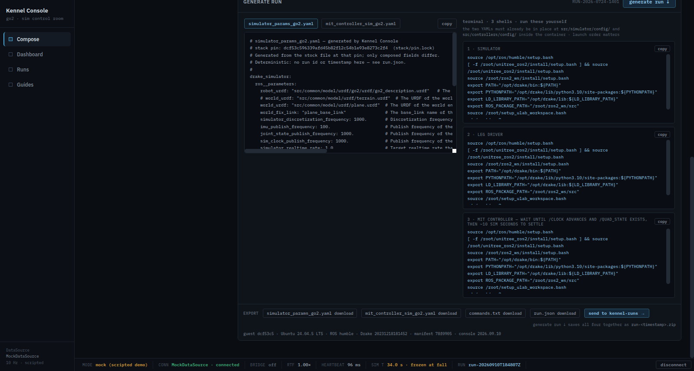

# The version manifest — what a baseline says about itself

Implementation record for
[issue #74](https://github.com/alius-git/kennel/issues/74), step 20 of 26 of
[*Finish the system*](https://github.com/alius-git/kennel/milestone/2). The
baseline gains a **version manifest**: one generated file per baseline, recording
the OS, the kernel, Docker, the stack image, the pin, ROS, Drake, every installed
package and the kennel commit it was built from. It is the identity
[`plan/design.md` §4](../plan/design.md) names — *"read by the console status
surface, the drift checker, and every Yuruna assert"* — and this record is where
that sentence becomes true of the running system.

Builds on [`vm/snapshot.md`](snapshot.md) ([#51](https://github.com/alius-git/kennel/issues/51)),
whose three-line `~/.kennel-baseline` it supersedes, and on
[`test/harness.md`](../test/harness.md) ([#23](https://github.com/alius-git/kennel/issues/23)–[#25](https://github.com/alius-git/kennel/issues/25)),
whose project archive it reads its provenance from. Its two consumers with
records of their own are [`vm/drift.md`](drift.md) (#75) and
[`vm/image.md`](image.md) (#76). Plan: [`plan/appliance.md`](../plan/appliance.md) §1.

> **Bypass note ([#26](https://github.com/alius-git/kennel/issues/26)):** the
> design has the manifest *"written by the appliance build, shipped in-image at a
> fixed path"*. There is no appliance build — the MVP builds the guest in place
> ([`provisioning.md`](provisioning.md)) — so the manifest is written by the last
> script that touches the guest before it is frozen, at `~/kennel-manifest.json`
> in the guest user's home. It is in the image in every sense that matters (it is
> on the disk the snapshot freezes and `export-image` ships); what it gives up is
> the fixed system path. *Retirement path:* `/etc/kennel/manifest.json`, written
> by an appliance build, when there is one. `console_version` is a date literal
> bumped by hand; a build would stamp it.

## 1. What is delivered

| Artifact | Purpose |
|---|---|
| [`test/ubuntu.server.24/ubuntu.server.24.kennel-baseline-prep.sh`](../test/ubuntu.server.24/ubuntu.server.24.kennel-baseline-prep.sh) | Two new phases: *attest the build inputs* and *write the version manifest*, after every clause of "clean baseline" has been asserted |
| the baseline, reset and MVP sequences in [`test/`](../test/) | Each asserts the **manifest's** pin (`jq -r .pin`) where it used to grep `~/.kennel-baseline`; the MVP's run record keeps `manifest.json` |
| [`demo/tools/kennel-demo.sh`](../demo/tools/kennel-demo.sh) | `up`, `run`, `status` and `reset` copy the manifest to `~/kennel-runs/.kennel-manifest.json` and print it; `snapshot` passes the checkout's provenance |
| [`kennel_console/serve.py`](../kennel_console/serve.py), [`Kennel Console.dc.html`](../kennel_console/Kennel%20Console.dc.html) | `/api/health` carries `manifest`, `manifest_ref`, `console_version`; the export strip names the guest and warns on a different pin; `run.json` gains `manifest_ref` when a manifest is known |
| [`stack/transfer/kennel-transfer.sh`](../stack/transfer/kennel-transfer.sh) | `apply` warns when the run's `manifest_ref` is not the guest's |
| [`kennel_console/verify-send.py`](../kennel_console/verify-send.py) group 7 | 20 checks: the version literals agree, health carries the manifest and its ref, the strip names the guest and warns, `run.json` has six keys with a manifest and five without |

## 2. The two files

```
~/kennel-manifest.json              the manifest -- canonical JSON, sorted keys
~/kennel-manifest.packages.txt      every installed package, "<name>\t<version>", C-sorted
```

The package list is a **sidecar** rather than a key: ~700 lines would make the
manifest unreadable in a transcript and heavy in every `/api/health`. The
manifest binds it by `packages.sha256`, and the drift check refuses to compare
against a sidecar whose hash is not the manifest's.

### 2.1 The fields, and where each comes from

The manifest the P1 cycle built, verbatim (its MVP run record's copy; byte-identical to the
one collected from the guest's home, `manifest_ref` `78f09058655ac922…`):

```json
{
  "console_version": "2026.09.10",
  "container_os": "Ubuntu 22.04.5 LTS",
  "created": "2026-09-10T18:45:29Z",
  "docker": "29.8.0",
  "drake": "20231218181452 9ba8f5d8d4ee6919ec41542d47509549cfa8d919",
  "drake_source": "/opt/drake/share/doc/drake/VERSION.TXT in the image (a binary tarball; docker/drake_setup.sh at the pin fetches drake-1.24.0-jammy)",
  "guides_version": "d2b5a1c1d691a07b5141318f82daf9690e55b93c",
  "image_id": "sha256:22dca342cc010287aa0f36f8db529e07095c1287b7a6ff22422e34bb73db1df8",
  "image_sha256": null,
  "kernel": "6.8.0-139-generic",
  "os": {
    "id": "ubuntu",
    "pretty_name": "Ubuntu 24.04.5 LTS",
    "version_id": "24.04"
  },
  "packages": {
    "count": 706,
    "file": "kennel-manifest.packages.txt",
    "sha256": "05a1ee40a4b5f466a9366c4619e0e0dd357900dc08de33eaf56dd2ce841f051b"
  },
  "pin": "dcf53c596339afd45b82f12c54b1e93e8273c2f4",
  "project_commit": "370078e214340c59ff8980c223de3efbe1622255",
  "provenance": "status-service",
  "ros_base": "ros-humble-ros-base 0.10.0-1jammy.20260804.204550",
  "ros_distro": "humble",
  "schema": "kennel-manifest/1"
}
```

| Field | Source | Notes |
|---|---|---|
| `pin` | the prep script's `DFKI_QUAD_COMMIT` literal | a derived copy of `stack/pin.lock`, as before; the sequences restate it independently |
| `os` | `/etc/os-release` `ID`, `VERSION_ID`, `PRETTY_NAME` | an object: three facts, one source |
| `kernel` | the kernel `/boot/vmlinuz` points at — **the one every revert boots** (§2.4) | refuses when it is not the running one |
| `docker` | `docker version -f '{{.Server.Version}}'` | |
| `image_id` | `docker image inspect dfki_quad:latest` | the same fact `~/.kennel-baseline` carried |
| `container_os`, `ros_distro`, `ros_base`, `drake` | read **from the image**, in one throwaway `docker run --rm --network none --entrypoint bash`, never `docker exec` — phase 1 has already stopped the container, and the facts are the image's | `null`, with a warning, when the image does not carry them |
| `drake_source` | where `drake` came from | Drake is not `pydrake` (not importable without root's `.bashrc`) and not an apt package: it is the `/opt/drake` binary tarball, whose `VERSION.TXT` is a build stamp and an upstream sha. The pin's `docker/drake_setup.sh` names the release it fetched (`drake-1.24.0-jammy`), and the field says both — #74 asked to *"record which"* |
| `packages` | `{file, count, sha256}` of the sidecar, from `dpkg-query -W` filtered to `installed` | |
| `project_commit`, `guides_version`, `console_version` | the build provenance (§2.3) | `null` when neither knobs nor the archive supply them |
| `provenance` | `knobs`, `status-service` or `unknown` | which of §2.3's paths produced the three above |
| `created` | `date -u` **on the guest** | guest clock; this host's clock is ~480 s slow, so the two disagree by that much |
| `image_sha256` | always `null` in-image | an image cannot contain its own checksum; `export-image` fills it in the **shipped** copy ([`image.md`](image.md) §2) |
| `schema` | `kennel-manifest/1` | |

### 2.2 `manifest_ref` — the identity is the bytes

`manifest_ref` is **the sha256 of `~/kennel-manifest.json`**. It is not a field of
the manifest (it cannot be); it is computed by whoever reads the file — the drift
check, `serve.py`, `kennel-transfer.sh`, `export-image`, `import` — and it is what
`run.json` references, what the safety gate (#77) will match, and what s008's
*"byte-identical version manifests across seats"* means.

For that to work the bytes must be reproducible, so the prep script writes the
manifest **canonically**: `json.dump(doc, indent=2, sort_keys=True)` plus one
trailing newline, through a temp file and `os.replace`. Anything that rebuilds the
manifest from its parsed form — `import` does, to check a bundle before writing
anything ([`image.md`](image.md) §4) — reproduces the same bytes and therefore the
same ref. The prep script prints it as its last line: `manifest_ref=<sha256>`.

A consequence worth stating: **re-running the prep script changes the ref**,
because `created` changes. That is why `snapshot` re-takes a baseline rather than
refreshing one, and why a manifest is the identity of *a baseline*, not of a pin.

### 2.3 Provenance: which kennel built this guest

The guest has no checkout of this repository. But the host that serves it the
prep script also serves the project clone as `/yuruna-project-archive.tar.gz`,
and that archive is a `git archive HEAD` — whose pax header carries the commit.
So, on the guest, with nothing but `curl`, `git` and `tar`:

| Field | Read how |
|---|---|
| `project_commit` | `git get-tar-commit-id < <(zcat project.tgz)` |
| `guides_version` | the **git tree id of `guides/`**: extract it, `git init` a scratch repository beside it, `git add -A -f .`, `git write-tree`. That reproduces `git rev-parse <commit>:guides` exactly — probed before building on it ([`plan/appliance.md`](../plan/appliance.md) §0.2 P-b). #74 asked for "the git hash of `guides/`"; the tree id is the hash git has for a directory, and it only moves when a guide does |
| `console_version` | `sed` the `KENNEL_CONSOLE_VERSION = "YYYY.MM.DD"` line out of the archive's `kennel_console/serve.py` |

Knobs win: `kennel-demo.sh snapshot` passes `KENNEL_PROJECT_COMMIT`,
`KENNEL_CONSOLE_VERSION` and `KENNEL_GUIDES_VERSION` from the checkout's committed
HEAD, so a baseline re-taken by hand never needs the archive. Any knob left empty
is filled from the archive; what neither supplies is recorded as `null` with a
warning, and each value is shape-checked (40 hex, 40 hex, `YYYY.MM.DD`) so a wrong
one is `null` rather than a lie. **A baseline is still a baseline without its
provenance** — it is a warning, not exit 1.

Why not the alternatives: a literal restated in a sequence would go stale on every
guides edit; `~/yuruna/project` on the guest is frozen at provisioning time and
[`test/harness.md`](../test/harness.md) forbids reading it; Yuruna's
`/runtime/status.json` carries no project entry.

### 2.4 The kernel that will boot

The prep script records the kernel `/boot/vmlinuz` resolves to — the one GRUB
boots by default, and so the one **every revert** will run — and **refuses (exit
1)** when that is not the kernel running now. The two differ exactly when an
upgrade installed a kernel this boot has not used, and a baseline frozen then
would come back from every reset running a kernel its manifest does not name;
the drift check would report it on every reset, correctly. On the MVP guest one
kernel is installed and it is both (`6.8.0-139-generic`).

## 3. Who reads it

| Reader | What it does with it |
|---|---|
| baseline sequence | asserts `jq -r .pin` equals the pin, the last gate before the freeze |
| reset sequence | the same assert after the revert; prints the manifest and its sha256 in the evidence step |
| MVP sequence | the same assert; copies `manifest.json` and `manifest.packages.txt` into the run record on the guest, which `mvp`/`cycle` collect |
| `kennel-demo.sh up`, `run`, `status`, `reset` | copy it to `~/kennel-runs/.kennel-manifest.json` (and the sidecar); `status` — and through it `up` and `reset` — prints a summary with `manifest_ref`; all of them **remove** the host copy when the guest has none, because a manifest left behind by a previous guest would be presented as this one's |
| `kennel-demo.sh snapshot` | passes the provenance knobs; prints the new manifest before freezing |
| `serve.py` | `/api/health`: `manifest`, `manifest_ref`, `console_version`, and `drift` (§4) |
| the console | the guest line and its warnings; `run.json.manifest_ref` (§4) |
| `kennel-transfer.sh apply` | warns when the run's `manifest_ref` is not the guest's, or the guest has none |
| `kennel-drift.sh` | the reference every finding is measured against ([`drift.md`](drift.md)) |
| `export-image`, `import` | the identity a bundle ships and an import proves ([`image.md`](image.md)) |

`~/.kennel-baseline` is still written, **deprecated**, for one release, and read
by nothing: every former reader above now reads the manifest. Remove it with the
next repin.

## 4. The console

`serve.py` reads `<out>/.kennel-manifest.json` per request, like the bridge and
Meshcat URLs before it, and appends four keys to `/api/health` —
`console_version`, `manifest` (the parsed file or `null`), `manifest_ref` (the
sha256 of its **bytes**, never of a re-serialization) and `drift`
([`drift.md`](drift.md) §4). A file that does not parse is `null`, never a 500:
the page must boot with no guest known.

The page shares the version literal: `const KENNEL_CONSOLE_VERSION` beside
`PIN_SHA`, equal to `serve.py`'s by a static check in `verify-send.py` group 7.
**Bump both, by hand, whenever the page or the server changes** — the baseline
prep script reads the server's copy into every manifest built after the change.

The Compose view's export strip gains two lines, appended after the existing
`pinDiffers` warning so nothing the suites click by text order moves:

- **the guest line**, grey: `guest <pin7> · <OS> · ROS <distro> · Drake <stamp> ·
  manifest <ref7> · console <version>` — present when a manifest is;
- **the warning line**, amber, any of: *guest pin differs from this console*,
  *server console version differs*, *environment drifted: <n> findings (checked
  <time>)*. Warnings, never refusals — a run composed here still sends, and
  `kennel-transfer.sh` says the same thing at apply time. It is a different
  question from `pinDiffers`, which compares this host's checkout with the page.

`run.json` gains **`manifest_ref` as a sixth top-level key, last, and only when
the page knows a manifest** — the same spread-last rule `disturbances` follows one
level down ([`kennel_console/export.md`](../kennel_console/export.md) §3). Served
by plain `http.server` the page never knows one, so every export there still has
exactly five keys and `verify-export.py` group 3 is untouched. `serve.py` accepts a
POSTed run whose `manifest_ref` is not the guest's with a `warning` in its 201
body; `/api/runs` passes each run's `manifest_ref` through.



*P4, on the cycle-built baseline: `guest dcf53c5 · Ubuntu 24.04.5 LTS · ROS humble · Drake 20231218181452 · manifest 78f0905 · console 2026.09.10` under the send button, and no warning line — one pin, one console version, a clean drift report.*

## 5. Running it

```bash
demo/tools/kennel-demo.sh status      # the manifest summary, and the last drift report
demo/tools/kennel-demo.sh snapshot    # re-take the baseline: a fresh manifest and manifest_ref
ssh … cat ~/kennel-manifest.json      # the file itself
curl -s localhost:8000/api/health     # what the console sees
```

The prep script's new knobs, all environment variables: `KENNEL_MANIFEST`
(`~/kennel-manifest.json`), `KENNEL_PROJECT_COMMIT` / `KENNEL_CONSOLE_VERSION` /
`KENNEL_GUIDES_VERSION` (the provenance; empty = read the archive),
`KENNEL_KEY_USER` and `KENNEL_APT_WAIT` (for the phases [`image.md`](image.md) and
[`drift.md`](drift.md) record). Its exit codes are unchanged: `0` a clean baseline
with its manifest, `1` an assertion failed (now including *the default kernel is
not the running one*), `2` could not look (now including *a tool the manifest
needs is missing*: `python3`, `jq`, `curl`, `git`, `dpkg-query`).

## 6. Validation — evidence

Everything in [`manifest/evidence/`](manifest/evidence/), protocol rows of
[`plan/appliance.md`](../plan/appliance.md) §4.

| # | File | What it shows |
|---|---|---|
| P0 | [`00-suites-before.txt`](manifest/evidence/00-suites-before.txt) | the nine console suites at `origin/main`, all exit 0 — 626 passing in a scratch worktree, where `verify-generate`'s three stock-file checks SKIP for want of the gitignored `dfki-quad/` clone; 629 in a checkout, PR #84's number |
| P1 | [`01-cycle.txt`](manifest/evidence/01-cycle.txt), [`cycle1-20260910T184533Z/`](manifest/evidence/cycle1-20260910T184533Z/) | one cold cycle through `Invoke-TestProject.ps1` at `370078e`: Yuruna `pass`, **2742 s**, 0 `warm_resume`. The baseline's *manifest carries the stack pin* [4/5], the reset's [5/13] and its drift check [13/13], and the MVP's [4/14] all PASS — the sequence path a CI host runs, with provenance read from the host's archive (`status-service`). The manifest it built is in the MVP run record, byte-identical to the one collected from the guest's home. The verb then exited 2 on a syntax error in its own last line, after all of that: F23 (§6.1, §7) |
| P2 | [`02-reset.txt`](manifest/evidence/02-reset.txt) | `reset` on the cycle-built baseline: **13/13 in 1m20s** — step 5 the manifest's pin, step 13 the drift check — then `drift` `findings=0` and `status` printing the manifest summary with `manifest_ref 78f09058655ac922…` |
| P3 | [`03-manifest.txt`](manifest/evidence/03-manifest.txt) | the guest's manifest and the hashes of both files (sidecar 706 lines); `apt-daily.timer` and `apt-daily-upgrade.timer` `disabled`/`disabled`, `kennel-import-key.service` `enabled`; the key unit silent (0 journal lines — no KENNELKEY volume on this disk). Against the commit the P1 cycle recorded (`370078e`, in this branch's history): pin, `project_commit`, `guides_version`, `console_version`, `provenance status-service`, `image_sha256 null` — **six of six ok**. A re-run: F24's paragraph says what was wrong with the first |
| P4 | [`04-console.txt`](manifest/evidence/04-console.txt), [`04-status.txt`](manifest/evidence/04-status.txt), [`04-health.json`](manifest/evidence/04-health.json), [`04-strip.png`](manifest/evidence/04-strip.png) | `status` prints the manifest summary; `/api/health` carries `console_version 2026.09.10`, `manifest.pin` the pin, `manifest_ref 78f09058655ac922…` and the last drift report (0 findings); the strip above. A re-run (F24) |
| F24 | [`04-console-stale.txt`](manifest/evidence/04-console-stale.txt) | `console` against b880567's `serve.py` on port 8000: with the driver's pidfile naming it, `console_version` `None` → *restarting the one this driver started* → `'2026.09.10'`, manifest key present; with no pidfile, three WARNING lines and the old server left serving |
| P5 | [`05-compose.txt`](manifest/evidence/05-compose.txt), [`05-run-json.txt`](manifest/evidence/05-run-json.txt), [`05-transfer-warn.txt`](manifest/evidence/05-transfer-warn.txt) | a composition through the real console: `run.json` keys `['run_id', 'run', 'generated_at', 'pin', 'choices', 'manifest_ref']` — six, `manifest_ref` last and equal to the guest's. `kennel-transfer.sh apply` of a copy naming `000…0`: 3 WARNING lines, applied, exit 0; the run as composed: *run.json names the same manifest*. A re-run (F24) |
| P12 | [`10-suites.txt`](manifest/evidence/10-suites.txt), [`10-gate.txt`](manifest/evidence/10-gate.txt) | at `854306f`, the last code commit: the nine console suites **9 × exit 0, 649 passed** (629 + group 7's 20); `bash -n` on the six shell scripts this PR touches, `py_compile` on `serve.py` and `verify-send.py`, all 7 `test/*.yml` parse, the template renders to XML; among the suites only `verify-send.py` (+173) and `verify-send.sh` changed, and the only lines removed are that script's two header lines. `Test-Config.ps1 -SkipSend`: **0 FAIL** (33 PASS, 6 WARN); the one line about this repository is the `file://` `projectUrl` advisory `test/README.md` §2 explains — no finding names a kennel file |

### 6.1 The cycle, per link

From the cycle's own perf rows ([`perf.jsonl`](manifest/evidence/cycle1-20260910T184533Z/perf.jsonl)),
against the first cycle of [`test/harness.md`](../test/harness.md) §5.6:

| Chain link | Steps | Seconds | PR #84, cycle 1 |
|---|---|---|---|
| `start…kennel.ssh` — create + autoinstall | 9 | 606 | 538 |
| `workload…kennel.ssh` — sizing | 8 | 2 | 2 |
| `workload…kennel.stack.ssh` — Docker + the stack | 11 | **1855** | 1449 |
| `workload…kennel.baseline.ssh` — prep, **manifest**, freeze | 5 | 39 | 37 |
| `workload…kennel.reset.ssh` — revert, prove, **drift** | 13 | 72 | 71 |
| `workload…kennel.mvp.ssh` — the demo, asserted | 14 | 106 | 100 |
| | **60** | **2679** | 2197 |

The three links this PR changed moved by **+2 s** (the baseline's four new phases:
the apt hold, the key unit, the provenance read from a 14 MB archive, the manifest),
**+1 s** (the drift step) and +6 s (the MVP, unchanged but for one assert). The link
it did not touch, the stack build, was 406 s slower: this host was running the nine
console suites of P0 and a headless-Chrome dry run while the guest compiled, the
likeliest cause, recorded rather than re-measured. Yuruna's 2742 s excludes the
300 s `cycleDelaySeconds` wait before the inner exits; the driver's *ran for
50m58s* includes it — the same accounting as PR #84's cycles.

The package list the cycle's fresh build recorded has the same sha256
(`05a1ee40…`, 706 packages) as the dev baseline re-taken earlier the same day from
the previous build: two independent provisions produced the identical package set.
The image ids differ, as two `docker build`s of the same Dockerfile do.

## 7. Findings

The F-series continues [`test/harness.md`](../test/harness.md)'s (F19 was the last).

**F20 — `bash -n` passed a line bash refuses at run time.** The prep script's
first run on the guest died at *write the version manifest* with `unexpected EOF
while looking for matching '`, and `kennel-demo.sh snapshot` refused to freeze
the half-prepared guest, as it should. `bash -n` had passed the script on both the
host and the guest (both `5.2.21`). The first suspect — a here-document inside
`$(…)` whose body carries single quotes — was wrong: a minimal reproduction of
that construct ran cleanly. Running the failing script's lines in isolation on the
guest found the real one:

```bash
drake_source="… (the binary tarball${drake_release:+ $drake_release that the pin's docker/drake_setup.sh fetches})"
```

An apostrophe inside `${var:+word}` **within double quotes** is read as an opening
quote, and the parse error surfaces only when that expansion runs. The fix builds
the string in three plain assignments, with a comment saying why; a scan of every
shell file this PR touches found no other `'` inside a `${…:+…}`/`${…:-…}` word.
(The here-documents that were rewritten while chasing the wrong cause stayed
rewritten — writing a probe to a temp file first is no worse — but the comments
that blamed them were corrected before the commit.) Worth a house rule if it bites
twice.

**F23 — editing the driver while one of its verbs ran broke that verb's last
line.** `kennel-demo.sh cycle` ran for 51 minutes from commit `370078e`. Eleven
minutes in, a one-line fix to the same file was committed (`dbcbf11`, +24 bytes).
bash reads a script from disk as it executes it, so when `do_cycle` returned,
bash resumed at the byte offset where it had stopped — 24 bytes into the next
line of the new file's dispatch table — and parsed `…age >&2; exit 2 ;;`:

```
[kennel-demo] all 1 cycle(s) green in 51m0s
demo/tools/kennel-demo.sh: line 2616: syntax error near unexpected token `;;'
```

Everything had already finished — the cycle, the evidence collection, the
summary — so only the exit code was wrong; confirmed by replaying the offset
against the two blobs. The rule it earns: **never edit a script while a verb that
reads it is still running.** `cycle`, `provision` and the `scenario` verbs run for
up to an hour from the working tree. Candidate for `CLAUDE.md`.

**F24 — `console` reused a server from before the branch existed, and the page
it served knew no manifest.** The first pass of P4 found `/api/health` with no
`console_version` key at all. Port 8000 was held by a `serve.py` that
`kennel-demo.sh console` had started the day before, from this checkout, before
this branch — and a Python process never re-reads its code. `console` saw the port
answer and said *already served*. So the strip photographed no guest line, the
composed `run.json` had five keys, and the drift warning never showed: the page was
this branch's (served from disk), the API was the old one. P3's comparison was
wrong in the same pass for a different reason (it compared `project_commit` with a
project clone that `reset` had just re-cloned at a newer commit); P3, P4, P5 and P7
were re-run, and the evidence files are the re-runs.

The version literal #74 added is exactly what detects it. `console` now asks the
running server for its `console_version` and compares it with the checkout's: a
server this driver started (its pidfile names a live process) is restarted, and
anyone else's is warned about, never stopped. A stale `serve.py` is the likeliest
way an operator's console disagrees with their checkout after a `git pull`.

## 8. Bypasses and limits

| | Retirement |
|---|---|
| **`~/kennel-manifest.json`, not a fixed system path** — the bypass note above | `/etc/kennel/manifest.json` from an appliance build |
| **`console_version` is a hand-bumped literal** in two files, held equal by a suite check | a build that stamps it |
| **`run.json.manifest_ref` exists only when a manifest was known** | the Run Manifests & Config Schema foundation, where the version-manifest reference is mandatory |
| **A manifest mismatch is a warning** at send time and at transfer time | #77's gate refuses a run whose `manifest_ref` is not the host's — the refusal lives where a decision is made |

- **The manifest describes the baseline, not the session.** A guest that has run
  experiments since its last revert still carries its baseline's manifest; *what
  changed since* is [`drift.md`](drift.md)'s question.
- **Provenance is as good as what served the prep script.** On the sequence path
  it is the host's project clone at the cycle's commit; by hand it is the knobs.
  A guest prepared from a checkout with uncommitted guides gets HEAD's tree id, and
  `snapshot` warns when that is the case.
- **`created` is the guest's clock**, which on this host disagrees with the host's
  by the host's ~480 s drift ([`host-baseline.md`](host-baseline.md) §2).

## 9. What this feeds

| Issue | What it takes from here |
|---|---|
| [#75](https://github.com/alius-git/kennel/issues/75) — **done here too** | the reference the drift check compares against, and the package list |
| [#76](https://github.com/alius-git/kennel/issues/76) — **done here too** | the identity an image ships; `image_sha256` in the shipped copy |
| [#77](https://github.com/alius-git/kennel/issues/77) | `run.json.manifest_ref` and the host's `.kennel-manifest.json`: the gate's "manifest match" is a string compare |
| s006, s008, s009 | "same version-manifest reference", "byte-identical manifests across seats", "a new manifest differing in exactly the repinned components" all have a file to point at |

---

Last review: 2026-09-10
